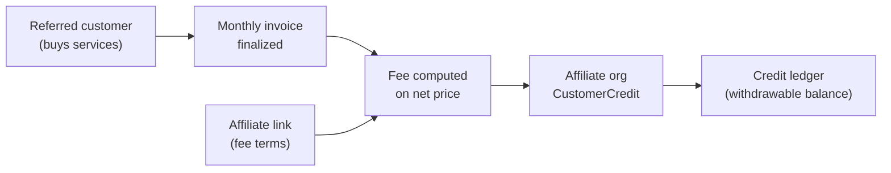
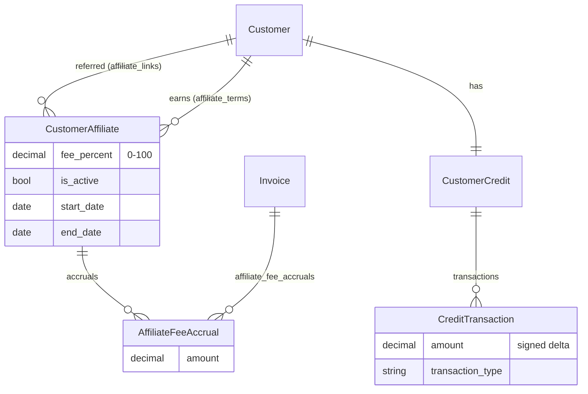
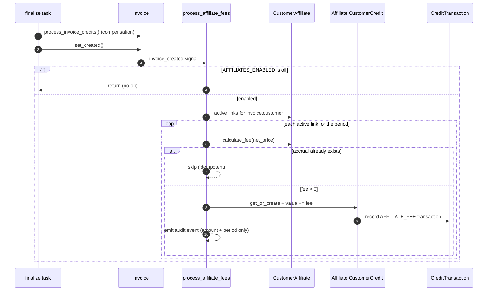
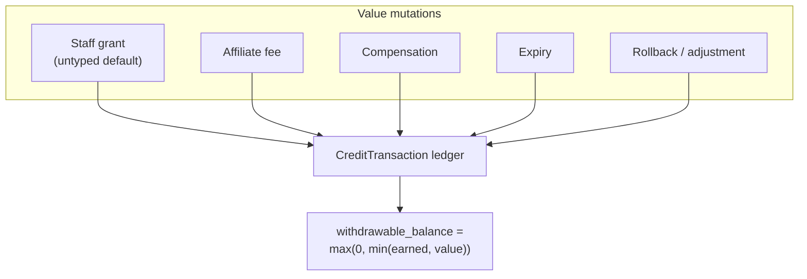

# Affiliate Program

## Overview

The affiliate program lets a staff operator reward one organization (the
**affiliate**) for business brought in by another organization (the **referred
customer**). Whenever a referred customer's monthly invoice is finalized, a
configurable **fee** is computed from the invoice and credited to the affiliate
organization's account. The fee lands in the affiliate's `CustomerCredit` and is
tracked in an append-only ledger so that the *earned* portion can later be paid
out or transferred, while staff-granted promotional credit cannot.

The whole program is **opt-in and disabled by default**. Configured links stay
dormant — and the API returns `404` — until it is switched on.



## Key concepts

| Term | Meaning |
|------|---------|
| **Referred customer** | The organization whose invoices generate fees (`CustomerAffiliate.customer`). |
| **Affiliate** | The organization that earns the fees (`CustomerAffiliate.affiliate`). |
| **Affiliate link** | A staff-configured `CustomerAffiliate` row binding the two, plus the fee terms. One link per `(customer, affiliate)` pair. |
| **Fee accrual** | An `AffiliateFeeAccrual` — one fee earned from one finalized invoice. Idempotent per invoice. |
| **Credit ledger** | `CreditTransaction` rows recording every change to a `CustomerCredit.value`. |
| **Withdrawable balance** | The part of the affiliate's credit that was *earned* (not granted) and may leave the platform. |

## Enabling the program

Two independent switches:

- **`AFFILIATES_ENABLED`** (Constance setting, default `False`) — the backend
  switch. It gates **both** the `customer-affiliates` API and fee accrual at
  invoice finalization. While off, the API responds with `404` and no fees are
  accrued, but existing links are preserved and resume once it is turned back on.
- **`reseller.affiliates`** (core feature flag) — controls **only** Homeport
  (frontend) menu and page visibility. It is *not* consulted by the backend.

Enable the backend in *Admin → Constance → Affiliates → AFFILIATES_ENABLED*, or
programmatically:

```python
from constance import config
config.AFFILIATES_ENABLED = True
```

## Data model



Each `AffiliateFeeAccrual` is unique on `(affiliate_link, invoice)`, which makes
accrual safe to re-run. It is also the *only* object that crosses the boundary
between the two organizations: it exposes the fee amount and the invoice period,
never the invoice contents.

## Fee

The fee is a single fixed percentage (`fee_percent`, 0–100) of the invoice
**net price** — pre-tax and *post-compensation* (after any credit compensation
has already reduced the invoice):

```text
fee = net_price × fee_percent / 100
```

The result is clamped to be non-negative. There is intentionally no per-invoice
fixed fee or formula — affiliate terms are deliberately simple. (For
quantity-driven *discounts* on what a customer pays, see
[Component dynamic discounts](component-discounts.md), a separate feature.)

## How a fee is accrued

Fee accrual rides on the existing invoice-finalization flow. The
`invoice_created` signal fires on the `PENDING → CREATED` transition, **after**
credit compensation has run, so the fee is computed on the final net price.



Robustness guarantees:

- **Never blocks finalization.** A broken formula or any per-link error is
  logged and skipped — the invoice still finalizes.
- **Idempotent.** Re-running finalization (grace periods, retries) does not
  double-accrue, thanks to the `(affiliate_link, invoice)` unique constraint.
- **Period-aware.** A link only accrues when `is_active` and the invoice period
  falls within `[start_date, end_date)`.

## Credit ledger and withdrawable balance

Every change to `CustomerCredit.value` — from any source — is recorded as a
`CreditTransaction` row by a `post_save` handler. The semantic type of the
change is declared by the programmatic flow that makes it, via the
`ledger.credit_transaction_type(...)` context manager; any untyped change
(staff UI, REST API, shell) is conservatively recorded as a **staff grant**.



The **withdrawable balance** is the sum of *earnings-typed* ledger entries
(`affiliate_fee`, `transfer_in`, `transfer_out`, `payout`), capped by the current
credit value. Two consequences fall out of this definition:

- Staff-granted (promotional) credit is **never** withdrawable.
- Credit **expiry wipes earnings too** — when the value is zeroed, the cap drops
  the withdrawable balance to zero.

Example — an affiliate with a 1000 promotional grant earns a 30 fee:

| Event | `value` | `withdrawable_balance` |
|-------|--------:|-----------------------:|
| Staff grant of 1000 | 1000 | 0 |
| Affiliate fee of 30 | 1030 | 30 |
| Credit expires (value → 0) | 0 | 0 |

The ledger is **append-only** — it is the source of truth for the withdrawable
balance, so rows are never edited or deleted; corrections are new rows.

## Worked scenarios

All amounts below are in the invoice currency and use the invoice **net price**
(pre-tax, post-compensation) as the base. Fees are clamped to be non-negative
and rounded before they are stored.

### A. Flat percentage

`ResellerCo` refers `AcmeLabs`. Terms: `fee_percent = 10`.

| Month | Invoice net price | Fee (10%) |
|-------|------------------:|----------:|
| June  | 1,200.00 | 120.00 |
| July  | 800.00 | 80.00 |
| August | 0.00 | — (no accrual on a zero invoice) |

### B. Compensation reduces the base

Fees are computed *after* credit compensation has been applied to the invoice,
so any credit the referred customer spends shrinks the affiliate's fee too.

`AcmeLabs` receives a gross invoice of 1,000.00 and has 400.00 of its own credit
applied as compensation. Terms: `fee_percent = 10`.

| Step | Amount |
|------|-------:|
| Gross invoice | 1,000.00 |
| Credit compensation | −400.00 |
| **Net price (fee base)** | **600.00** |
| Fee (10 % of 600.00) | **60.00** |

The fee is 60.00, not 100.00 — the affiliate earns on what the customer actually
pays.

### C. Withdrawable balance over time

`ResellerCo` begins with a 1,000 promotional grant from staff, then earns fees
over three months, takes a payout, and finally lets the credit expire. Only the
*earned* portion is ever withdrawable, and the running value caps it.

| Event | Ledger type | Δ value | `value` | Earned sum | `withdrawable_balance` |
|-------|-------------|--------:|--------:|-----------:|-----------------------:|
| Promotional grant | `staff_grant` | +1,000 | 1,000 | 0 | 0 |
| June fee | `affiliate_fee` | +120 | 1,120 | 120 | 120 |
| July fee | `affiliate_fee` | +80 | 1,200 | 200 | 200 |
| August fee | `affiliate_fee` | +150 | 1,350 | 350 | 350 |
| Payout to bank | `payout` | −200 | 1,150 | 150 | 150 |
| Credit expires | `expiry` | −1,150 | 0 | 150 | 0 |

Notes:

- The promotional grant never adds to the withdrawable balance — it is not an
  earnings-typed entry.
- The payout is an earnings-typed *outflow*, so it reduces the earned sum.
- Expiry is **not** earnings-typed, so the earned sum stays at 150 — but because
  the cap is `min(earned, value)` and the value is now 0, the withdrawable
  balance drops to 0. Expiry wipes earnings along with everything else.

### D. Period gating

A link with `start_date = 2026-03-01` and `end_date = 2026-07-01`. The window is
half-open: the start is inclusive, the end is exclusive (`date >= end_date` is
inactive).

| Invoice period | Accrues? |
|----------------|:--------:|
| February 2026 | No (before start) |
| March–June 2026 | Yes |
| July 2026 | No (end is exclusive) |

Setting `is_active = False` suspends accrual immediately, independent of the
dates, while keeping the link and its history.

### E. Multiple affiliates for one customer

A customer may be referred by several affiliates at once (links are unique per
`(customer, affiliate)` pair). Each link accrues independently from the same
invoice.

`AcmeLabs` net invoice of 1,200.00, referred by two affiliates:

| Affiliate | Terms | Fee |
|-----------|-------|----:|
| `ResellerCo` | `fee_percent = 10` | 120.00 |
| `ConsultingX` | `fee_percent = 5` | 60.00 |

Both fees are accrued; the referred customer's invoice is unaffected (affiliate
fees are paid by the operator, not added to the customer's bill).

## API

All endpoints live under `/api/customer-affiliates/` and return `404` while
`AFFILIATES_ENABLED` is off.

| Method & path | Who | Purpose |
|---------------|-----|---------|
| `GET /api/customer-affiliates/` | staff, affiliate owners | List links (affiliates see only their own). |
| `POST /api/customer-affiliates/` | **staff only** | Create a link. |
| `GET /api/customer-affiliates/{uuid}/` | staff, affiliate owner | Retrieve a link. |
| `PATCH/PUT /api/customer-affiliates/{uuid}/` | **staff only** | Update fee terms. |
| `DELETE /api/customer-affiliates/{uuid}/` | **staff only** | Remove a link. |
| `GET /api/customer-affiliates/{uuid}/accruals/` | staff, affiliate owner | Per-invoice fees (amount + period only). |
| `GET /api/customer-affiliates/{uuid}/earnings/` | staff, affiliate owner | Lifetime total, per-month series, withdrawable balance. |

Validation on create/update:

- An organization cannot be its own affiliate.
- `fee_percent` must be between 0 and 100.
- `end_date` must be after `start_date`.

### Example: create a link (staff)

```http
POST /api/customer-affiliates/
{
  "customer":  "https://waldur.example.com/api/customers/<referred-uuid>/",
  "affiliate": "https://waldur.example.com/api/customers/<affiliate-uuid>/",
  "fee_percent": 10
}
```

### Example: earnings summary

```http
GET /api/customer-affiliates/<uuid>/earnings/

{
  "total_earned": "30.00000",
  "withdrawable_balance": "30.00000",
  "per_month": [{"year": 2026, "month": 6, "amount": "30.00000"}]
}
```

## Privacy model

The program is designed so an affiliate **never** sees what the referred
customer bought:

- Affiliate owners get **read-only** access to their own links, accruals and
  earnings; they cannot view the referred customer's invoices (those return
  `404`).
- The accrual representation exposes the fee `amount` and the invoice
  `year`/`month` only — never a link or embed of the `Invoice` object.
- Audit events for earned fees carry the period and amount only, scoped to the
  affiliate organization.

## Audit events

| Event type | When | Scope |
|------------|------|-------|
| `create_of_affiliate_by_staff` | A link is created | Affiliate org |
| `update_of_affiliate_by_staff` | Link terms change | Affiliate org |
| `increase_of_customer_credit_due_to_affiliate_fee` | A fee is accrued | Affiliate org |

All three belong to the `CREDITS` and `CUSTOMERS` event groups.
