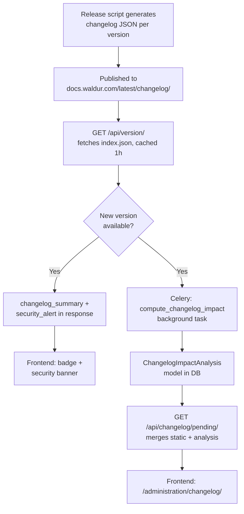

# Changelog System

## Overview

The changelog system provides staff users with context-aware release information, including what changed, whether changes affect their specific deployment, and what actions are needed after upgrading. It replaces the basic "new version available" notification with structured, filterable changelogs that include security alerts, impact analysis, and deployment-specific relevance matching.

## Architecture



### Components

| Component | Location | Purpose |
|-----------|----------|---------|
| Changelog JSON files | `docs.waldur.com/latest/changelog/releases/` | Structured release data (static) |
| `index.json` manifest | `docs.waldur.com/latest/changelog/index.json` | Version list with summary stats |
| `waldur_core.changelog` app | `src/waldur_core/changelog/` | Backend API, models, utils |
| `ChangelogImpactAnalysis` | Database model | Stores background analysis results |
| `changelog/schema.json` | Repo root | JSON Schema for release files |
| `assemble_changelog` | Management command | Assembles fragments into release files |

## Changelog Data Format

Each release has a structured JSON file following `changelog/schema.json`. Key fields per entry:

### Entry structure

```json
{
  "id": "8.0.7-1",
  "type": "feature",
  "category": "auth",
  "title": "Personal Access Tokens (PATs)",
  "description": "Previously, API integrations required session tokens. Now, users can create scoped PATs with configurable expiry.",
  "scope": "core",
  "component": ["backend", "frontend"],
  "highlight": true,
  "impact": {
    "risk": "low",
    "affected_scope": "api_consumers"
  },
  "actions": [
    {
      "type": "migration",
      "description": "Run waldur migrate",
      "automatic": true
    }
  ],
  "relevant_when": {
    "plugins": [],
    "feature_flags": [],
    "settings": []
  }
}
```

### Entry types

| Type | Description |
|------|-------------|
| `breaking` | Backward-incompatible changes |
| `security` | Security fixes (must include `security` object) |
| `deprecation` | Will be removed in a future version |
| `feature` | New functionality |
| `improvement` | Enhancement to existing functionality |
| `fix` | Bug fix |

### Scope

| Value | Meaning | Relevance filtering |
|-------|---------|-------------------|
| `core` | Affects all deployments | Always shown |
| `plugin` | Requires specific plugins | Filtered by `relevant_when` |
| `infra` | Deployment infrastructure only | Always shown (same as `core` - `component` isn't consulted for relevance) |
| `dev` | Development/testing only | Hidden in production views |

### Component

Array of stack layers affected: `backend`, `frontend`, `helm`, `docker`, `site-agent`, `sdk`.

### Categories

`marketplace`, `auth`, `identity`, `openstack`, `slurm`, `invoices`, `ai_assistant`, `reporting`, `policy`, `proposal`, `support`, `ui`, `infrastructure`, `notifications`.

### Impact and risk

| Risk | Meaning |
|------|---------|
| `high` | Breaking change, data migration, or service disruption |
| `medium` | Behavior change that may affect workflows |
| `low` | Minor change, unlikely to affect workflows |
| `none` | Informational, no action needed |

`affected_scope` provides a broad impact category when a specific Django model doesn't apply: `all_users`, `all_resources`, `infrastructure`, `api_consumers`, `none`.

`affected_resources` with `model` and `filter` enables the Celery task to run live count queries (e.g., "47 pending orders affected"). Both `model` and the keys of `filter` are checked server-side against an explicit allowlist (`ALLOWED_IMPACT_MODELS` in `changelog/tasks.py`) before any query runs — this JSON is remote, unauthenticated input, so only pre-approved `(model, field)` combinations are queryable, with exact-match values only (no `__` lookups). Currently allowlisted: `marketplace.Resource.state`, `marketplace.Offering.{state,type}`, `marketplace.Order.{state,type}`, and `is_staff`/`is_support`/`is_active` for `affected_users`. `state` fields are `FSMIntegerField`s, so filter values must be the numeric state (e.g. `{"state": 1}`), not a display string like `"pending-consumer"` — a non-matching model, field, or value type is skipped (logged, not counted) rather than erroring. Extending the allowlist is a deliberate, reviewed code change in `tasks.py`, not something a changelog entry can request on its own.

### Security entries

Entries with `type: security` must include a `security` object:

```json
{
  "security": {
    "urgency": "high",
    "cve": "CVE-2026-12345",
    "ghsa": "GHSA-xxxx-yyyy-zzzz",
    "affected_versions": "< 8.0.7",
    "exploitability": "Requires authenticated access.",
    "mitigation": "Rotate session secrets if you cannot upgrade immediately.",
    "advisory_url": "https://docs.waldur.com/security/CVE-2026-12345"
  }
}
```

Security urgency levels control frontend notification behavior. `changelog_summary.security_alert` (and the badge/banner it drives) is only ever populated for `critical`/`high` — `build_changelog_summary` filters on exactly those two (`utils.py`) — so `moderate`/`low` entries never reach any dedicated notification; they appear only as regular entries wherever the changelog is listed, ranked by their own `impact.risk`:

| Urgency | UI behavior |
|---------|-------------|
| `critical` | Red banner (`SecurityAlertBanner`, `bg-danger`), persistent, cannot dismiss; red footer badge |
| `high` | Orange/warning banner (`bg-warning`), dismissible per session (`sessionStorage`); orange footer badge |
| `moderate` | No dedicated banner or badge — standard changelog entry only |
| `low` | No dedicated banner or badge — standard changelog entry only |

### Version model (stable and RC)

Waldur uses SemVer with `-rc.N` pre-releases. Each release file contains:

- `entries[]` — cumulative since the previous stable release
- `since_previous[]` — incremental since the immediately preceding version (RC or stable)
- `component_activity` — per-repo commit counts with compare URLs

This supports three views: stable-to-stable, RC-to-RC, and RC-to-stable.

## API Endpoints

All endpoints require `IsAuthenticated + IsStaffOrSupportUser`.

| Endpoint | Description |
|----------|-------------|
| `GET /api/version/` | Returns version + `changelog_summary` with security alerts |
| `GET /api/changelog/pending/` | Cumulative changelog from current to latest, with relevance and impact analysis |
| `GET /api/changelog/{version}/` | Full changelog for one version |
| `GET /api/changelog/{version}/delta/` | Only `since_previous` entries |
| `GET /api/changelog/compare/{from}/{to}/` | Merged deltas between arbitrary versions |
| `GET /api/changelog-entries/` | Flat, paginated, filterable list of entries across all pending versions (table view) |

### Version endpoint response

```json
{
  "version": "8.0.6",
  "latest_version": "8.0.8",
  "changelog_summary": {
    "versions_behind": 2,
    "breaking_release_count": 1,
    "has_breaking_changes": true,
    "security_alert": {
      "max_urgency": "high",
      "count": 1,
      "versions": [
        {"version": "8.0.7", "max_urgency": "high"}
      ]
    }
  }
}
```

### Pending endpoint response

```json
{
  "current_version": "8.0.6",
  "latest_version": "8.0.8",
  "versions_behind": 2,
  "impact_analysis_status": "completed",
  "impact_analysis_computed_at": "2026-04-15T10:30:00Z",
  "releases": [
    {
      "version": "8.0.8",
      "date": "2026-04-13",
      "type": "stable",
      "summary": "...",
      "entries": [
        {
          "id": "8.0.8-1",
          "type": "feature",
          "title": "...",
          "relevant": true,
          "relevance_reasons": ["Plugin waldur_marketplace is active"],
          "impact": {"risk": "low"},
          "affected_resources_count": 47
        }
      ]
    }
  ]
}
```

### Flat entries endpoint

`GET /api/changelog-entries/` flattens every pending version's entries into one paginated list — for the standard Waldur table component, rather than the per-release grouping `pending` returns. Query parameters:

| Param | Description |
|-------|-------------|
| `type` | Filter by entry type |
| `risk` | Filter by `impact.risk` |
| `scope` | Filter by scope |
| `version` | Filter to entries from one release version |
| `highlight` | `true`/`1` — only entries with `highlight: true` |
| `relevant_only` | `true`/`1` — only entries relevant to this deployment |
| `search` | Case-insensitive match against `title`/`description` |
| `page`, `page_size` | Pagination (`page_size` clamped to 1-200) |

Results are sorted relevant-first, then by risk (high to none). Each entry additionally carries `version`, `release_date`, `release_type` (from the release it belongs to).

```json
{
  "count": 12,
  "current_version": "8.0.6",
  "latest_version": "8.0.8",
  "versions_behind": 2,
  "results": [
    {
      "id": "8.0.8-1",
      "type": "feature",
      "title": "...",
      "relevant": true,
      "impact": {"risk": "low"},
      "version": "8.0.8",
      "release_date": "2026-04-13",
      "release_type": "stable"
    }
  ]
}
```

## Relevance Matching

Entries are matched against the deployment's configuration:

- **Plugins**: `relevant_when.plugins` checked against `INSTALLED_APPS`
- **Feature flags**: `relevant_when.feature_flags` checked against the features registry
- **Settings**: `relevant_when.settings` checked for non-default constance values

Entries with `scope: core` or `scope: infra`, or empty `relevant_when` arrays, are always relevant.

## Background Impact Analysis

The `compute_changelog_impact` Celery task runs automatically when `/api/version/` detects a new release. It computes:

1. **Affected resource counts** — runs `Model.objects.filter(**filter).count()` for entries with `affected_resources.model`, restricted to the `ALLOWED_IMPACT_MODELS`/`ALLOWED_USER_IMPACT_FIELDS` allowlist (see "Impact and risk" above)
2. **Settings diffs** — captures current vs default values for referenced constance settings
3. **Plugin state** — records which referenced plugins are installed

Results are stored in the `ChangelogImpactAnalysis` model and refreshed every 24 hours. The `/api/changelog/pending/` endpoint merges these results into the response.

## Configuration

### Disabling the changelog

Set in `override.conf.py` or Helm values:

```python
WALDUR_CORE["CHANGELOG_ENABLED"] = False
```

```yaml
# Helm values.yaml
waldur:
  core:
    CHANGELOG_ENABLED: false
```

When disabled:

- `/api/version/` returns only `{version}` — no changelog data
- `/api/changelog/*` endpoints return 404
- The Celery impact analysis task is a no-op
- No frontend changelog UI elements are rendered

## Management Command: assemble_changelog

Assembles changelog fragments from `changelog/next/` into a release file:

```bash
waldur assemble_changelog \
  --release-version 8.0.8 \
  --date 2026-04-15 \
  --release-type stable \
  --base-stable 8.0.7 \
  --summary "Security fixes, new reporting features"
```

### Options

| Flag | Required | Description |
|------|----------|-------------|
| `--release-version` | Yes | Version string (e.g., `8.0.8` or `8.0.8-rc.1`) |
| `--date` | Yes | Release date (ISO 8601) |
| `--release-type` | No | `stable` (default) or `rc` |
| `--base-stable` | No | Previous stable version for cumulative entries |
| `--previous` | No | Immediately preceding version |
| `--stable-target` | No | Target stable version (for RC releases) |
| `--summary` | No | Release summary text |
| `--no-clear` | No | Don't clear `changelog/next/` after assembly |
| `--dry-run` | No | Validate and print without writing |

### Fragment format

Each fragment in `changelog/next/` is a JSON file with the same structure as an entry, minus the `id` field (auto-assigned):

```json
{
  "type": "feature",
  "category": "marketplace",
  "title": "Monthly component usage reporting",
  "description": "Providers can now view aggregated monthly usage data.",
  "scope": "core",
  "component": ["backend", "frontend"],
  "impact": {"risk": "none"},
  "relevant_when": {"plugins": [], "feature_flags": [], "settings": []}
}
```

### Validation rules

Each assembled entry is validated against `changelog/schema.json` (the `$defs/entry` sub-schema) via `jsonschema` — `schema.json` is the source of truth, so the constraints below track it automatically rather than needing to be kept in sync by hand:

- `type` must be one of: `breaking`, `security`, `deprecation`, `feature`, `improvement`, `fix`
- `category` must match the predefined category list
- `scope` must be `core`, `plugin`, `infra`, or `dev`
- `component` values must be from: `backend`, `frontend`, `helm`, `docker`, `site-agent`, `sdk`
- `impact.risk` must be `high`, `medium`, `low`, or `none`

One rule the schema can't express and is checked separately: security entries (`type: security`) must include a `security` object with `urgency`, `affected_versions`, `exploitability`, and `mitigation`.

## Schema Versioning

The JSON schema at `changelog/schema.json` includes a `schema_version` field (currently `1.0.0`). Release files include this version for forward compatibility — consumers can check the schema version before parsing.

## Release Script Integration

Changelog entries are generated at release time by `waldur-docs/scripts/release.sh` — a local, interactive script a dev runs to cut a release (`./scripts/release.sh <VERSION>`). It's not CI-driven: there's no dedicated pipeline job for changelog generation, staff/support-facing or otherwise. The script already collects git log data across all core repos (mastermind, homeport, helm, docker-compose) between the previous tag and the new one, and drives two independent Claude Code (`claude --print`) calls against that same commit data:

1. **`scripts/prompts/changelog-prompt.md`** — produces free-form Markdown, prepended to `docs/about/CHANGELOG.md`. This is the pre-existing, human-facing changelog and is unaffected by the structured system described in this document.
2. **`scripts/prompts/changelog-json-prompt.md`** — produces a single `{summary, entries[]}` JSON object classifying the same changes into this schema's fields (`type`, `category`, `scope`, `component`, `impact`, `relevant_when`, etc.). Each entry in `entries[]` is written to its own file under `waldur-mastermind/changelog/next/` (a fragment, matching this document's fragment format above), then `assemble_changelog` validates and assembles them into `changelog/releases/{version}.json` inside this repo. That file is copied into `waldur-docs/docs/changelog/releases/{version}.json`, and `scripts/update_changelog_index.py` upserts its summary row into `waldur-docs/docs/changelog/index.json`.

Both stable and RC releases go through this same flow — there's no separate "daily RC" cadence script.

Publishing happens for free: `docs/changelog/` lives in `waldur-docs`' normal `docs_dir`, so the site's existing "Deploy MkDocs pages" CI job (`mkdocs build` + `mike deploy $TAG latest --update-aliases`, unchanged by this) picks it up like any other doc content. Because `mike` nests the built site under version-prefixed paths (`docs.waldur.com/8.0.9/...`), the changelog is only reachable at a **stable, unversioned URL via mike's `latest` alias** — `docs.waldur.com/latest/changelog/...` — which is why `CHANGELOG_BASE_URL` in `utils.py` points at `/latest/changelog`, not `/changelog`, and why the alias must be kept up to date on every stable release (mike already does this via `--update-aliases`).

`release.sh` also commits `changelog/releases/{version}.json` directly into this repo (`waldur-mastermind`, `develop` branch) as an audit trail, independent of `waldur-docs` — that commit is not required at runtime (the API only ever fetches from `docs.waldur.com`), it just keeps the generated release data in this repo's history too.
