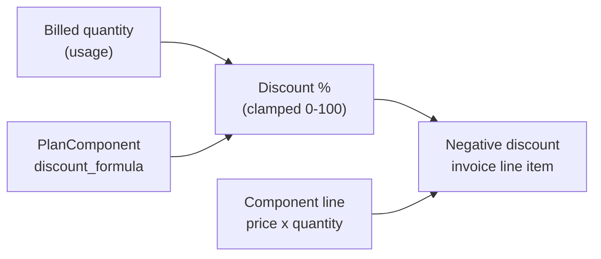
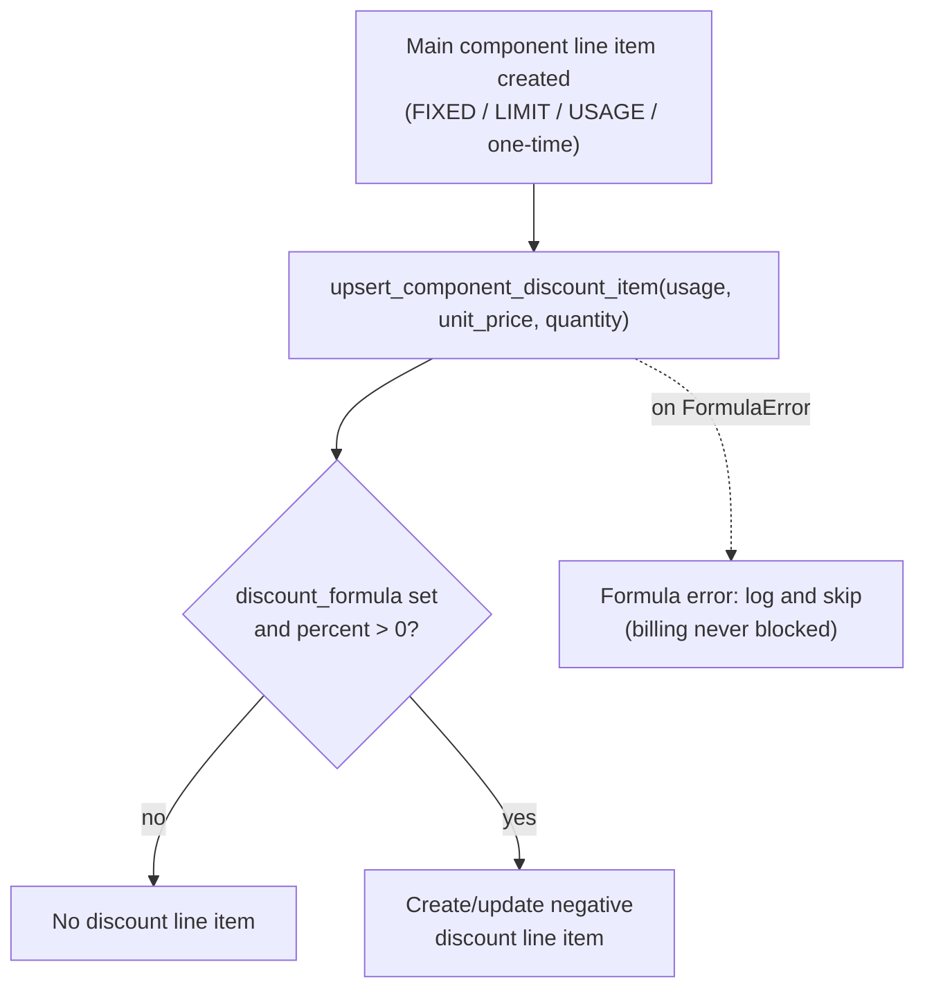

# Component Dynamic Discounts

## Overview

A plan component can carry a **volume discount** expressed as a formula. At
billing time the formula receives the billed quantity (bound to the variable
`usage`) and returns a **discount percentage**; that percentage is applied to
the component's line charge and materialized as a separate negative invoice
line item, so the discount stays visible on the invoice.

This lets operators express "the more you use, the cheaper the unit gets"
without hard-coding tiers: a single `discount_formula` covers flat thresholds,
graduated tiers, logarithmic curves, and caps.



> This is a separate feature from the [Affiliate program](affiliate-program.md),
> which uses the same safe formula evaluator but for a different purpose.

## The formula

`PlanComponent.discount_formula` is evaluated by the safe, side-effect-free
evaluator in `waldur_mastermind.common.formula`, which walks a whitelisted AST —
it never calls `eval()`. The single bound variable is `usage` (the billed
quantity for the period). The result is interpreted as a percentage and
**clamped to `[0, 100]`**; an empty formula means no discount.

Supported grammar:

- Numbers and the variable `usage`
- Operators `+ - * / // % **`, unary minus, comparisons, `and` / `or`
- Conditional expressions: `10 if usage >= 100 else 0`
- Functions (case-insensitive): `MIN, MAX, LN, LOG10, FLOOR, CEIL, POW, ABS`
  (`LN` = natural log, `LOG10` = decimal log; there is deliberately no plain `LOG`)

Formulas are **validated at save time** — the evaluator probe-runs them over a
range of sample quantities, so a formula that would throw (e.g. `LN(usage)` at
`usage = 0`) is rejected by the API before it can reach the billing pipeline.

### Example formulas

| Formula | Behaviour |
|---------|-----------|
| `10 if usage >= 100 else 0` | flat 10 % once usage reaches 100 |
| `20 if usage >= 1000 else (10 if usage >= 100 else 0)` | graduated 0 → 10 → 20 % |
| `MIN(50, usage * 0.5)` | 0.5 % per unit, capped at 50 % |
| `MIN(70, LN(MAX(1, usage)) * 10)` | logarithmic curve, capped at 70 % |

## How the discount is applied

The discount scales on the **volume** (`usage`) but applies to the **actual
line charge** (`unit_price × billed_quantity`). What `usage` maps to depends on
the component's billing type — the discount is supported on all of them:

| Billing type | `usage` is bound to | Line charge the discount reduces |
|--------------|---------------------|----------------------------------|
| FIXED / ON_PLAN_SWITCH | the component `amount` | `price × amount × period_fraction` |
| ONE_TIME (incl. prepaid) | the billed quantity | that one-time charge |
| LIMIT | the limit quantity | `price × duration-multiplied quantity` |
| USAGE | the reported usage for the period | `price × reported usage` |



Key properties:

- **One shared code path.** All billing types call the same
  `upsert_component_discount_item` helper, so the discount semantics are
  identical everywhere.
- **Idempotent.** The USAGE path re-reports usage repeatedly; the paired
  discount item is created, updated, or removed to match — never duplicated. If
  usage later drops below the threshold (percent → 0), the stale discount item
  is removed.
- **Never blocks billing.** A broken formula is logged and skipped; the main
  component line is always billed.
- **Overage is not discounted.** Prepaid overage top-ups are premium-priced and
  bypass the discount.

## Worked example

Component price 10.00, usage 150 for the period, formula `10 if usage >= 100
else 0`:

| Line item | Amount |
|-----------|-------:|
| Component (10.00 × 150) | 1,500.00 |
| Volume discount (10 % of 1,500.00) | −150.00 |
| **Net** | **1,350.00** |

Logarithmic curve `MIN(70, LN(MAX(1, usage)) * 10)` applied to the same 10.00
unit price:

| Usage | Discount % | Line charge | Discount | Net |
|------:|-----------:|------------:|---------:|----:|
| 10 | 23.03 % | 100.00 | −23.03 | 76.97 |
| 100 | 46.05 % | 1,000.00 | −460.50 | 539.50 |
| 1,000 | 69.08 % | 10,000.00 | −6,908.00 | 3,092.00 |
| 10,000 | 70.00 % (capped) | 100,000.00 | −70,000.00 | 30,000.00 |

## API

Discounts are managed per plan through the existing `update_discounts` action;
the caller needs the `UPDATE_OFFERING_PLAN` permission (service provider or
staff).

```http
POST /api/marketplace-plans/<plan-uuid>/update_discounts/
{
  "discounts": {
    "cpu": {"discount_formula": "10 if usage >= 100 else 0"},
    "ram": {"discount_formula": ""}
  }
}
```

- An empty `discount_formula` clears the discount for that component.
- Component types not present in the plan's offering are rejected.
- Invalid formulas are rejected with a 400 and the evaluator's error message.

Plan and plan-component serializers expose `discount_formula` and a derived
`discount_description` for display.

## Migration from the old threshold/rate discount

This replaces the earlier flat `discount_threshold` + `discount_rate` fields on
`PlanComponent` (which only applied to LIMIT components). Existing configurations
are converted automatically by migration
`0243_plancomponent_discount_formula` into the equivalent formula:

```text
discount_rate=15, discount_threshold=100   ->   "15 if usage >= 100 else 0"
```

Two behavioural changes come with the unification:

- The discount now applies to **all** billing types (FIXED, ONE_TIME, LIMIT,
  USAGE), not just LIMIT.
- On the LIMIT path the discount now scales on the **full line charge**
  (duration-multiplied), making it proportional to what is actually billed.
