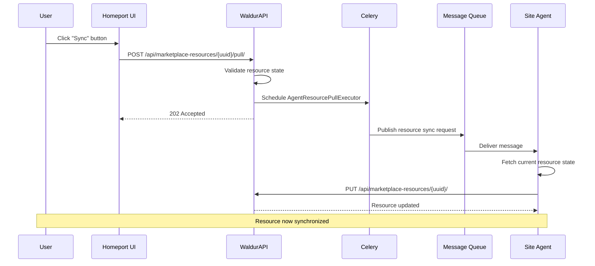

# STOMP-Based Event Notification System

## System Overview

The [STOMP](https://stomp.github.io/)-based event notification system enables Waldur to communicate changes to resources, orders, user roles, and other events to external systems via message queues. This eliminates the need for constant polling and enables immediate reactions to events in distributed architectures.

The key components include:

1. **STOMP Publisher (Waldur side)**: Located in the [waldur_core/logging/utils.py](https://github.com/waldur/waldur-mastermind/blob/73f2a0a7df04405b1c9ed5d2512d6213d649d398/src/waldur_core/logging/utils.py#L88) file, this component publishes messages to STOMP queues when specific events occur.

2. **Event Subscription Service**: Manages subscriptions to events by creating unique topics for each type of notification. Related file: event subscription management via API: [waldur_core/logging/views.py](https://github.com/waldur/waldur-mastermind/blob/73f2a0a7df04405b1c9ed5d2512d6213d649d398/src/waldur_core/logging/views.py#L193)

3. **STOMP Consumer (External System)**: Any external system that subscribes to these topics and processes incoming messages. This can be:
   - The `waldur-site-agent` running on resource provider infrastructure
   - Custom integration services (e.g., SharePoint integration, external notification systems)
   - Third-party systems that need to react to Waldur events

## Event Flow

1. An event occurs in Waldur (e.g., a new order is created, a user role changes, or a resource is updated)
2. Waldur publishes a message to the appropriate STOMP queue(s)
3. External systems (agents, integrations, or third-party services) receive the message and process it based on the event type
4. The consuming system executes the necessary actions based on the message content

## Queue Naming Strategy

The system follows an **object-based naming convention** for STOMP queues rather than event-based naming. This design choice provides several benefits:

- **Simplified Client Configuration**: Clients subscribe to object types (e.g., `resource_periodic_limits`) rather than specific event types
- **Action Flexibility**: Specific actions (e.g., `apply_periodic_settings`, `update_limits`) are stored in the message payload
- **Easier Maintenance**: Adding new actions doesn't require queue reconfiguration
- **Future Migration Path**: Sets foundation for eventual migration to event-based naming without immediate client changes

**Current Approach:**

- Queue: `resource_periodic_limits`
- Payload: `{"action": "apply_periodic_settings", "settings": {...}}`

**Alternative Event-Based Approach** (for future consideration):

- Queue: `resource_periodic_limits_update`
- More specific but requires client reconfiguration for each new event type

## Message Types

The system handles several types of events:

1. **Order Messages** (`order`): Notifications about marketplace orders (create, update, terminate)
2. **User Role Messages** (`user_role`): Changes to user permissions in projects
3. **Resource Messages** (`resource`): Updates to resource configuration or status
4. **Resource Periodic Limits** (`resource_periodic_limits`): SLURM periodic usage policy updates with allocation and limit settings
5. **Offering User Messages** (`offering_user`): Creation, updates, and deletion of offering users
6. **Service Account Messages** (`service_account`): Service account lifecycle events
7. **Course Account Messages** (`course_account`): Course account management events
8. **Importable Resources Messages** (`importable_resources`): Backend resource discovery events

## Implementation Details

### Publishing Messages (Waldur Side)

Events are published through a standardized mechanism in Waldur:

1. **Event Detection**: Events are triggered by Django signal handlers throughout the system
2. **Message Preparation**: Event data is serialized into JSON format with standardized payload structure
3. **Queue Publishing**: Messages are sent to appropriate queues using the `publish_messages` Celery task

The core publishing function is located in `src/waldur_core/logging/tasks.py:118` and utilizes the `publish_stomp_messages` utility in `src/waldur_core/logging/utils.py:93`.

### Offering User Event Messages

Offering user events are published when offering users are created, updated, or deleted. These handlers are located in [waldur_mastermind/marketplace/handlers.py](https://github.com/waldur/waldur-mastermind/blob/develop/src/waldur_mastermind/marketplace/handlers.py):

- `send_offering_user_created_message` - Triggers when an OfferingUser is created
- `send_offering_user_updated_message` - Triggers when an OfferingUser is updated
- `send_offering_user_deleted_message` - Triggers when an OfferingUser is deleted
- `send_user_attribute_update_message` - Triggers when a User's profile attributes change
  (connected to `core.User` post_save, not `OfferingUser`)

**Message Payload Structure for create/update/delete Events:**

```json
{
  "offering_user_uuid": "uuid-hex-string",
  "user_uuid": "user-uuid-hex-string",
  "username": "generated-username",
  "state": "OK|Requested|Creating|...",
  "runtime_state": "Active|Pending account linking|Pending additional validation",
  "action": "create|update|delete",
  "attributes": {"email": "user@example.com", "first_name": "Alice"},  // create only
  "changed_fields": ["field1", "field2"]  // update only
}
```

**Message Payload Structure for attribute_update Events:**

When a User's profile fields change, a separate event is published for each offering
the user belongs to. The `OfferingUserAttributeConfig` for the offering determines which
changed fields are included.

```json
{
  "offering_user_uuid": "uuid-hex-string",
  "user_uuid": "user-uuid-hex-string",
  "username": "generated-username",
  "action": "attribute_update",
  "changed_attributes": ["email", "first_name"],
  "attributes": {"email": "new@example.com", "first_name": "Alice"}
}
```

**Event Triggers:**

- **Create**: When a new offering user account is created for a user in an offering
- **Update**: When any field of an existing offering user is modified (username, state, runtime_state, etc.)
- **Delete**: When an offering user account is removed from an offering
- **Attribute Update**: When a User's profile fields change, filtered through each offering's `OfferingUserAttributeConfig`

**`runtime_state` field:** Both `create` and `update` messages include `runtime_state` alongside `state`. Consumers should use `runtime_state` to determine operational access status (e.g. TOU accepted, account linked) independently of the lifecycle `state`. See [OfferingUser States and Management](offering-users.md#runtime-states) for details.

### Resource Periodic Limits Event Messages

Resource periodic limits events are published when SLURM periodic usage policies are applied to resources. These messages contain calculated SLURM settings including allocation limits, fairshare values, and QoS thresholds. The handler is located in [waldur_mastermind/policy/models.py](https://github.com/waldur/waldur-mastermind/blob/develop/src/waldur_mastermind/policy/models.py).

**Message Payload Structure for Resource Periodic Limits:**

```json
{
  "resource_uuid": "resource-uuid-hex-string",
  "backend_id": "slurm-account-name",
  "offering_uuid": "offering-uuid-hex-string",
  "action": "apply_periodic_settings",
  "timestamp": "2024-01-01T00:00:00.000000",
  "settings": {
    "fairshare": 333,
    "limit_type": "GrpTRESMins",
    "grp_tres_mins": {
      "billing": 119640
    },
    "qos_threshold": {
      "billing": 119640
    },
    "grace_limit": {
      "billing": 143568
    },
    "carryover_details": {
      "carryover_applied": true,
      "previous_period": "2023-Q4",
      "previous_usage": 750.0,
      "decay_factor": 0.015625,
      "effective_previous_usage": 11.7,
      "unused_allocation": 988.3,
      "base_allocation": 1000.0,
      "total_allocation": 1988.3
    }
  }
}
```

**Event Triggers:**

- **Policy Application**: When a SLURM periodic usage policy calculates new allocation limits and sends them to the site agent
- **Carryover Calculation**: When unused allocation from previous periods is calculated with decay factors
- **Limit Updates**: When fairshare values, TRES limits, or QoS thresholds need to be updated on the SLURM backend

### Subscription Management (Consumer Side)

External systems consuming events can be implemented with different levels of sophistication:

#### 1. Simple Event Subscription (Basic Integration)

For basic integrations, implement a direct subscription pattern:

```python
from waldur_api_client import AuthenticatedClient
from waldur_api_client.models import ObservableObjectTypeEnum
import stomp

# Create event subscription
client = AuthenticatedClient(base_url="https://api.waldur.com", token="your-token")
subscription = create_event_subscription(
    client,
    ObservableObjectTypeEnum.ORDER  # or other types
)

# Setup STOMP connection
connection = stomp.WSStompConnection(
    host_and_ports=[(stomp_host, stomp_port)],
    vhost=subscription.user_uuid.hex
)

# Implement message listener
class EventListener(stomp.ConnectionListener):
    def on_message(self, frame):
        message_data = json.loads(frame.body)
        # Process message based on action and content
        handle_event(message_data)
```

#### 2. Structured Agent Pattern (Advanced Integration)

For more complex systems that need structured management and monitoring, use the **AgentIdentity** framework pattern from waldur-site-agent:

```python
import datetime
from waldur_api_client.models import AgentIdentityRequest, AgentServiceCreateRequest, AgentProcessorCreateRequest
from waldur_api_client.api.marketplace_site_agent_identities import (
    marketplace_site_agent_identities_create,
    marketplace_site_agent_identities_register_service,
)
from waldur_api_client.api.marketplace_site_agent_services import (
    marketplace_site_agent_services_register_processor,
)

# Register agent identity
agent_identity_data = AgentIdentityRequest(
    offering=offering_uuid,
    name="my-integration-agent",
    version="1.0.0",
    dependencies=["stomp", "requests"],
    last_restarted=datetime.datetime.now(),
    config_file_path="/etc/my-agent/config.yaml",
    config_file_content="# agent configuration"
)

agent_identity = marketplace_site_agent_identities_create.sync(
    body=agent_identity_data,
    client=waldur_rest_client
)

# Register agent service for event processing
service_name = f"event_process-{observable_object_type}"
agent_service = marketplace_site_agent_identities_register_service.sync(
    uuid=agent_identity.uuid.hex,
    body=AgentServiceCreateRequest(
        name=service_name,
        mode="event_process"
    ),
    client=waldur_rest_client
)

# Register processors within the service
processor = marketplace_site_agent_services_register_processor.sync(
    uuid=agent_service.uuid.hex,
    body=AgentProcessorCreateRequest(
        name="order-processor",
        backend_type="CUSTOM_BACKEND",
        backend_version="2.0"
    ),
    client=waldur_rest_client
)
```

**Benefits of AgentIdentity Pattern:**

- **Monitoring**: Track agent health, version, and dependencies in Waldur
- **Service Management**: Organize multiple services within a single agent
- **Processor Tracking**: Monitor individual processors and their backend versions
- **Configuration Management**: Store and version configuration files
- **Statistics**: Collect and report agent performance metrics
- **Unified Queue**: Single queue per agent via `register_queue` with enriched payloads

**Unified Queue Registration:**

A site agent can register a unified queue where one RabbitMQ queue receives all event types. This is the recommended approach for new agents. The queue's state lives on a generic `EventConsumer` (in `waldur_core.logging`) that the `AgentIdentity` links to, bound to the agent's offering:

```python
# Register a unified queue (one call replaces multiple create_queue calls)
result = marketplace_site_agent_identities_register_queue.sync(
    uuid=agent_identity.uuid.hex,
    client=waldur_rest_client
)
# result contains: rmq_username, queue_name, vhost, observable_object_types
```

For the complete guide on unified queues, see [Unified Agent Queue](../guides/agent-pubsub.md).

### Message Processing (Consumer Side)

When a message arrives, it should be routed to appropriate handlers based on the event type and action. The message structure includes:

- **Event Type**: Determined by the observable object type (`order`, `user_role`, `resource`, etc.)
- **Action**: Specific operation to perform (`create`, `update`, `delete`, `apply_periodic_settings`, etc.)
- **Payload**: Event-specific data needed to process the action

**Message Processing Patterns:**

The system supports different message processing approaches based on complexity:

```python
# 1. Simple message processing (lightweight integration pattern)
class SimpleEventListener(stomp.ConnectionListener):
    def on_message(self, frame):
        try:
            message_data = json.loads(frame.body)
            message_type = self.get_message_type_from_queue(frame.headers.get('destination'))

            if message_type == 'order':
                self.handle_order(message_data)
            elif message_type == 'user_role':
                self.handle_user_role(message_data)

        except Exception as e:
            logger.error(f"Error processing message: {e}")

# 2. Structured agent processing (waldur-site-agent pattern)
OBJECT_TYPE_TO_HANDLER = {
    "order": handle_order_message_stomp,
    "user_role": handle_user_role_message_stomp,
    "resource": handle_resource_message_stomp,
    "resource_periodic_limits": handle_resource_periodic_limits_stomp,
    "service_account": handle_account_message_stomp,
    "course_account": handle_account_message_stomp,
    "importable_resources": handle_importable_resources_message_stomp,
}

def route_message(frame, offering, user_agent):
    """Route message to appropriate handler based on destination."""
    destination = frame.headers.get(HDR_DESTINATION, "")
    # Extract object type from queue name: subscription_xxx_offering_yyy_OBJECT_TYPE
    object_type = destination.split('_')[-1] if '_' in destination else ""

    handler = OBJECT_TYPE_TO_HANDLER.get(object_type)
    if handler:
        handler(frame, offering, user_agent)
    else:
        logger.warning(f"No handler found for object type: {object_type}")
```

## API Endpoints

The event notification system provides REST API endpoints for managing event-based functionality (verified from OpenAPI specification):

### Event Subscriptions

- **GET /api/event-subscriptions/** - List event subscriptions
- **POST /api/event-subscriptions/** - Create new event subscription
- **GET /api/event-subscriptions/{uuid}/** - Retrieve specific subscription
- **PATCH /api/event-subscriptions/{uuid}/** - Update subscription settings
- **DELETE /api/event-subscriptions/{uuid}/** - Delete subscription

### Agent Identity Management

- **GET /api/marketplace-site-agent-identities/** - List agent identities
- **POST /api/marketplace-site-agent-identities/** - Register new agent identity
- **GET /api/marketplace-site-agent-identities/{uuid}/** - Retrieve agent identity
- **PATCH /api/marketplace-site-agent-identities/{uuid}/** - Update agent identity
- **DELETE /api/marketplace-site-agent-identities/{uuid}/** - Delete agent identity
- **POST /api/marketplace-site-agent-identities/{uuid}/register_service/** - Register service within agent
- **POST /api/marketplace-site-agent-identities/{uuid}/register_event_subscription/** - Register event subscription for agent (legacy)
- **POST /api/marketplace-site-agent-identities/{uuid}/register_queue/** - Register unified agent queue (recommended)

#### Agent Identity Permissions

Agent identity management uses a four-tier permission model checked by `_can_manage_offering_agent()`:

| Tier | Who | Scope |
|------|-----|-------|
| 1. Staff | `user.is_staff` | All offerings, all identities |
| 2. Customer owner | `CREATE_OFFERING` permission on offering's customer | All identities for customer's offerings |
| 3. Offering manager | `UPDATE_OFFERING` permission on the offering | All identities for that offering |
| 4. ISD identity manager | `is_identity_manager=True` + non-empty `managed_isds` | Own identities only, non-archived/draft offerings |

ISD identity managers can create agent identities for offerings in Active, Paused, or Unavailable states without requiring pre-existing offering users. This enables bootstrapping: agents create offering users, so requiring offering users to register agents would be a chicken-and-egg problem.

#### Agent Identity Ownership

Each `AgentIdentity` has a `created_by` field tracking the user who created it. This field is used to scope ISD identity manager access:

- **Create**: Any ISD identity manager can create an agent identity for an allowed offering
- **Update/Delete**: ISD identity managers can only modify or delete their own agent identities (`created_by == request.user`)
- **List**: ISD identity managers only see their own agent identities in query results

Staff, customer owners, and offering managers are not restricted by `created_by` — they can manage all agent identities within their scope.

### Agent Services

- **GET /api/marketplace-site-agent-services/** - List agent services
- **GET /api/marketplace-site-agent-services/{uuid}/** - Retrieve service details
- **PATCH /api/marketplace-site-agent-services/{uuid}/** - Update service
- **DELETE /api/marketplace-site-agent-services/{uuid}/** - Delete service
- **POST /api/marketplace-site-agent-services/{uuid}/register_processor/** - Register processor within service
- **POST /api/marketplace-site-agent-services/{uuid}/set_statistics/** - Update service statistics

### Agent Processors

- **GET /api/marketplace-site-agent-processors/** - List agent processors
- **GET /api/marketplace-site-agent-processors/{uuid}/** - Retrieve processor details
- **PATCH /api/marketplace-site-agent-processors/{uuid}/** - Update processor
- **DELETE /api/marketplace-site-agent-processors/{uuid}/** - Delete processor

### Monitoring & Statistics

- **GET /api/rabbitmq-vhost-stats/** - Get RabbitMQ virtual host statistics
- **GET /api/rabbitmq-user-stats/** - Get RabbitMQ user statistics

### Utility Endpoints

- **POST /api/projects/{uuid}/sync_user_roles/** - Trigger user role synchronization for specific project

## Technical Components

1. **WebSocket Transport**: The system uses STOMP over WebSockets for communication
2. **TLS Security**: Connections can be secured with TLS
3. **User Authentication**: Each subscription has its own credentials and permissions in RabbitMQ
4. **Queue Structure**: Two queue naming patterns are supported:

   **Legacy (per-offering, per-object-type):**
   - Pattern: `/queue/subscription_{subscription_uuid}_offering_{offering_uuid}_{object_type}`
   - Example: `/queue/subscription_abc123_offering_def456_order`

   **Unified (single queue per consumer):**
   - Pattern: `/queue/consumer_{consumer_uuid}`
   - Example: `/queue/consumer_a1b2c3d4e5f67890...`
   - All event types delivered to one queue; agent routes by `object_type` in payload
   - See [Unified Agent Queue guide](../guides/agent-pubsub.md) for details

## Error Handling and Resilience

The system includes:

- Graceful connection handling
- Signal handlers for proper shutdown
- Retry mechanisms for order processing — erred orders can be explicitly retried via `POST /api/marketplace-orders/{uuid}/retry/` for offering types that opt in with `supports_order_retry=True` (see [Retrying Erred Orders](marketplace.md#retrying-erred-orders))
- Error logging and optional Sentry integration

## Integration Examples

### Real-world Implementations

1. **Waldur Site Agent**: Full-featured agent for SLURM/HPC resource management
   - Manages compute allocations, user accounts, and resource limits
   - Implements structured AgentIdentity pattern with services and processors
   - Handles complex periodic usage policies and carryover calculations

2. **External Billing Systems**: Automated billing updates
   - Subscribes to resource usage and order events
   - Updates external accounting systems in real-time
   - Reduces manual billing reconciliation

3. **Custom Integration Services**: Lightweight integration patterns
   - Process marketplace orders to create external resources
   - Use simple subscription patterns for specific event types
   - Demonstrate flexible integration approaches

## Manual Resource Synchronization

While the STOMP-based event system handles automatic synchronization, there are cases where manual synchronization is needed—for example, when investigating desynchronization issues or after network outages.

### Pull Endpoint

The marketplace provides a manual sync endpoint for resources:

```text
POST /api/marketplace-resources/{uuid}/pull/
```

**Response Codes:**

| Code | Description |
|------|-------------|
| 202 Accepted | Pull operation was successfully scheduled |
| 409 Conflict | Pull operation is not implemented for this offering type |

**Prerequisites:**

- Resource state must be `OK` or `ERRED`
- Resource must have a `backend_id` set

### Site Agent Resource Sync Flow



### How Site Agent Pull Works

The pull operation for site agent resources works differently from direct backend integrations:

1. **No Direct Backend Access**: Waldur doesn't have direct access to site agent backends (e.g., SLURM clusters)
2. **Message-Based Sync**: Instead, a sync request message is published to the STOMP queue
3. **Agent Response**: The site agent receives the message, queries the actual backend, and reports the current state back to Waldur

**Backend Registration** (in `marketplace_site_agent/apps.py`):

```python
manager.register(
    SITE_AGENT_OFFERING,
    # ... other processors ...
    pull_resource_executor=executors.AgentResourcePullExecutor,
)
```

**Executor Implementation** (in `marketplace_site_agent/executors.py`):

```python
class AgentResourcePullExecutor(MarketplaceActionExecutor):
    @classmethod
    def get_task_signature(cls, instance, serialized_instance, **kwargs):
        return tasks.sync_resource.si(serialized_instance)
```

### Use Cases

1. **L1 Support**: Quickly verify resource state matches backend during incident investigation
2. **Post-Outage Recovery**: Manually trigger sync after network or service disruptions
3. **Debugging**: Confirm that the STOMP messaging pipeline is working correctly
4. **Data Reconciliation**: Force update when automatic sync may have missed changes

## Reliability and Self-Healing Features

The STOMP publishing system includes several features for improved reliability and self-healing capabilities.

### Circuit Breaker Pattern

A circuit breaker protects the system when RabbitMQ is unavailable:

- **CLOSED**: Normal operation, messages are published
- **OPEN**: RabbitMQ failures detected, messages are skipped to prevent cascading failures
- **HALF_OPEN**: Testing recovery, allowing limited messages through

Configuration (in `waldur_core/logging/circuit_breaker.py`):

- `failure_threshold`: 5 consecutive failures to trip the circuit
- `recovery_timeout`: 60 seconds before attempting recovery
- `success_threshold`: 2 successful calls to close the circuit

### Rate Limiting

Token bucket rate limiter prevents overwhelming RabbitMQ during burst scenarios:

- **Rate**: 500 messages per second
- **Burst**: 1000 messages maximum burst size

### Message Idempotency

The system prevents duplicate message sends from periodic Celery beat tasks:

1. **Content Hashing**: Message payloads are hashed (excluding timestamps)
2. **State Tracking**: Last-sent hash is cached per resource/message-type
3. **Skip Unchanged**: Messages with unchanged content are not re-sent
4. **Sequence Numbers**: Monotonically increasing numbers enable consumer-side ordering

### Message Delivery Configuration

STOMP messages include headers for reliable delivery:

- **Persistence**: Messages are persisted to disk (`persistent: true`)
- **TTL**: Type-based expiration (orders: 24h, resources: 2h, etc.)
- **Dead Letter Queue**: Failed messages routed to `waldur.dlq.messages`
- **Queue Limits**: Maximum 10,000 messages per queue with overflow rejection

### Celery Task Retry

The `publish_messages` task uses Celery's built-in retry mechanism:

```python
@shared_task(
    autoretry_for=(ConnectionError, OSError, Exception),
    retry_backoff=True,           # Exponential backoff
    retry_backoff_max=300,        # Max 5 minutes between retries
    max_retries=5,
    retry_jitter=True,            # Randomness to prevent thundering herd
)
def publish_messages(messages):
    ...
```

### Monitoring and Debug API

Staff-only endpoints under `/api/debug/pubsub/` provide system visibility:

| Endpoint | Method | Description |
|----------|--------|-------------|
| `/overview/` | GET | Dashboard with health status, issues, metrics summary |
| `/circuit_breaker/` | GET | Circuit breaker state, config, and history |
| `/circuit_breaker_reset/` | POST | Manually reset circuit breaker to CLOSED |
| `/metrics/` | GET | Publishing metrics (sent, failed, skipped, latency) |
| `/metrics_reset/` | POST | Reset all metrics counters |
| `/message_state_cache/` | GET | Idempotency cache statistics |
| `/queues/` | GET | Subscription queue overview with top queues |
| `/dead_letter_queue/` | GET | DLQ statistics across all vhosts |

#### Example: Check system health

```bash
curl -H "Authorization: Token <staff-token>" \
  https://api.waldur.example/api/debug/pubsub/overview/
```

Response:

```json
{
  "health_status": "healthy",
  "issues": [],
  "circuit_breaker": {
    "state": "closed",
    "healthy": true,
    "failure_count": 0
  },
  "metrics": {
    "messages_sent": 1523,
    "messages_failed": 2,
    "failure_rate": "0.1%",
    "avg_latency_ms": 12.5
  },
  "last_updated": "2024-01-15T10:30:00Z"
}
```

### Health Status Indicators

The overview endpoint calculates health status:

- **healthy**: Circuit breaker closed and failure rate < 10%
- **degraded**: Circuit breaker open OR failure rate > 10%
- **critical**: Failure rate > 50%

### Existing RabbitMQ Monitoring Endpoints

Additional monitoring is available via:

- **GET /api/rabbitmq-stats/**: Queue statistics with message counts
- **POST /api/rabbitmq-stats/**: Purge or delete queues (staff only)
- **GET /api/rabbitmq-overview/**: Cluster health and throughput metrics
- **GET /api/rabbitmq-vhost-stats/**: Virtual host and subscription details
- **GET /api/rabbitmq-user-stats/**: Connection statistics per user
