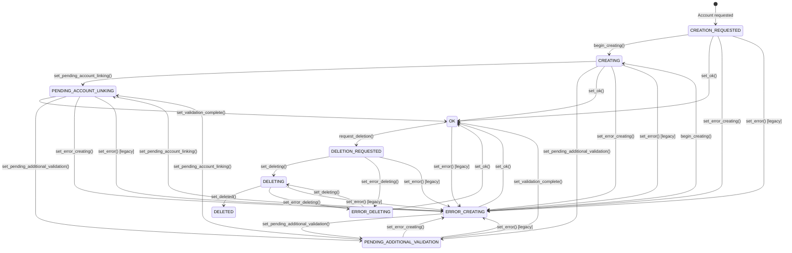
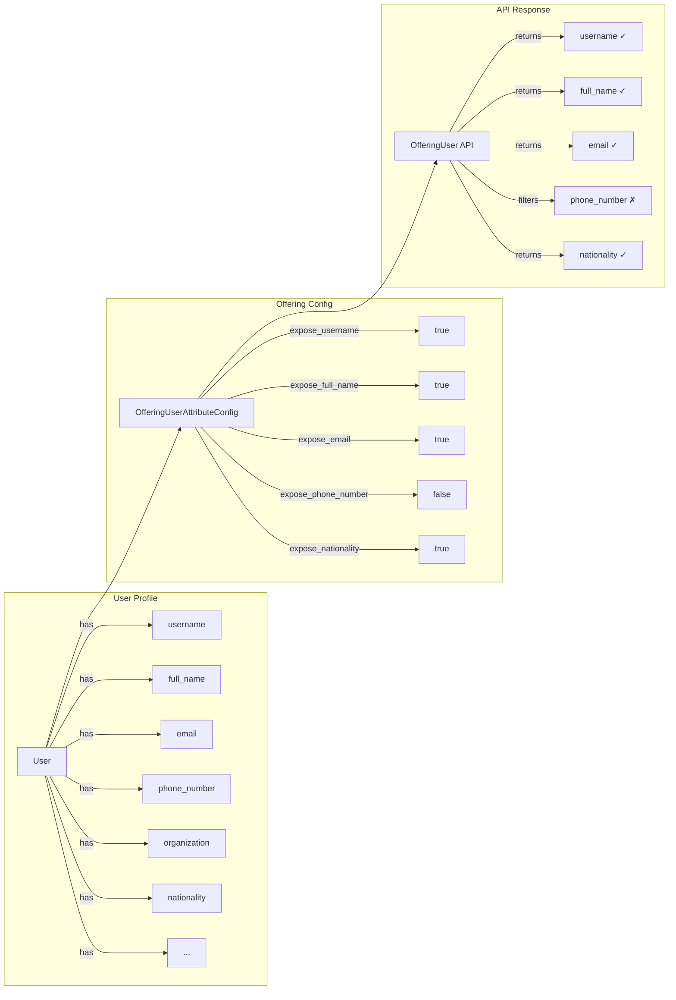

# OfferingUser States and Management

OfferingUser represents a user account created for a specific marketplace offering. It tracks two independent state dimensions:

- **Lifecycle state** (`state`): A finite state machine (FSM) tracking where the account is in the provisioning/deletion workflow.
- **Runtime state** (`runtime_state`): An operational flag the service provider can set freely to signal whether the user currently has access to the service (e.g. TOU accepted, account linked). This is independent of lifecycle and can be updated at any time except when the account is `DELETED`.

## Lifecycle States

OfferingUser has the following lifecycle states:

| State | Description |
|-------|-------------|
| `CREATION_REQUESTED` | Initial state when user account creation is requested |
| `CREATING` | Account is being created by the service provider |
| `PENDING_ACCOUNT_LINKING` | Waiting for user to link their existing account |
| `PENDING_ADDITIONAL_VALIDATION` | Requires additional validation from service provider |
| `OK` | Account is active and ready to use |
| `DELETION_REQUESTED` | Account deletion has been requested |
| `DELETING` | Account is being deleted |
| `DELETED` | Account has been successfully deleted |
| `ERROR_CREATING` | An error occurred during account creation |
| `ERROR_DELETING` | An error occurred during account deletion |

## State Transitions



## REST API Endpoints

### State Transition Actions

All state transition endpoints require `UPDATE_OFFERING_USER` permission and are accessed via POST to the offering user detail endpoint with the action suffix.

**Base URL:** `/api/marketplace-offering-users/{uuid}/`

#### Set Pending Additional Validation

```http
POST /api/marketplace-offering-users/{uuid}/set_pending_additional_validation/
Content-Type: application/json

{
  "comment": "Additional documents required for validation",
  "comment_url": "https://docs.example.com/validation-requirements"
}
```

**Valid transitions from:** `CREATING`, `ERROR_CREATING`, `PENDING_ACCOUNT_LINKING`

#### Set Pending Account Linking

```http
POST /api/marketplace-offering-users/{uuid}/set_pending_account_linking/
Content-Type: application/json

{
  "comment": "Please link your existing service account",
  "comment_url": "https://service.example.com/account-linking"
}
```

**Valid transitions from:** `CREATING`, `ERROR_CREATING`, `PENDING_ADDITIONAL_VALIDATION`

#### Set Validation Complete

```http
POST /api/marketplace-offering-users/{uuid}/set_validation_complete/
```

**Valid transitions from:** `PENDING_ADDITIONAL_VALIDATION`, `PENDING_ACCOUNT_LINKING`

**Note:** This action clears both the `service_provider_comment` and `service_provider_comment_url` fields.

#### Set Error Creating

```http
POST /api/marketplace-offering-users/{uuid}/set_error_creating/
```

**Valid transitions from:** `CREATION_REQUESTED`, `CREATING`, `PENDING_ACCOUNT_LINKING`, `PENDING_ADDITIONAL_VALIDATION`

Sets the user account to error state during the creation process. Used when creation operations fail.

#### Set Error Deleting

```http
POST /api/marketplace-offering-users/{uuid}/set_error_deleting/
```

**Valid transitions from:** `DELETION_REQUESTED`, `DELETING`

Sets the user account to error state during the deletion process. Used when deletion operations fail.

#### Begin Creating

```http
POST /api/marketplace-offering-users/{uuid}/begin_creating/
```

**Valid transitions from:** `CREATION_REQUESTED`, `ERROR_CREATING`

Initiates the account creation process. Can be used to retry creation after an error.

#### Request Deletion

```http
POST /api/marketplace-offering-users/{uuid}/request_deletion/
```

**Valid transitions from:** `OK`

Initiates the account deletion process. Moves the user from active status to deletion requested.

#### Set Deleting

```http
POST /api/marketplace-offering-users/{uuid}/set_deleting/
```

**Valid transitions from:** `DELETION_REQUESTED`, `ERROR_DELETING`

Begins the account deletion process. Can be used to retry deletion after an error.

#### Set Deleted

```http
POST /api/marketplace-offering-users/{uuid}/set_deleted/
```

**Valid transitions from:** `DELETING`

Marks the user account as successfully deleted. This is the final state for successful account deletion.

### Service Provider Comment Management

#### Update Comments

Service providers can directly update comment fields without changing the user's state:

```http
PATCH /api/marketplace-offering-users/{uuid}/update_comments/
Content-Type: application/json

{
  "service_provider_comment": "Updated instructions for account access",
  "service_provider_comment_url": "https://help.example.com/account-setup"
}
```

**Permissions:** Requires `UPDATE_OFFERING_USER` permission on the offering's customer.

**Valid states:** All states except `DELETED`

Both fields are optional - you can update just the comment, just the URL, or both.

#### Update Runtime State

```http
POST /api/marketplace-offering-users/{uuid}/update_runtime_state/
Content-Type: application/json

{
  "runtime_state": "Pending account linking",
  "service_provider_comment": "Please link your MyAccessID account",
  "service_provider_comment_url": "https://help.example.com/linking"
}
```

`service_provider_comment` and `service_provider_comment_url` are optional. Omit them to leave existing comments unchanged, or pass empty strings to clear them.

Where `runtime_state` is one of:

| Value | Meaning |
|-------|---------|
| `Active` | User can access the service normally |
| `Pending account linking` | User must link an external account (e.g. MyAccessID) before access is granted |
| `Pending additional validation` | User must complete additional validation (e.g. accept new Terms of Use) |

**Valid transitions:** Any → Any (no FSM). Can be set regardless of lifecycle `state`, except when lifecycle is `DELETED`.

**Permissions:** Requires `UPDATE_OFFERING_USER` permission on the offering's customer.

**Key use case — backfill sync:** When a service provider syncs an external system (e.g. Puhuri), they can update `runtime_state` on users already in lifecycle `OK` without touching the provisioning FSM.

### OfferingUser Fields

When retrieving or updating OfferingUser objects, the following state-related fields are available:

- `state` (string, read-only): Current lifecycle state of the user account (provisioning/deletion)
- `runtime_state` (string, read-only): Current operational/access state of the user account
- `service_provider_comment` (string, read-only): Comment from service provider for pending states
- `service_provider_comment_url` (string, read-only): Optional URL link for additional information or actions related to the service provider comment

## Runtime States

| State | Description |
|-------|-------------|
| `Active` | User has full access to the service |
| `Pending account linking` | Access blocked; user must link an external account |
| `Pending additional validation` | Access blocked; user must complete additional validation (e.g. TOU) |

### Lifecycle vs Runtime State

These two fields are independent:

| `state` (lifecycle) | `runtime_state` | Meaning |
|---------------------|-----------------|---------|
| `OK` | `Active` | Account provisioned and fully accessible |
| `OK` | `Pending account linking` | Provisioned in Waldur, but blocked in backend (e.g. MyAccessID not linked yet) |
| `OK` | `Pending additional validation` | Provisioned in Waldur, but blocked pending TOU acceptance |
| `Creating` | `Active` | Account being created; default runtime state |

The lifecycle FSM (`state`) tracks Waldur-side provisioning. The `runtime_state` tracks operational access status as reported by the service provider. Service providers should update `runtime_state` via `update_runtime_state`, and upstream consumers should read both fields from STOMP messages.

## Backward Compatibility

The system maintains backward compatibility with existing integrations:

### Automatic State Transitions

- **Username Assignment**: When a username is assigned to an OfferingUser (via API or `set_offerings_username`), the state automatically transitions to `OK`
- **Creation with Username**: Creating an OfferingUser with a username immediately sets the state to `OK`

### Legacy Endpoints

- `POST /api/marketplace-service-providers/{uuid}/set_offerings_username/` - Bulk username assignment that automatically transitions users to `OK` state

### Legacy Error State Support

For backward compatibility with existing integrations:

- **`set_error()` method**: The legacy `set_error()` method still exists and defaults to `ERROR_CREATING` state

New integrations should use the specific error states (`ERROR_CREATING`, `ERROR_DELETING`) for better error context.

## Usage Examples

### Service Provider Workflow

#### Standard Creation Flow

1. **Initial Creation**: OfferingUser is created with state `CREATION_REQUESTED`
2. **Begin Processing**: Transition to `CREATING` state
3. **Require Validation**: If additional validation needed, transition to `PENDING_ADDITIONAL_VALIDATION` with explanatory comment and optional URL
4. **Complete Validation**: Once validated, transition to `OK` state
5. **Account Ready**: User can now access the service

#### Enhanced Workflow with Comment URLs

```http
# Step 1: Start creating the account
POST /api/marketplace-offering-users/abc123/begin_creating/

# Step 2: If validation is needed, provide instructions and a helpful URL
POST /api/marketplace-offering-users/abc123/set_pending_additional_validation/
{
  "comment": "Please upload your identity verification documents",
  "comment_url": "https://portal.example.com/identity-verification"
}

# Step 3: Service provider can update instructions without changing state
PATCH /api/marketplace-offering-users/abc123/update_comments/
{
  "service_provider_comment": "Documents received. Additional tax forms required.",
  "service_provider_comment_url": "https://portal.example.com/tax-forms"
}

# Step 4: When validation is complete, transition to OK (clears comment fields)
POST /api/marketplace-offering-users/abc123/set_validation_complete/
```

#### Error Handling and Recovery

```http
# If creation fails, set appropriate error state
POST /api/marketplace-offering-users/abc123/set_error_creating/

# To retry creation after fixing issues
POST /api/marketplace-offering-users/abc123/begin_creating/

# If deletion fails, set deletion error state
POST /api/marketplace-offering-users/abc123/set_error_deleting/

# To retry deletion after fixing issues
POST /api/marketplace-offering-users/abc123/set_deleting/
```

#### Account Deletion Workflow

```http
# Step 1: Request account deletion (from OK state)
POST /api/marketplace-offering-users/abc123/request_deletion/

# Step 2: Begin deletion process (service provider starts deletion)
POST /api/marketplace-offering-users/abc123/set_deleting/

# Step 3: Mark as successfully deleted (final step)
POST /api/marketplace-offering-users/abc123/set_deleted/

# Alternative: If deletion encounters errors
POST /api/marketplace-offering-users/abc123/set_error_deleting/

# Then retry deletion process
POST /api/marketplace-offering-users/abc123/set_deleting/
```

## Permissions

State transition endpoints use the `permission_factory` pattern with:

- Permission: `UPDATE_OFFERING_USER`
- Scope: `["offering.customer"]` - User must have permission on the offering's customer

This means users need the `UPDATE_OFFERING_USER` permission on the customer that owns the offering associated with the OfferingUser.

## Filtering OfferingUsers

The OfferingUser list endpoint supports filtering by state to help manage users across different lifecycle stages.

### State Filtering

Filter OfferingUsers by their current state using the `state` query parameter:

```http
GET /api/marketplace-offering-users/?state=Requested
GET /api/marketplace-offering-users/?state=Pending%20additional%20validation
```

#### Available State Filter Values

| Filter Value | State Constant | Description |
|--------------|----------------|-------------|
| `Requested` | `CREATION_REQUESTED` | Users with account creation requested |
| `Creating` | `CREATING` | Users whose accounts are being created |
| `Pending account linking` | `PENDING_ACCOUNT_LINKING` | Users waiting to link existing accounts |
| `Pending additional validation` | `PENDING_ADDITIONAL_VALIDATION` | Users requiring additional validation |
| `OK` | `OK` | Users with active, ready-to-use accounts |
| `Requested deletion` | `DELETION_REQUESTED` | Users with deletion requested |
| `Deleting` | `DELETING` | Users whose accounts are being deleted |
| `Deleted` | `DELETED` | Users with successfully deleted accounts |
| `Error creating` | `ERROR_CREATING` | Users with errors during account creation |
| `Error deleting` | `ERROR_DELETING` | Users with errors during account deletion |

#### Multiple State Filtering

Filter by multiple states simultaneously:

```http
GET /api/marketplace-offering-users/?state=Requested&state=OK
GET /api/marketplace-offering-users/?state=Pending%20account%20linking&state=Pending%20additional%20validation
```

#### Combining with Other Filters

State filtering can be combined with other available filters:

```http
# Filter by state and offering
GET /api/marketplace-offering-users/?state=OK&offering_uuid=123e4567-e89b-12d3-a456-426614174000

# Filter by state and user
GET /api/marketplace-offering-users/?state=Pending%20additional%20validation&user_uuid=456e7890-e89b-12d3-a456-426614174001

# Filter by state and provider
GET /api/marketplace-offering-users/?state=Creating&provider_uuid=789e0123-e89b-12d3-a456-426614174002
```

#### Error Handling

Invalid state values return HTTP 400 Bad Request:

```http
GET /api/marketplace-offering-users/?state=InvalidState
# Returns: 400 Bad Request with error details
```

### Other Available Filters

The OfferingUser list endpoint also supports these filters:

- `offering_uuid` - Filter by offering UUID
- `user_uuid` - Filter by user UUID
- `user_username` - Filter by user's username (case-insensitive)
- `provider_uuid` - Filter by service provider UUID
- `is_restricted` - Filter by restriction status (boolean)
- `created_before` / `created_after` - Filter by creation date
- `modified_before` / `modified_after` - Filter by modification date
- `query` - General search across offering name, username, and user names

### Practical Filtering Examples

Here are common filtering scenarios for managing OfferingUsers:

#### Find Users Requiring Attention

```http
# Get users needing validation or account linking
GET /api/marketplace-offering-users/?state=Pending%20additional%20validation&state=Pending%20account%20linking

# Get users in creation error state
GET /api/marketplace-offering-users/?state=Error%20creating

# Get users in deletion error state
GET /api/marketplace-offering-users/?state=Error%20deleting

# Get all users with any error state
GET /api/marketplace-offering-users/?state=Error%20creating&state=Error%20deleting
```

#### Monitor Service Provider Operations

```http
# Track active creation processes for a specific provider
GET /api/marketplace-offering-users/?provider_uuid=123e4567&state=Creating

# Find successfully created accounts for a provider
GET /api/marketplace-offering-users/?provider_uuid=123e4567&state=OK
```

#### Audit and Reporting

```http
# Get all deleted accounts for audit purposes
GET /api/marketplace-offering-users/?state=Deleted

# Find restricted users across all offerings
GET /api/marketplace-offering-users/?is_restricted=true
```

## Events and Logging

State transitions generate:

- **Event logs**: Recorded in the system event log for audit purposes
- **Application logs**: Logged with user attribution for debugging and monitoring
- **STOMP messages**: Published to the `offering_user` queue for external systems (see [Event-Based Order Processing](event-based-order-processing.md#offering-user-event-messages)). `OfferingUserAttributeConfig` also gates which user profile attributes are included in STOMP event payloads.

## User Attribute Exposure Configuration

Waldur supports GDPR-compliant per-offering configuration of which user attributes are exposed to service providers. This allows organizations to declare and control what personal data is shared with each offering.

### Overview

The `OfferingUserAttributeConfig` model allows service provider administrators to configure exactly which user profile attributes are exposed when retrieving OfferingUser data via the API.



### API Endpoints

#### Get/Update Attribute Configuration

**Endpoint**: `/api/marketplace-offering-user-attribute-configs/`

```http
GET /api/marketplace-offering-user-attribute-configs/?offering_uuid={uuid}
```

```http
POST /api/marketplace-offering-user-attribute-configs/
Content-Type: application/json

{
  "offering": "https://api.example.com/api/marketplace-offerings/{uuid}/",
  "expose_username": true,
  "expose_full_name": true,
  "expose_email": true,
  "expose_phone_number": false,
  "expose_organization": true,
  "expose_nationality": true,
  "expose_civil_number": false
}
```

#### Update Existing Configuration

```http
PATCH /api/marketplace-offering-user-attribute-configs/{uuid}/
Content-Type: application/json

{
  "expose_phone_number": true,
  "expose_nationality": false
}
```

### Available Attributes

| Attribute | Default | Description |
|-----------|---------|-------------|
| `expose_username` | `true` | User's username |
| `expose_full_name` | `true` | User's full name |
| `expose_email` | `true` | User's email address |
| `expose_phone_number` | `false` | User's phone number |
| `expose_organization` | `false` | User's organization |
| `expose_job_title` | `false` | User's job title |
| `expose_affiliations` | `false` | User's affiliations |
| `expose_gender` | `false` | User's gender (ISO 5218) |
| `expose_personal_title` | `false` | Honorific title |
| `expose_place_of_birth` | `false` | Place of birth |
| `expose_country_of_residence` | `false` | Country of residence |
| `expose_nationality` | `false` | Primary nationality |
| `expose_nationalities` | `false` | All citizenships |
| `expose_organization_country` | `false` | Organization's country |
| `expose_organization_type` | `false` | Organization type (SCHAC URN) |
| `expose_eduperson_assurance` | `false` | REFEDS assurance level |
| `expose_civil_number` | `false` | Civil/national ID number |
| `expose_birth_date` | `false` | Date of birth |
| `expose_identity_source` | `false` | Identity provider source |

### Default Behavior

When no `OfferingUserAttributeConfig` exists for an offering, the system uses the `DEFAULT_OFFERING_USER_ATTRIBUTES` Constance setting, which defaults to:

```python
["username", "full_name", "email"]
```

Staff can configure system-wide defaults via `/api-auth/override-db-settings/`:

```http
PATCH /api-auth/override-db-settings/
Content-Type: application/json

{
  "DEFAULT_OFFERING_USER_ATTRIBUTES": ["username", "full_name", "email", "organization"]
}
```

### Permissions

- **View**: Users with `VIEW_OFFERING` permission on the offering
- **Create/Update**: Offering owner or customer owner

### GDPR Compliance

This feature supports GDPR Article 13/14 compliance by:

1. **Data minimization**: Only expose attributes necessary for the service
2. **Transparency**: Configuration is accessible via API for audit
3. **Purpose limitation**: Each offering declares its data processing needs
4. **Consent integration**: Can be linked to `OfferingTermsOfService` to show users what data is collected
