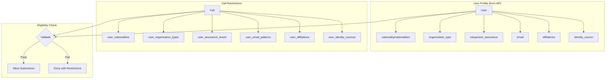
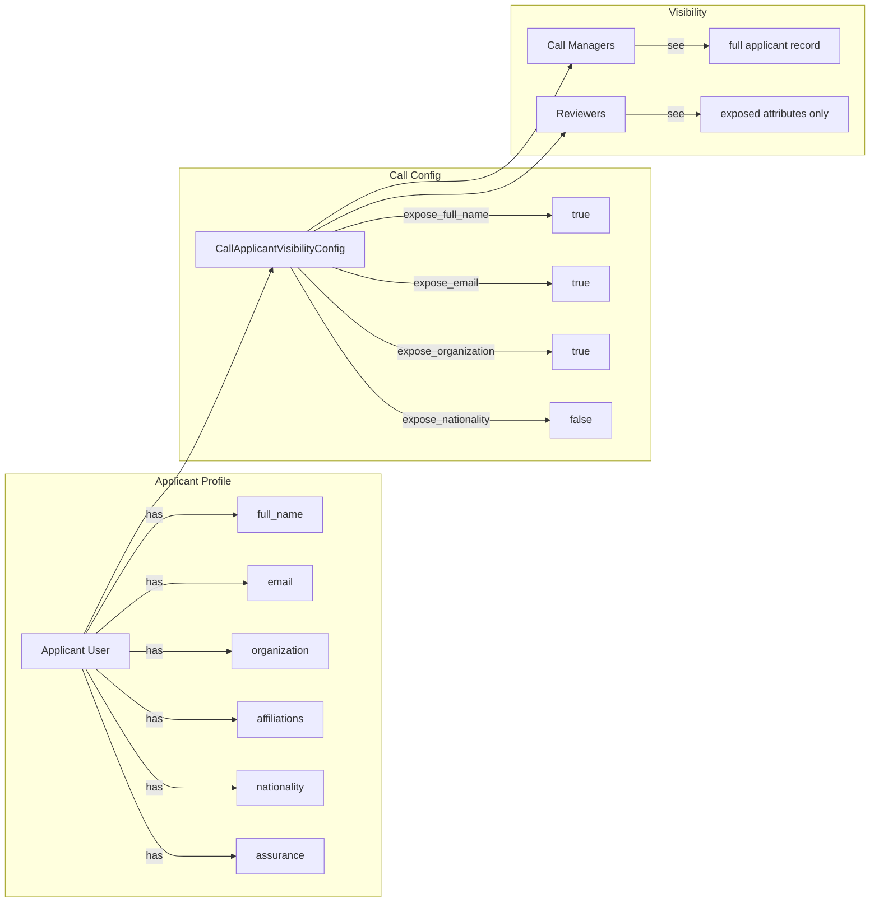

# Call Eligibility and Applicant Attribute Configuration

Waldur's proposal module supports AAI-based eligibility restrictions and GDPR-compliant applicant attribute exposure configuration. This enables call managers to control who can submit proposals and what applicant data is visible during the review process.

## Call Eligibility Restrictions

Calls for proposals can define eligibility restrictions based on user attributes sourced from identity providers (IdPs). This ensures only qualified applicants from specific institutions, countries, or assurance levels can submit proposals.

### Architecture Overview



### Restriction Fields

| Field | Type | Logic | Description |
|-------|------|-------|-------------|
| `user_nationalities` | JSON array | OR | User must have at least one matching nationality (ISO 3166-1 alpha-2) |
| `user_organization_types` | JSON array | OR | User's organization type must match one (SCHAC URN) |
| `user_assurance_levels` | JSON array | AND | User must have ALL specified assurance levels (REFEDS) |
| `user_email_patterns` | JSON array | OR | User's email must match at least one regex pattern |
| `user_affiliations` | JSON array | OR | User must have at least one matching affiliation |
| `user_identity_sources` | JSON array | OR | User must authenticate via one of the specified IdPs |

### Restriction Logic

The check is `validate_user_restrictions` in `waldur_core/permissions/utils.py`. It reads as two
stages, not as six independent allow-lists:

1. **One OR group** over email patterns, affiliations and identity sources. If none of the three
   is configured the group passes; otherwise the user needs a match in *any one* of them.
2. **Each configured AAI field is a further requirement** on top of that group. Nationalities pass
   if any of the user's nationalities is listed, organization type if the user's single
   `organization_type` is listed, and assurance if the user holds *every* listed level.

An empty field is not checked. The reading that trips people up is treating stage 1 as three
separate requirements: a call that lists both an affiliation and an email pattern admits anyone
matching either, not only applicants matching both.

### API Endpoints

#### Check Eligibility

Check if the current user can submit to a call:

```http
GET /api/proposal-public-calls/{uuid}/check_eligibility/
Authorization: Bearer {token}
```

**Response (eligible):**

```json
{
  "is_eligible": true,
  "restrictions": []
}
```

**Response (not eligible):**

```json
{
  "is_eligible": false,
  "restrictions": [
    "User nationality 'DE' is not in allowed list: ['FI', 'SE', 'NO']",
    "User does not have required assurance level: https://refeds.org/assurance/IAP/high"
  ]
}
```

#### Configure Restrictions

Restrictions are editable in the UI under **Call management → the call → Configuration →
Applicant eligibility**, which is the path a call manager should normally use. The API below is
the same write, for scripted setup:

```http
PATCH /api/proposal-protected-calls/{uuid}/
Content-Type: application/json
Authorization: Bearer {token}

{
  "user_nationalities": ["FI", "SE", "NO", "DK", "IS"],
  "user_organization_types": ["urn:schac:homeOrganizationType:int:university"],
  "user_assurance_levels": ["https://refeds.org/assurance/IAP/medium"],
  "user_email_patterns": [],
  "user_affiliations": [],
  "user_identity_sources": []
}
```

### Examples

#### Nordic Universities Only

```json
{
  "user_nationalities": ["FI", "SE", "NO", "DK", "IS"],
  "user_organization_types": [
    "urn:schac:homeOrganizationType:int:university",
    "urn:schac:homeOrganizationType:int:research-institution"
  ]
}
```

#### High Assurance Required

```json
{
  "user_assurance_levels": [
    "https://refeds.org/assurance/IAP/high",
    "https://refeds.org/assurance/ID/eppn-unique-no-reassign"
  ]
}
```

#### Specific Federation Members

```json
{
  "user_identity_sources": ["haka", "swamid", "feide"],
  "user_email_patterns": [".*@(helsinki\\.fi|kth\\.se|uio\\.no)$"]
}
```

## Applicant Attribute Exposure Configuration

The `CallApplicantVisibilityConfig` model controls which applicant attributes are visible to
reviewers during evaluation. This supports GDPR compliance and anonymous review workflows.

It replaced the older `CallApplicantAttributeConfig`, which was dropped in migration
`0050_remove_callapplicantattributeconfig`. That migration also retired
`reviewers_see_applicant_details`: a legacy row with it set to `False` was carried forward with
every `expose_*` flag forced off, so anonymity is now expressed by the per-attribute toggles
alone rather than by one master switch.

### Overview



### Configuration Fields

The toggles come from the shared `UserAttributeConfigBase`
(`waldur_mastermind/marketplace/models.py`), which the offering-user configuration also uses.
Every personal-data field on that base follows the `expose_<attribute>` convention and is
available on a call. The ones that matter for proposal review:

| Field | Model default | Description |
|-------|---------------|-------------|
| `expose_full_name` | true | Show applicant's full name |
| `expose_email` | true | Show applicant's email address |
| `expose_username` | true | Show applicant's username |
| `expose_registration_method` | true | Show how the applicant registered |
| `expose_organization` | false | Show applicant's organization |
| `expose_affiliations` | false | Show applicant's affiliations list |
| `expose_organization_type` | false | Show organization type (SCHAC URN) |
| `expose_organization_country` | false | Show organization's country |
| `expose_nationality` | false | Show primary nationality |
| `expose_nationalities` | false | Show all nationalities |
| `expose_country_of_residence` | false | Show country of residence |
| `expose_eduperson_assurance` | false | Show assurance levels |
| `expose_identity_source` | false | Show identity provider |

The base carries further toggles — phone number, job title, civil number, birth date, postal
address, organization registry and VAT codes, and the POSIX `uid_number`/`primary_gid` — which
are accepted on a call for completeness. Consult the model rather than this table when you need
the exhaustive list.

The *model* defaults above only apply to a row written field by field. In practice a call with
no stored row falls back to the Constance setting `DEFAULT_CALL_USER_ATTRIBUTES`
(`["username", "full_name", "email"]` out of the box) and its serialized config reports
`"is_default": true`; and the first write to a call seeds every toggle from that same setting
before applying what was sent, so an unmentioned attribute is not silently exposed by a
model-level `default=True` (`get_default_exposure_flags`).

### API

There are no dedicated attribute-configuration endpoints. The configuration is a nested object
on the protected call, read with the call and written with it — in the UI, under **Call
management → the call → Configuration → Applicant data visibility**.

#### Read

```http
GET /api/proposal-protected-calls/{uuid}/
Authorization: Bearer {token}
```

The response carries `applicant_visibility_config`:

```json
{
  "uuid": "def456...",
  "name": "Nordic HPC Call 2025",
  "applicant_visibility_config": {
    "uuid": "abc123...",
    "created": "2026-01-15T09:12:44Z",
    "modified": "2026-01-15T09:12:44Z",
    "expose_full_name": true,
    "expose_email": true,
    "expose_username": true,
    "expose_registration_method": true,
    "expose_organization": true,
    "expose_affiliations": false,
    "expose_organization_type": false,
    "expose_organization_country": false,
    "expose_nationality": true,
    "expose_nationalities": false,
    "expose_country_of_residence": false,
    "expose_eduperson_assurance": false,
    "expose_identity_source": false,
    "exposed_fields": ["full_name", "email", "username", "registration_method", "organization", "nationality"],
    "is_default": false
  }
}
```

When the call has no stored configuration, `to_representation` serializes an unsaved instance
from the Constance defaults instead, marked `"is_default": true`.

#### Update

```http
PATCH /api/proposal-protected-calls/{uuid}/
Content-Type: application/json
Authorization: Bearer {token}

{
  "applicant_visibility_config": {
    "expose_full_name": true,
    "expose_email": true,
    "expose_organization": true,
    "expose_nationality": true,
    "expose_organization_country": true
  }
}
```

The nested object is a partial update like any other: toggles left out keep their stored value.
Sending `"applicant_visibility_config": null` is how a call reverts to the installation defaults.

### Permissions

Writing either the eligibility restrictions or the visibility configuration requires the
`UPDATE_CALL` permission on the call, which is what the protected call endpoint enforces.

## Use Cases

Each example below is the body of a `PATCH /api/proposal-protected-calls/{uuid}/`.

### Anonymous Peer Review

For double-blind review, expose nothing that identifies the applicant:

```json
{
  "applicant_visibility_config": {
    "expose_full_name": false,
    "expose_email": false,
    "expose_username": false,
    "expose_organization": false
  }
}
```

Call managers still see the full applicant record; the configuration governs what reviewers see.

### Nationality-Based Eligibility Tracking

For calls requiring nationality verification, restrict who may apply and expose the attributes a
reviewer needs to check the claim — two different fields on the same request:

```json
{
  "user_nationalities": ["FI", "SE", "NO"],
  "applicant_visibility_config": {
    "expose_nationality": true,
    "expose_nationalities": true,
    "expose_country_of_residence": true
  }
}
```

### High-Trust Research Calls

Strong identity assurance, with the evidence visible during evaluation. Every listed assurance
level is required, so this admits only applicants whose IdP asserts both:

```json
{
  "user_assurance_levels": [
    "https://refeds.org/assurance/IAP/high",
    "https://refeds.org/assurance/ID/eppn-unique-no-reassign"
  ],
  "applicant_visibility_config": {
    "expose_eduperson_assurance": true,
    "expose_identity_source": true
  }
}
```

## When Eligibility Is Enforced

`validate_user_restrictions` runs in `ProposalViewSet.perform_create` — that is, when the
proposal is created. Two consequences:

- A draft started before a restriction was added is not re-checked when it is submitted. Adding
  a restriction to a call that already has drafts does not retract them.
- Eligibility does not govern who may join the awarded project. It gates proposal creation only;
  project membership is governed by the project's own restrictions and invitations.

`GET /api/proposal-public-calls/{uuid}/check_eligibility/` runs the same validation without
creating anything, which is what the applicant-facing UI uses to explain a call it cannot apply
to.

## Integration with User Profile Attributes

The eligibility and attribute exposure features build on Waldur's extended user profile attributes. See [User Profile Attributes](../user-profile-attributes.md) for details on:

- AAI attribute sources (OIDC claims)
- ISO and SCHAC standards
- REFEDS assurance profiles

## Related Documentation

- [Proposals Overview](./proposals.md) - Core proposal module architecture
- [Conflict of Interest Detection](./proposals-coi.md) - COI management
- [Reviewer Matching](./proposals-matching.md) - Reviewer assignment algorithms
- [User Profile Attributes](../user-profile-attributes.md) - User attribute reference
