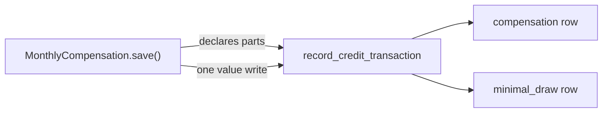

# Credit ledger

`CreditTransaction` is an append-only record of every change to a credit
balance — `CustomerCredit` for an organization, `ProjectCredit` for a project
allocation. It answers two questions that nothing else in the system can:
how much of a credit was *withdrawable* (see
[Affiliate program](affiliate-program.md)), and where the credit *went*.

## Why the invoice items are not enough

A month of compensation moves a balance twice, in one write:

- against real usage, which leaves a negative `InvoiceItem`;
- to top that draw up to the minimal-consumption floor, which leaves nothing at
  all — the value simply drops.

So anything reconstructing history from invoice items sees only the first
movement. "Used", "Lost", "Last month drew" and the consumption chart all read
about half the money, and a figure derived as
`lost = max(0, |compensation| − incurred)` is structurally zero, because a
compensation never exceeds the cost it offsets.

The ledger records both movements, which makes the balance reconcile:

```text
granted = used + lost + remaining
```

where `remaining` is the credit's current `value`.

## Transaction types

| Type | Meaning |
|------|---------|
| `staff_grant` | An untyped write — staff UI, REST, shell. The conservative default. |
| `compensation` | Credit given up against real usage. |
| `minimal_draw` | Credit given up to reach the minimal-consumption floor: the "Lost" figure, spent without buying anything. |
| `affiliate_fee` | A fee earned by referring another organization. |
| `transfer_in` / `transfer_out` | Credit moved between organizations. |
| `payout` | Earned credit paid out of the platform. |
| `expiry` | The balance zeroed because its end date passed. |
| `rollback` | A month's compensation reversed, before it is re-applied. |
| `adjustment` | A correction that is not withdrawable. |
| `withdrawable_adjustment` | A staff correction of the withdrawable part. |

## How a row is written

A `post_save` handler on both credit models computes the delta from the
model's `FieldTracker` and writes a row. Ledger writes are never suppressed —
unlike the audit events, which flows can silence to avoid duplicates — because
the withdrawable balance and the drawdown history are derived from them.

The *semantic type* comes from the innermost
`ledger.credit_transaction_type(...)` block. A flow that does not declare one
has its write recorded as a staff grant rather than skipped, so an untyped path
degrades to a conservative default instead of leaving a gap.

### One write, two kinds of movement

Compensation applies both the usage draw and the floor draw in a single `value`
write, so a single type cannot describe it. Saving twice was rejected: it fires
the policy `post_save` receivers twice and briefly exposes an intermediate
balance to policy evaluation.

Instead the writer *declares the breakdown* of the delta it is about to apply,
with `ledger.credit_transaction_parts(...)`, and the handler emits one row per
part:



Two properties make this safe to rely on:

- **The split is measured, not inferred.** The compensation flow records what
  each balance gives up at the point of each subtraction, rather than deriving
  it from the invoice items afterwards. The last partial compensation of an
  exhausted credit is written net of tax, so the item and the balance movement
  genuinely differ there.
- **A breakdown that does not add up is refused.** If the parts do not sum to
  the delta, the handler logs a warning and records the movement as a single
  row instead, so the ledger never states a split it cannot back. The row still
  takes its type from the enclosing `credit_transaction_type` block — declare
  both, or a refusal degrades to an untyped staff grant.

## Billing period

`billing_period` is the first day of the month a movement *belongs to*, which is
not the month it was recorded in. It is a real column rather than the
`reference` generic foreign key, because dashboards group drawdown by month in
SQL and a generic foreign key cannot be grouped on.

Movements that reverse or re-state a month carry that month, not the day they
ran. Applying compensations is a roll-back followed by a re-application, and
staff can run it against a pending invoice repeatedly; an undated roll-back
would leave every superseded run standing in its month, and the month would
report its drawdown once per run.

Grants, expiry and transfers belong to no month and leave it empty.

## Attribution outlives the allocation

`ProjectCredit` is deleted outright when its project is removed, so the row
cannot rely on the foreign key alone. `project_credit` is `SET_NULL`, and the
project's uuid and name are denormalised onto the row — a ledger that loses its
attribution on a delete is not a ledger.

## Reading the ledger

`GET /api/credit-transactions/` is read-only and scoped by role: staff see
every row, an organization owner sees their organization's rows on either
balance, and project roles see their own project's drawdown.

| Filter | Selects |
|--------|---------|
| `customer_uuid` | Rows on either balance belonging to that organization |
| `credit_uuid` | Rows on one organization credit |
| `project_credit_uuid` | Rows on one project allocation |
| `project_uuid` | A project's rows, including those whose allocation is gone |
| `transaction_type` | One type |
| `billing_period` | One month |
| `billing_period_after` / `billing_period_before` | A range of months |

Ordering is available on `created` and `billing_period` via `o`.

Note that `project_uuid` filters the denormalised column rather than the
allocation, which is what keeps a deleted project's history queryable.

## Append-only

Rows are never edited or deleted: the ledger is the source of truth for the
withdrawable balance, and corrections are new rows.

The single exception is
[backfilling history that predates the ledger](admin/credit-ledger-backfill.md),
where `--force` deletes and rewrites the rows that command itself wrote. It
touches nothing else, and reconstructed rows are labelled as such.
