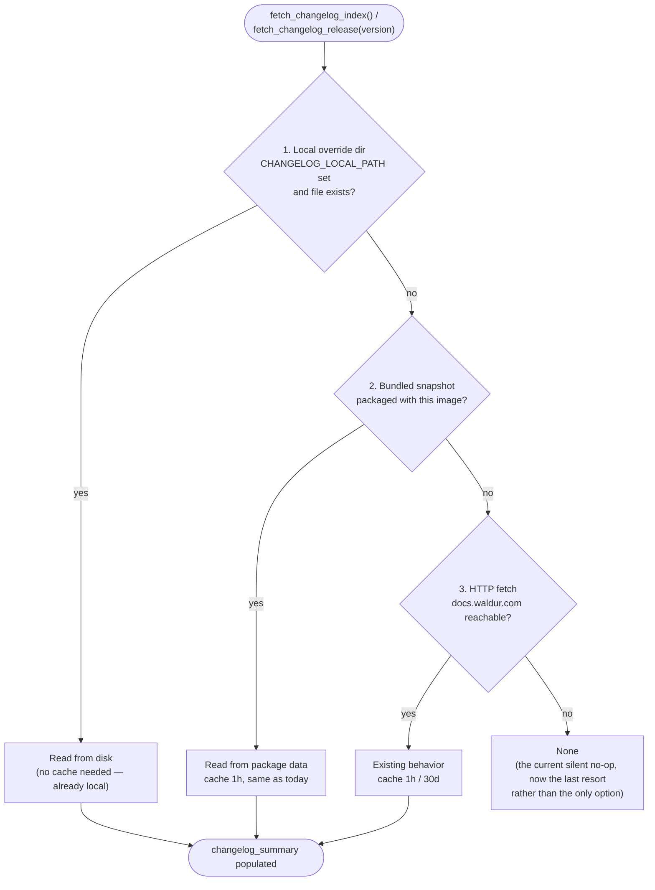

# Changelog support for offline / airgapped deployments

Status: **proposal** — not implemented. Builds on [the changelog
system](../changelog-system.md) (WAL-9853), which this note assumes as given.

## Problem

`fetch_changelog_index()` / `fetch_changelog_release()`
(`waldur_core/changelog/utils.py`) hit
`https://docs.waldur.com/latest/changelog/...` over HTTPS. The legacy
fallback, `get_latest_github_tag()`, hits
`api.github.com`. Both wrap their request in `try/except RequestException` and
return `None` on failure, so a deployment with no egress to either host
doesn't crash — `/api/version/` just returns `{"version": "..."}` with no
`changelog_summary`, no `latest_version`, no security banner.

That's a silent no-op, not a working feature. It also inverts the risk profile:
airgapped deployments — the ones least able to casually check "what changed
upstream" some other way — are exactly the ones this degrades for.

## Goals

- A deployment with zero outbound access still gets `changelog_summary`,
  `security_alert`, and `/api/changelog/pending/` populated, scoped to
  whatever changelog data it actually has on hand.
- Deployments that *do* have some path to fetch updates (an internal mirror,
  a periodic sync job, a side-loaded file) can use it without code changes.
- No regression for the common case (direct internet access to
  docs.waldur.com) — this is additive.

## Non-goals

- Making offline deployments learn about releases that happened *after* their
  last data refresh, without some operator action. There's no way around that
  without a network path of some kind, even an indirect one (sneakernet,
  scheduled sync from a jump host).
- A generic plugin system for changelog data sources. Three concrete sources
  (below) cover the realistic cases; more can be added later if needed.

## Design: three-tier lookup

Insert two sources ahead of the existing HTTP fetch, checked in order, first
hit wins:

1. **Local override directory.** A path (`WALDUR_CORE["CHANGELOG_LOCAL_PATH"]`,
   e.g. mounted from a ConfigMap or a plain volume) checked first, so an
   operator can refresh data by dropping newer `index.json` /
   `releases/{version}.json` files in without a redeploy or code change. No
   cache layer needed here — reading a local file is already cheap, and it
   lets an operator's own sync job (cron, `rsync`, CI artifact) take effect
   immediately instead of waiting out the 1h cache.
2. **Bundled snapshot.** `changelog/index.json` + `changelog/releases/*.json`
   as of build time, shipped as package data inside the image (same tree
   `assemble_changelog` already writes to — no new format). An 8.0.7 image
   knows everything that was true when 8.0.7 was built. It can't discover an
   8.0.9 that shipped later without a new image or tier 1 — that's the
   fundamental limit of "no network," not a gap in this design.
3. **HTTP fetch.** Unchanged — today's behavior, now the last resort instead
   of the only option.

Each tier already produces data in the same shape (`index.json` /
per-version release JSON per `changelog/schema.json`), so
`build_changelog_summary()`, `enrich_entries_with_relevance()`,
`compute_changelog_impact`, and every API view are untouched. This is purely a
sourcing change inside `fetch_changelog_index()` / `fetch_changelog_release()`.

## Alternatives considered

| Option | Trade-off |
|---|---|
| **Configurable `CHANGELOG_BASE_URL` only** (point HTTP at an internal mirror) | Simplest code change — one constant becomes a setting. But it's still "HTTP or nothing": an operator with literally zero egress (not even to an internal-only mirror reachable from the pod) gets nothing, and it doesn't help the zero-config case ("this should say something useful out of the box"). |
| **Bundled snapshot only** (tier 2, no tier 1) | Works out of the box, no operator setup. But there's no way to refresh it short of shipping a new image, even for operators who *do* have some side-channel (e.g. they already push new images through an internal registry and could push refreshed JSON the same way). |
| **Local override only** (tier 1, no tier 2) | Fully flexible, but a fresh install has nothing until an operator configures it — worse zero-config behavior than today's HTTP-only design for deployments that *do* have internet. |
| **Three-tier (this proposal)** | Covers both the zero-config case (bundled) and the "operator wants control" case (local override), at the cost of one more branch in two already-simple functions. |

`CHANGELOG_BASE_URL` becoming a setting (first bullet) is worth doing
regardless, orthogonal to tiers — it costs nothing and helps the "internal
mirror instead of docs.waldur.com" case even for deployments that do have
some internal network access.

## Concrete changes

- `waldur_core/changelog/utils.py`
  - `fetch_changelog_index()` / `fetch_changelog_release(version)`: try
    `CHANGELOG_LOCAL_PATH` (if set), then bundled package data, then HTTP —
    same public signature, same return shape.
  - `CHANGELOG_BASE_URL` becomes `settings.WALDUR_CORE.get("CHANGELOG_BASE_URL", "https://docs.waldur.com/latest/changelog")`.
- New `WALDUR_CORE` settings: `CHANGELOG_LOCAL_PATH` (default unset — tier 1
  skipped unless configured).
- Packaging: bundling the snapshot means the release pipeline that already
  writes `changelog/releases/{version}.json` (see [Release Script
  Integration](../changelog-system.md#release-script-integration)) also needs
  to land in the built package/image — likely `MANIFEST.in` / `pyproject.toml`
  package-data entry, no new generation step.
- `waldur-helm` / `waldur-docker-compose`: document `CHANGELOG_LOCAL_PATH` as
  an optional mount point, not a mandatory one (existing deployments need no
  changes) — the **packaging-config** skill's mandatory-config checklist
  doesn't apply here.

## Open questions

- Does the bundled snapshot need `assemble_changelog` to also copy the latest
  N releases (not just the current one) into package data, so a fresh
  install's `changelog_summary` can show `versions_behind > 1` immediately
  after an offline upgrade skips several versions? Or is "what changed since
  the version this image replaces" (typically one hop) enough?
- Should `compute_changelog_impact`'s Celery trigger in `version_detail` be
  skipped when the *only* available source is the bundled snapshot, since
  there's nothing new to learn between fixed-at-build-time data refreshes
  (the 24h re-run in `_trigger_impact_analysis_if_needed` would just repeat
  the same query on unchanged data until the next image)?
