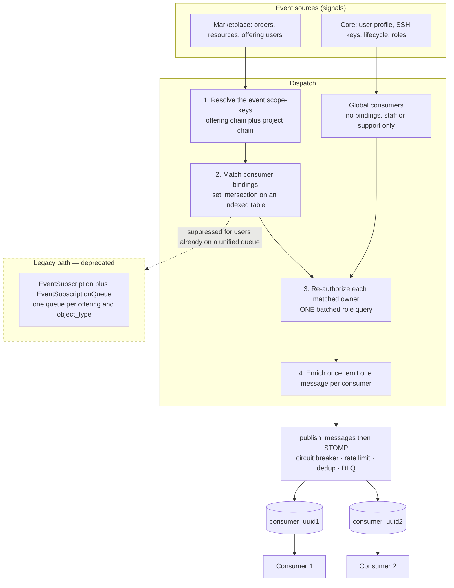

# Event pub/sub architecture

How Waldur delivers events to external consumers: one RabbitMQ queue per
consumer, scoped by entity bindings, with authorization re-checked at publish
time.

This describes the system **as it is built**. Runtime mechanics for site agents
(registration calls, STOMP connection, payload examples, migration runbook) live
in [the unified agent queue guide](../guides/agent-pubsub.md).

## Overview

A signal fires once. The dispatcher resolves which **scope-keys** the event
belongs to, matches consumers whose **bindings** intersect those keys,
re-authorizes each matched owner, enriches the payload once, and emits one
message per consumer. Each consumer drains exactly one queue and demultiplexes
on the envelope's `object_type`.

## The consumer model

`waldur_core.logging.EventConsumer` owns all unified-queue state:

| Field | Meaning |
|-------|---------|
| `user` | Owner/registrant; the RabbitMQ vhost is `user.uuid.hex` |
| `rmq_username` | RMQ login (random UUID hex), blank until provisioned |
| `queue_created` | Whether the queue exists in RMQ |
| `object_types` | Allow-list of event types (empty = all) |
| `scopes` | Entity bindings — see below |

The queue is `consumer_{uuid}`. A consumer is **generic**: a site agent, an
IdM/IGA sync, the keycloak operator, or a reporting script can each own one.
Site agents link theirs from `AgentIdentity.event_consumer` (a nullable
OneToOne); `AgentIdentity` itself is purely site-agent registration and
telemetry — `AgentService`, `AgentProcessor` and `SiteAgentLog` keep their names
and their home in the `marketplace_site_agent` plugin.

## Scope bindings

`EventConsumerScope(consumer, content_type, object_id)` binds a consumer to a
**list** of entities — an offering, several projects, a customer — using
GenericForeignKeys, which is what keeps `waldur_core` free of marketplace
imports.

| Bindings | Meaning |
|----------|---------|
| one offering | the classic site-agent case |
| projects, a customer, or a mix | a slice the owner has access to |
| **empty** | **global: everything platform-wide — user-centric events (all-user PII) AND marketplace events. Staff/support only.** |

Bindings use the same vocabulary as Personal Access Tokens (`TYPE_MAP`,
`AllowedScopeInputSerializer`), so `{"type": "project", "uuid": "..."}` means the
same thing in both features.

> **An empty binding set means global.** A consumer left without bindings by a
> partial write would therefore fail *open* as an all-user PII firehose. Both
> registration paths create the consumer and its bindings in one transaction.

## Dispatch and delivery authorization

An event's **scope-keys** are the `(content_type, object_id)` pairs it belongs
to: the offering's own chain (offering, its project, that project's customer,
the offering's customer) plus the consumer-side project chain derived from the
order or resource. Matching is a set intersection against the indexed
`EventConsumerScope` table, so a consumer bound anywhere in that chain matches —
binding to a *customer* picks up its projects' events.

Authorization is enforced **twice**, and stays dynamic:

1. **At registration** — you may only bind to an entity you hold an active role
   on, or on one of its ancestors (`holds_any_role_on_scope_or_ancestor`).
   Staff/support may bind to anything, and are the only ones allowed to request
   the empty (global) binding set.
2. **At delivery** — the same rule is re-checked for every matched consumer, in
   **one batched query for the whole fan-out**
   (`users_with_role_on_any_scope_key`). Global consumers are re-checked for
   staff/support.

Registration is therefore not a permanent grant: **revoking someone's role stops
their delivery immediately.**

Two properties make this work:

- `get_scope_ancestors(offering)` yields exactly what
  `OfferingQuerySet.filter_for_user` ORs over, so the binding predicate is the
  *same* rule the rest of the platform uses for offering visibility. The unified
  path is therefore never narrower than the legacy path it replaces — a plain
  project member can subscribe to their project's events.
- Because it is one batched query rather than a permission query per recipient,
  the dynamic check is also *cheaper* than the per-recipient `filter_for_user`
  it replaced.

Client-side filtering (`object_types`) is a convenience knob, never a security
boundary.

### A deliberate divergence from the legacy rule

The legacy consumer-access check only resolved a customer when the project still
had a non-terminated resource on the offering. Scope-keys are derived straight
from the order or resource, so that narrowing is gone: a project-bound consumer
now also receives the event for its *last* resource being terminated, which the
legacy path dropped. Treated as a bug fix; see `_resolve_event_project`.

## Event types and payloads

| Coverage | Trigger | `object_type` |
|----------|---------|---------------|
| Orders, resources, offering users, service and course accounts, importable resources, periodic limits | marketplace signals | `order`, `resource`, `offering_user`, … |
| Role changes on **any** scope | `role_granted` / `role_revoked` | `user_role` |
| Profile fields | `User` post_save diff | `user_profile` |
| SSH keys | `SshPublicKey` post_save / post_delete | `user_ssh_key` |
| Account lifecycle | user create, activate, deactivate, delete | `user_lifecycle` |

The user-centric events originate in `waldur_core` (User, SSH keys, roles), so
they are dispatched from `waldur_core.logging.event_dispatch` and delivered to
**global consumers**. A global (empty-scope) consumer means "everything": it
also receives the marketplace events (orders, resources, offering users, …)
through the marketplace dispatcher, which opts globals in via
`build_messages(include_global=True)`. The single care point is `user_role`,
which BOTH dispatchers can emit — the core path on the `role_granted`/`role_revoked`
signal, the marketplace path on a manual project re-sync. To avoid delivering it
to a global twice, the core path owns `user_role` for globals and the
marketplace path passes `include_global=False` for `user_role` only; every other
object type is emitted by exactly one path, so a global receives it once.
Suppression of a user's legacy subscription is keyed on messages actually
delivered, so a global that genuinely receives a marketplace event correctly
supersedes its own legacy queue for it. Payloads are built lazily — construction
runs only when a consumer actually exists — and every emitter is guarded by
`get_skip_side_effects()` so imports, migrations and bulk loads stay silent.

**Profile events are data-minimized.** The broadcast field set is derived from
`ENABLED_USER_PROFILE_ATTRIBUTES` (plus always-on core fields such as email and
name), so an attribute an operator disabled never leaves the platform, and
newly-enabled ones are picked up automatically. `is_active` is deliberately
excluded — it belongs to the lifecycle event. Auth and security columns are
never eligible.

### Envelope

Messages carry `object_type` so one queue can serve many event kinds, plus
`schema_version`. The core dispatcher additionally stamps `event_type`.
Marketplace events carry `object_type`, `offering_uuid` and `schema_version`,
but not `event_type` (only the core dispatcher stamps it) — see
[Known gaps](#known-gaps).

## Credentials and queue lifecycle

The RMQ password is the credential the consumer presents: if it registered with
a **Personal Access Token**, that PAT is the password, so the queue survives a
browser logout or session-token rotation (the raw secret is read from the
request header — only its hash is stored). A caller still using a plain session
token keeps the DRF token as the password.

Queues are provisioned with the hardened arguments the legacy path uses —
`x-message-ttl` (1h), `x-max-length` (10 000), `reject-publish-dlx` overflow and
a DLQ — and registration is idempotent, reconciling stale RMQ state.

Housekeeping tasks operate on `EventConsumer` regardless of binding:

- `cleanup_stale_agent_queues` (24h) — tears down consumers whose owner holds
  neither a live DRF token nor a live PAT.
- `cleanup_dangling_agent_queues` (1h) — clears `queue_created` when the backing
  RMQ user vanished out of band.
- `cleanup_orphan_subscription_queues` (6h) — deletes `consumer_*` queues with
  no matching row.
- `pre_delete` handlers tear down RMQ state for both agent-linked and standalone
  consumers.

## Registration

- **Site agents** — `POST /api/marketplace-site-agent-identities/{uuid}/register_queue/`
  creates the consumer bound to the agent's offering. Permissions are unchanged
  (`_can_manage_offering_agent`), and ownership is one-user-at-a-time (409 on
  takeover).
- **Everything else** — `POST /api/event-consumers/register/` takes
  `object_types` and `scopes`. Any authenticated user may register a *bound*
  consumer; an empty `scopes` list requires staff/support. Idempotent per
  binding set.

## The legacy path

`EventSubscription` plus `EventSubscriptionQueue` — one queue per
*(subscription × offering × object_type)* — still runs, unchanged, so existing
consumers keep working. Its endpoints are marked `deprecated` in the OpenAPI
schema, and therefore in the generated SDKs.

The two paths never double-deliver: a user who owns a unified queue is
suppressed from the legacy loop, so every consumer is on exactly one path.

Retirement — the migration command, drain telemetry, and the removal itself — is
tracked in **WAL-10111**, gated on drain-to-zero rather than a date, because
removal is a breaking change for anyone still on the legacy endpoints.
Site-agent adoption of the unified queue is tracked in **WAL-10011**.

## Why it is built this way

**App-side fan-out, not broker-native routing.** A topic exchange with routing
keys was considered and rejected: routing keys are static, but Waldur's
authorization is dynamic and revocable, so the broker cannot answer "may this
consumer see this event *now*". Recipient resolution therefore happens
server-side at publish time. The cost of that choice is CPU and queries per
event, which is why matching is a set intersection and the re-auth is batched.

**Bindings normalized, not JSON.** `PersonalAccessToken` stores `allowed_scopes`
as JSON because enforcement checks *one* token per request. Pub/sub is the
inverse problem — one event matched against *many* consumers — so bindings live
in an indexed table the dispatcher can intersect against.

**No new permissions.** "What you may subscribe to" is already defined by "what
you have access to", so binding validation reuses existing roles rather than
introducing `SUBSCRIBE_*` permissions that would have to be kept in sync.

## Known gaps

- **Envelope** — marketplace events do not carry `event_type` (only the core
  dispatcher stamps it); they do carry `object_type`, `offering_uuid` and
  `schema_version`.
- **Bindings inherited from a PAT** — a consumer registered with a PAT could
  default its bindings to that token's `allowed_scopes`, making API access and
  event delivery share one definition. Unblocked now that bindings exist; not
  built.
- **`call` bindings** work by construction (any `TYPE_MAP` entity is bindable)
  but are untested.
- **`AgentIdentity` retirement** — the site-agent model still exists alongside
  its consumer; collapsing it is only worthwhile once the legacy path is gone.

## References

- Azure Architecture Center — [Messaging in multitenant solutions](https://learn.microsoft.com/en-us/azure/architecture/guide/multitenant/approaches/messaging)
  (shared vs sharded vs dedicated; noisy-neighbour handling).
- Permit.io — [Multi-tenant authorization best practices](https://www.permit.io/blog/best-practices-for-multi-tenant-authorization)
  (auth global, authz tenant-scoped, evaluated dynamically).
- CS Virginia — [Content-based publish/subscribe survey](https://www.cs.virginia.edu/~hs6ms/publishedPaper/bookChapter/2009/sub-pub-Shen.pdf)
  and [Confidentiality-preserving pub/sub survey](https://arxiv.org/pdf/1705.09404)
  (content-based filtering is more expressive — matches dynamic-authz fan-out).
- Solace — [Designing and naming topics for EDA](https://solace.com/blog/designing-and-naming-topics-for-event-driven-architecture-with-pubsub/)
  (hierarchical, versioned envelopes).
