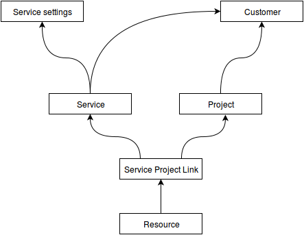
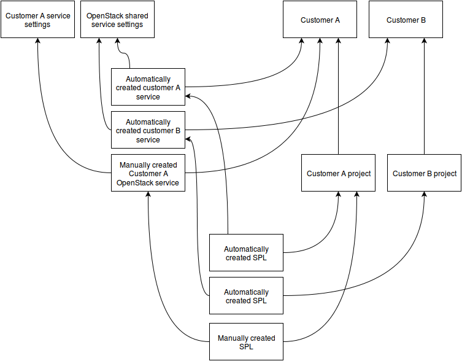

Customers, projects, services, resources and users
--------------------------------------------------

Waldur is a service for sharing resources across projects. It is based on the delegation model where a customer
can allocate certain users to perform technical or non-technical actions in the projects.

Glossary
++++++++

.. glossary::

    User
      An account in Waldur belonging to a person or a robot. A user can belong to project or customer
      that can grant him different roles.

    Customer
      A standalone entity. Represents a company or a department.

    Customer owner
      A role of the user that allows her to represent a corresponding customer. In this role, a user can create new
      projects, register resources, as well as allocate them to the projects.

    Service settings
      Represents an account of particular cloud service, for example, AWS, OpenStack, GitHub or Oracle.
      Account credentials must provide full access to service API. It is possible to mark service settings as "shared"
      and they will be automatically connected to all customers (service that is "available for all" will be created
      as connection between service settings and customer).

    Service property
      Represents any properties of cloud service usually used for a resource provisioning.
      For example: image and flavor in OpenStack or zone and template in Oracle.

    General service property
      Represents any property of a service that is not connected to service settings.

    Project
      A project is an entity within a customer. Project has a linked group of users collaborating on work - 'project
      administrators'. Project aggregates and isolates resources. A customer owner can allow usage of certain clouds
      within a project - defining what resource pools project administrators can use.

    Project administrator
      A project role responsible for the day-to-day technical operations within a project.
      Limited access to project management and billing.

    Project manager
      An optional non-technical role that a customer can use to delegate management of certain projects to selected
      users. Project manager can create new projects and manage administrators within a scope of a certain project.

    Resource
      A resource is a provisioned entity of a service, for example, a VM in OpenStack or AWS, a repository in GitHub
      or a database in Oracle. Each resource belongs to a particular project.

Architecture
++++++++++++

Relationships between customers and services:

Example of shared settings and private service:
 - OpenStack service settings - shared settings, that are available for all customers.
 - Private Customer A service with separate settings - available only for customer A.

