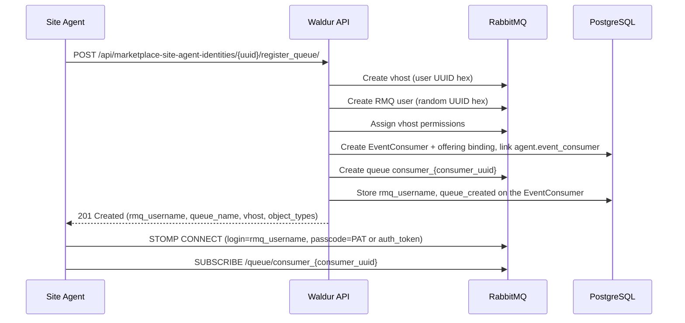
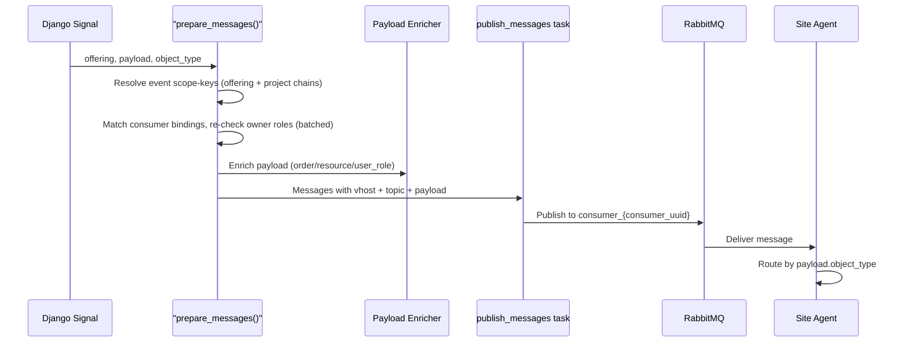

# Unified Agent Queue (Pubsub)

## Overview

The unified agent queue simplifies how site agents receive STOMP messages from Waldur. Instead of creating separate RabbitMQ queues for each combination of offering and object type (the legacy approach), agents register a single queue that receives all event types. Routing is done by the agent based on `object_type` in the payload.

## Architecture Comparison

```mermaid
graph TD
    subgraph Legacy Path
        W1[Waldur] -->|order| Q1[subscription_X_offering_Y_order]
        W1 -->|user_role| Q2[subscription_X_offering_Y_user_role]
        W1 -->|resource| Q3[subscription_X_offering_Y_resource]
        Q1 --> A1[Agent]
        Q2 --> A1
        Q3 --> A1
    end

    subgraph Unified Path
        W2[Waldur] -->|all events| Q4["consumer_&#123;consumer_uuid&#125;"]
        Q4 --> A2[Agent]
        A2 -->|routes by object_type| A2
    end
```



| Aspect | Legacy | Unified |
|--------|--------|---------|
| Queues per agent | N (one per offering x object_type) | 1 |
| DB models | `EventSubscription` + `EventSubscriptionQueue` | `EventConsumer` (in `waldur_core.logging`) |
| Queue naming | `subscription_{sub}_offering_{off}_{type}` | `consumer_{consumer_uuid}` |
| Routing | RabbitMQ (separate queues) | Agent (reads `object_type` from payload) |
| Payload enrichment | No | Yes (order, resource, user_role) |
| Cleanup on delete | CASCADE through `EventSubscription` | `pre_delete` on `AgentIdentity` + stale/dangling sweeps on `EventConsumer` |

The unified-queue state lives on a generic `EventConsumer` model, not on the
site-agent `AgentIdentity` (which links to its consumer via a nullable
`event_consumer` OneToOne). A consumer is bound to a *list* of entities — an
offering, several projects, a customer — so any external integration, not only
site agents, can own one. Both paths coexist: an offering can have legacy
subscriptions and unified consumer queues simultaneously.

## Registration Flow



## Message Delivery



## API Reference

### Register Queue

```http
POST /api/marketplace-site-agent-identities/{uuid}/register_queue/
```

**Request body (optional):**

```json
{
    "object_types": ["order", "resource"]
}
```

`object_types` filters which event types this queue receives. Pass an explicit `[]` to receive every type; **omitting the field leaves an existing queue's filter unchanged** (so a restarting agent that stops sending it cannot silently widen itself back to the full firehose). Authoritative schema: `AgentQueueRegistrationRequest` in the OpenAPI spec.

**Response (201 Created):**

```json
{
    "rmq_username": "a1b2c3d4e5f6...",
    "queue_name": "consumer_abcdef0123456789...",
    "vhost": "user_uuid_hex",
    "observable_object_types": [
        "order",
        "user_role",
        "resource",
        "offering_user",
        "importable_resources",
        "service_account",
        "course_account",
        "resource_periodic_limits"
    ]
}
```

**Response (200 OK):** Same format, returned when the queue already exists and RMQ state is valid. The endpoint also refreshes the agent's RMQ password to match the caller's current auth token, and persists any change to `object_types`.

**Response (409 Conflict):** Returned when the identity is already registered by a different user. The current owner must deregister (delete the identity, or call a future `deregister_queue` action) before a new owner can take over.

**Idempotent behavior:** If the agent identity already has a valid queue, returns 200. If the RMQ state is stale (user deleted, permissions missing, password upsert failed), the endpoint cleans up and recreates.

**Permissions:** Allowed for staff, customer owners and service-provider managers (`CREATE_OFFERING` on the customer), offering managers (`UPDATE_OFFERING` on the offering), and identity managers (`is_identity_manager` + overlapping `managed_isds`) for offerings in non-archived/non-draft states. Identity managers can only manage agent identities they created.

### STOMP Connection

After registration, connect using:

- **Login:** `rmq_username` from the response
- **Passcode:** The credential presented at registration — a Personal Access
  Token if you registered with one (recommended: a PAT survives a browser logout
  and session-token rotation), otherwise the user's DRF auth token
- **Vhost:** `vhost` from the response
- **Destination:** `/queue/{queue_name}` from the response

## Enriched Payloads

The unified path enriches payloads server-side to reduce the number of API lookups agents need to make.

### Order Messages

Enricher: `_enrich_order_payload` adds resource, project, and plan context.

```json
{
    "order_uuid": "abc123...",
    "order_state": "pending provider",
    "offering_uuid": "def456...",
    "object_type": "order",
    "order_type": "Create",
    "resource_uuid": "res789...",
    "resource_backend_id": "slurm_account_1",
    "resource_name": "My Allocation",
    "project_uuid": "proj012...",
    "project_name": "Research Project",
    "attributes": {"name": "item_name"},
    "limits": {"cpu": 100},
    "plan_uuid": "plan345..."
}
```

### Resource Messages

Enricher: `_enrich_resource_payload` adds resource state and project context.

```json
{
    "resource_uuid": "res789...",
    "offering_uuid": "def456...",
    "object_type": "resource",
    "resource_name": "My Allocation",
    "resource_state": "OK",
    "project_uuid": "proj012...",
    "project_name": "Research Project",
    "limits": {"cpu": 100}
}
```

### User Role Messages

Enricher: `_enrich_user_role_payload` adds user profile details.

```json
{
    "user_uuid": "usr678...",
    "user_username": "john",
    "project_uuid": "proj012...",
    "project_name": "Research Project",
    "role_name": "PROJECT.ADMIN",
    "granted": true,
    "offering_uuid": "def456...",
    "object_type": "user_role",
    "user_email": "john@example.com",
    "user_full_name": "John Doe"
}
```

### Other Message Types

`offering_user`, `service_account`, `course_account`, `importable_resources`, and `resource_periodic_limits` messages are delivered without enrichment. They include only the original handler payload plus `offering_uuid` and `object_type`.

## Cleanup Mechanisms

### Signal-Based Cleanup (Real-Time)

When an `AgentIdentity` is deleted, the `cleanup_agent_identity_queue` signal handler in `marketplace_site_agent/handlers.py` reads the linked `event_consumer` and:

1. Deletes the RabbitMQ queue `consumer_{consumer_uuid}` from the vhost
2. Deletes the RabbitMQ user identified by the consumer's `rmq_username`
3. Logs warnings on failure but does not block deletion

### Orphan Queue Cleanup (Periodic)

The `cleanup_orphan_subscription_queues` task (every 6 hours) handles both queue types:

- **`subscription_*` queues:** Checks against `EventSubscriptionQueue` records
- **`consumer_*` queues:** Parses the consumer UUID, checks if a matching `EventConsumer` with `queue_created=True` exists, deletes orphans

### Consumer Queue Lifecycle (Periodic)

Two tasks pair the unified path with the same GC story the legacy path has (both now operate over `EventConsumer` rows):

- **`cleanup_stale_agent_queues` (every 24h):** Mirrors `delete_stale_event_subscriptions`. For any `EventConsumer` whose owning user no longer holds a live credential — neither an active DRF token **nor** a live Personal Access Token — deletes the RMQ queue + user and resets `queue_created`/`rmq_username`. The PAT arm matters: a PAT-backed agent typically has no DRF token, so a PAT-only check would otherwise reap it.
- **`cleanup_dangling_agent_queues` (every 1h):** Mirrors `delete_dangling_event_subscriptions`. For any `EventConsumer` whose backing RMQ user has been removed out of band, flips `queue_created=False` and clears `rmq_username` so the DB matches reality.

### Offline recovery for long-down agents

An important property: `cleanup_stale_agent_queues` only considers a queue stale when the owning user's auth token is **already expired** in the DB. The threshold it uses (`get_active_tokens()`) is the same threshold `authenticate_credentials` uses to reject the token. So by the time cleanup is willing to tear down RMQ state, the agent can no longer make REST calls anyway — cleanup does not create a new failure mode, it just reclaims an unreachable user's resources.

There are two regimes:

1. **`user.token_lifetime IS NULL`** (long-lived service account — the **recommended setup for production site agents**). The token never expires; `get_active_tokens()` always returns it; cleanup never fires; the queue persists indefinitely. An agent that comes back online after an arbitrarily long outage just calls `register_queue` again — the 200-OK fast path refreshes the RMQ password and the agent reconnects to its existing queue. Messages older than the 1-hour queue TTL are dropped by RMQ, but the queue itself survives.

2. **`user.token_lifetime` is finite**. The token's `created` timestamp is updated on every API call (debounced every `token_lifetime / 2`). If the agent is offline longer than `token_lifetime`, the token expires; the agent's stored token can no longer authenticate; cleanup will eventually run and tear down RMQ state. The agent needs a fresh auth token to recover — this is a pre-existing property of token auth, not a consequence of these cleanup tasks.

If your site-agent users are configured with a finite `token_lifetime` and you want them to survive multi-hour outages, either lift `token_lifetime` to `NULL` or have the agent issue a lightweight authenticated heartbeat call (for example a periodic `register_processor` or `set_statistics` update) inside the `token_lifetime / 2` window. Once `token.created` is refreshed, the identity is no longer stale and cleanup keeps its hands off.

Race-condition note: if cleanup runs while the agent is reconnecting with a still-valid token, the agent may briefly see its `register_queue` fast path succeed and then find the queue gone moments later. Calling `register_queue` once more falls through to the recreate path and produces fresh credentials. One extra round trip, no data loss beyond the queue's 1-hour TTL.

### Queue Arguments

Both paths use the same queue arguments:

```python
SUBSCRIPTION_QUEUE_ARGUMENTS = {
    "x-message-ttl": 60 * 60 * 1000,       # 1 hour
    "x-max-length": 10000,
    "x-overflow": "reject-publish-dlx",
    "x-dead-letter-exchange": "",
    "x-dead-letter-routing-key": "waldur.dlq.messages",
}
```

## Data Model

The unified path stores its state on a generic `EventConsumer` model in
`waldur_core.logging`, not on `AgentIdentity`. A site agent links to its consumer
via a nullable `AgentIdentity.event_consumer` OneToOne; a consumer can also exist
standalone (owned by any external integration).

| Field (`EventConsumer`) | Type | Description |
|-------|------|-------------|
| `user` | FK to User | Owner/registrant; the RMQ vhost is `user.uuid.hex` |
| `rmq_username` | CharField(32) | RMQ login (UUID hex), blank when no queue |
| `queue_created` | BooleanField | Whether a queue exists in RMQ |
| `object_types` | JSONField | Allow-list of event types (empty = all) |
| `scopes` | reverse FK | The consumer's entity bindings — see below |

The queue name is `consumer_{consumer_uuid}` (property `EventConsumer.queue_name`).

### Scope bindings

A consumer is bound to a **list** of entities via `EventConsumerScope(consumer,
content_type, object_id)`. An event is delivered when its **scope-keys**
intersect those bindings.

| Bindings | Meaning |
|----------|---------|
| one offering | the classic site-agent case |
| a project, a customer, several projects | subscribe to a slice you have access to |
| **empty** | **GLOBAL — everything platform-wide: user-centric events (all-user PII) AND marketplace events. Staff/support only.** |

An event's scope-keys are the offering's own chain (offering, its project, that
project's customer, the offering's customer) plus the consumer-side project
chain derived from the order/resource. So a consumer bound anywhere in that
chain matches — binding to a *customer* picks up its projects' events.

**Authorization is checked twice, and stays dynamic:**

1. *At registration* — you may only bind to an entity you hold an active role
   on (or an ancestor of it). Staff/support may bind to anything, and are the
   only ones who may request the empty (global) binding set.
2. *At delivery* — the same rule is re-checked for every matched consumer, in
   one batched query. **Revoking someone's role stops their delivery
   immediately**; registration is not a permanent grant.

Because the predicate mirrors `Offering.objects.filter_for_user`, the unified
path is never narrower than the legacy path it replaces — a plain project member
can subscribe to their project's events.

Sources: `src/waldur_core/logging/models.py` (`EventConsumer`,
`EventConsumerScope`), `src/waldur_core/permissions/utils.py`
(`holds_any_role_on_scope_or_ancestor`, `users_with_role_on_any_scope_key`),
`src/waldur_mastermind/marketplace_site_agent/models.py`
(`AgentIdentity.event_consumer`).

### Registering a non-agent consumer

Site agents use `register_queue` on their `AgentIdentity` (above). Any other
integration — an IdM/IGA sync, the keycloak operator, a reporting script —
registers directly:

```http
POST /api/event-consumers/register/
```

```json
{
    "object_types": ["user_role", "resource"],
    "scopes": [
        {"type": "project", "uuid": "<project-uuid>"},
        {"type": "customer", "uuid": "<customer-uuid>"}
    ]
}
```

`scopes` uses the same `{type, uuid}` vocabulary as Personal Access Token
bindings (`TYPE_MAP`: customer, project, offering, resource, call, …). The
response matches `register_queue`: `rmq_username`, `queue_name`, `vhost`,
`observable_object_types`. Registration is idempotent per binding set.

**Omitting `scopes` (or passing `[]`) requests a GLOBAL queue** — *everything*
platform-wide: the user-centric events (`user_profile`, `user_ssh_key`,
`user_lifecycle`, and `user_role` on any scope) plus the marketplace events
(`order`, `resource`, `offering_user`, …). It is rejected with 403 unless you
are staff/support. Profile events only carry the attributes the platform
currently exposes via `ENABLED_USER_PROFILE_ATTRIBUTES`, so a field an operator
disabled is never broadcast.

## Migration from Legacy to Unified

This section is a practical runbook for moving an existing site agent off the legacy multi-queue path onto the unified `consumer_{uuid}` queue. The two paths coexist at the server, so migration is one agent at a time — no cross-agent coordination required.

### Architectural facts that make migration painless

- **Same vhost in both paths.** Legacy and unified queues both live in the RabbitMQ vhost named after the user's UUID hex. The STOMP connection's vhost does not change.
- **Different STOMP login.** Legacy uses `subscription.uuid.hex` as login (one per object type); unified uses a fresh `rmq_username` returned by `register_queue`. They authenticate against the same vhost, so an agent can hold two STOMP connections to the same vhost during the cut-over without any RMQ reconfiguration.
- **Payload shape is a strict superset.** Unified messages start with the legacy payload, then add `offering_uuid`, `object_type`, and (for `order`/`resource`/`user_role`) enrichment fields. An old payload parser that ignores unknown keys keeps working.
- **AgentIdentity identifier is the same.** The agent already has one `AgentIdentity` per running agent; the migration mutates that row, it does not create a new one.

### Agent-side code changes

1. Replace `register_event_subscription(identity, type)` calls (one per object type) with a single `register_queue(identity, object_types=[...])`.
2. Open one STOMP subscription to `/queue/{queue_name}` from the response.
3. Route incoming frames by `payload["object_type"]` instead of by destination queue name.
4. Stop calling follow-up REST GETs for the resource / order / user enrichment fields that are now in the payload (see *Enriched Payloads* above).

The before/after code shape is unchanged from earlier in this guide.

### Cut-over runbook

Pick a strategy based on whether duplicate event delivery is acceptable during the window.

#### Strategy A — Sequential (brief delivery gap, safest)

Use when the agent cannot afford double-processing and a few seconds of dropped events between steps 2 and 4 is acceptable.

1. Upgrade and restart the agent on a version that supports the unified path.
2. Stop consuming from all legacy `subscription_*` queues (close STOMP subscriptions). Buffered messages in those queues either stay until consumed later or are dropped at the message TTL (1h by default).
3. `DELETE /api/event-subscriptions/{uuid}/` for each of the agent's legacy `EventSubscription` rows. This deletes the RMQ user and (if it was the user's last subscription) the vhost; the unified path will recreate the vhost in step 4 if needed.
4. `POST /api/marketplace-site-agent-identities/{uuid}/register_queue/` with the desired `object_types`. Store the returned `rmq_username`, `queue_name`, `vhost`.
5. Open a STOMP connection (login=`rmq_username`, passcode=current auth token, vhost=`vhost`) and subscribe to `/queue/{queue_name}`.

#### Strategy B — Overlap (zero delivery gap, requires dedup)

Use when the agent can deduplicate by event identity (order UUID + state, resource UUID + last_sync, etc.) and any event must be processed at least once.

1. Upgrade and restart the agent.
2. Call `register_queue` first. Open a STOMP subscription to the unified queue and start processing.
3. Keep the legacy queues subscribed too. During the overlap window the agent will receive each event twice; the dedup layer drops the second copy.
4. After confirming the unified queue is delivering correctly (compare `messages_in` counters in `agent_connection_stats`), `DELETE` each legacy `EventSubscription` and close its STOMP subscription.

#### Strategy C — Operator-managed (no agent code change yet)

If you cannot ship a new agent build, an operator can still flip the agent identity to the unified path:

1. As staff, `POST .../register_queue/` on behalf of the agent — but note that the consumer's owner (`EventConsumer.user`) becomes the calling user, and ownership is one-user-at-a-time (a second user will get 409 Conflict). For this reason this is rarely the right move; prefer Strategy A or B.

### What to do with the legacy `EventSubscription` rows

Two ways to retire them:

- **Explicit:** `DELETE /api/event-subscriptions/{uuid}/` deletes the RMQ user and (if last subscription for that user) the vhost. Queues are emptied at the next `cleanup_orphan_subscription_queues` run (every 6h).
- **Implicit:** Stop refreshing the agent's auth token. The periodic `delete_stale_event_subscriptions` task (every 24h) drops `EventSubscription` rows whose user has no active token. This is a slower garbage path, useful when the agent host is decommissioned outright.

Either way: do not leave a legacy `EventSubscription` and a unified queue both subscribed by the same agent process unless the agent is actively deduping (Strategy B).

Deleting the legacy rows is safe for the hourly safety-net tasks: the
stale-resource force-resync (`sync_resources`) and the pending-order reminder
(`send_messages_about_pending_orders`) recognise an offering as covered when it
has **either** a legacy `EventSubscription` **or** a unified `EventConsumer`
bound to it, so a fully migrated offering keeps its coverage after the legacy
rows are gone.

### Validating a successful migration

Run as staff:

```bash
# Confirm the agent's EventConsumer holds unified-path state
GET /api/marketplace-site-agent-identities/{uuid}/register_queue/
# Expect the response: queue_created state, rmq_username non-empty,
# owner = the registering user, object_types as requested

# Confirm RMQ queue exists and has a consumer
curl -u guest:guest http://<rmq-host>:15672/api/queues/{vhost_uuid_hex}/consumer_{consumer_uuid}
# Expect: consumers >= 1, messages_unacknowledged small

# Confirm legacy state is gone
GET /api/event-subscriptions/?user_uuid={user_uuid}
# Expect: an empty list, or only subscriptions that genuinely belong to other agents
```

The `agent_connection_stats` endpoint (staff/support) reports both queue types side-by-side per identity for a fleet-wide view.

### Rolling back

If the unified path misbehaves in production:

1. Re-create the legacy subscriptions (`register_event_subscription` once per object type, then `create_queue` per offering + type).
2. `DELETE /api/marketplace-site-agent-identities/{uuid}/` — the `cleanup_agent_identity_queue` `pre_delete` signal tears down the unified RMQ queue + user.
3. *Or* leave the unified record in place and stop the agent from connecting to it; the new `cleanup_dangling_agent_queues` task will reconcile state on the next 1h tick if the RMQ side disappears.

### Things that will trip you up

- **Cross-user takeover blocked.** Once an identity is registered by user A, only A can re-register or refresh. A second user gets HTTP 409 Conflict; ask the original owner to deregister (delete the identity, or call `register_queue` on a fresh identity).
- **Token rotation drops the password.** The `register_queue` 200-OK path upserts the RMQ password to the caller's current auth token. An agent that hits STOMP `AUTH_FAILED` after a token refresh should call `register_queue` again — it returns 200 and silently rotates the password.
- **Payload shape varies between paths.** During Strategy B's overlap the same event arrives twice with different shapes. The handler must tolerate both (the legacy shape is a subset of the unified shape, so dispatching on `payload.get("object_type")` to pick a route works without branching on which queue delivered it).
- **`object_types` is sticky on `register_queue`.** Re-registering with a different `object_types` value updates the field, but does **not** retroactively drop already-queued events. Until the agent drains the queue, it may still see filtered-out types from before the change. Omitting the field keeps the current filter; only an explicit `[]` widens the queue to all types.
- **Agent-owned consumers are managed only through the site-agent endpoints.** They are hidden from `/api/event-consumers/`, so the generic register/list/delete routes cannot retune or tear down a running agent's queue. Delete the `AgentIdentity` to release it — that also deletes its `EventConsumer` and its RabbitMQ state.

### Coexistence

Both paths can run simultaneously per offering. Migrate agents one at a time without disrupting unmigrated peers. Server-side cleanup is automatic: legacy garbage is handled by `delete_stale_event_subscriptions` (24h) + `delete_dangling_event_subscriptions` (1h); unified garbage by `cleanup_stale_agent_queues` (24h) + `cleanup_dangling_agent_queues` (1h). Orphan queues on either path are pruned by `cleanup_orphan_subscription_queues` (6h).

## Troubleshooting

### Queue Registration Fails

**Symptom:** 400/500 on `register_queue`

**Check:**

1. RabbitMQ Management API is accessible
2. User has `CREATE_OFFERING` permission on the offering's customer
3. Agent identity exists and is associated with a valid offering

### Messages Not Delivered

**Symptom:** Events fire but agent receives nothing

**Check:**

1. The agent's `EventConsumer.queue_created` is True and `rmq_username` is not empty
2. The consumer's owner (`EventConsumer.user`) has access to the offering (via `filter_for_user`)
3. Queue exists in RabbitMQ: `curl -u guest:guest http://localhost:15672/api/queues/{vhost}/consumer_{consumer_uuid}`

### Stale RMQ State

**Symptom:** `register_queue` returns 200 but agent cannot connect

**Cause:** RMQ user or permissions were deleted outside Waldur

**Fix:** Call `register_queue` again. The endpoint detects stale state, cleans up, and recreates.

### Orphan Queues

**Symptom:** `agent_*` queues in RMQ with no consumers

**Fix:**

```python
from waldur_core.logging.tasks import cleanup_orphan_subscription_queues
cleanup_orphan_subscription_queues()
```

## Related Documentation

- [Event Subscription Queues (Legacy)](event-subscription-queues.md)
- [Event-Based Order Processing](../core-concepts/event-based-order-processing.md)
