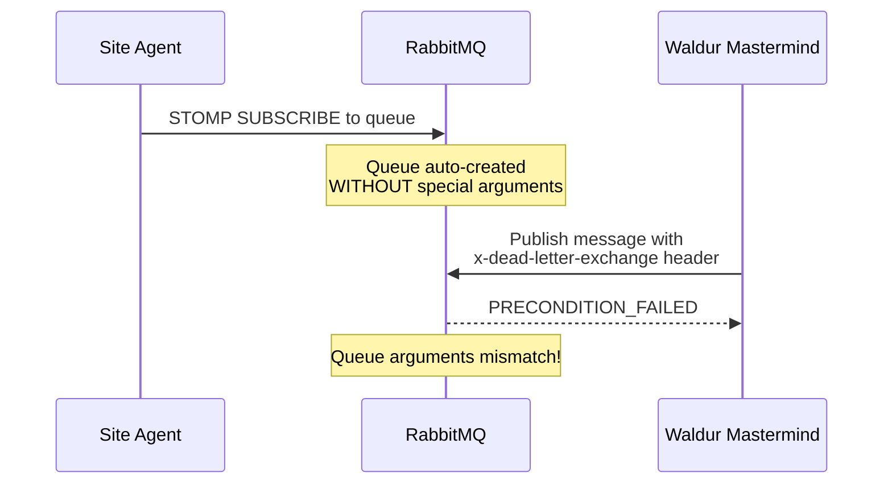
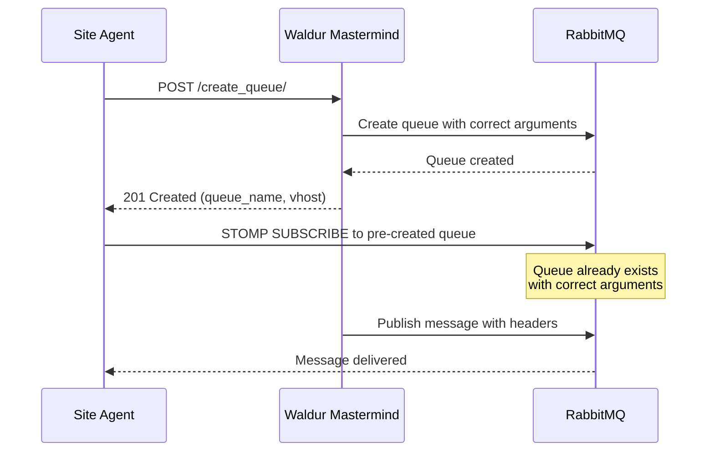
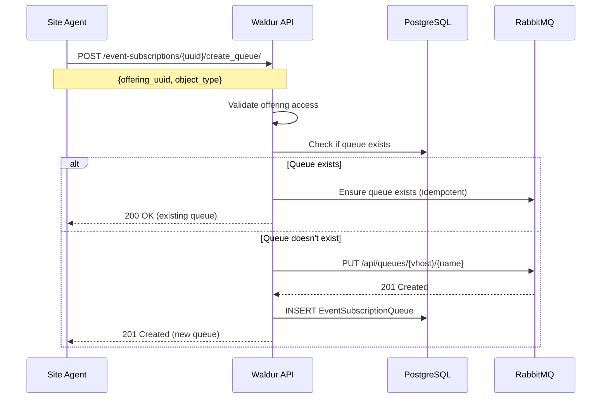
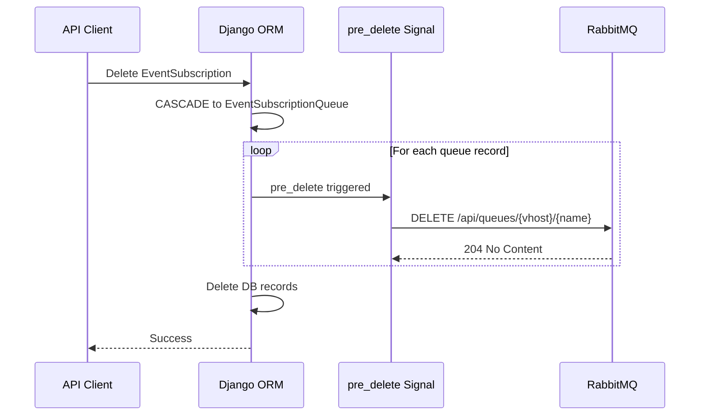
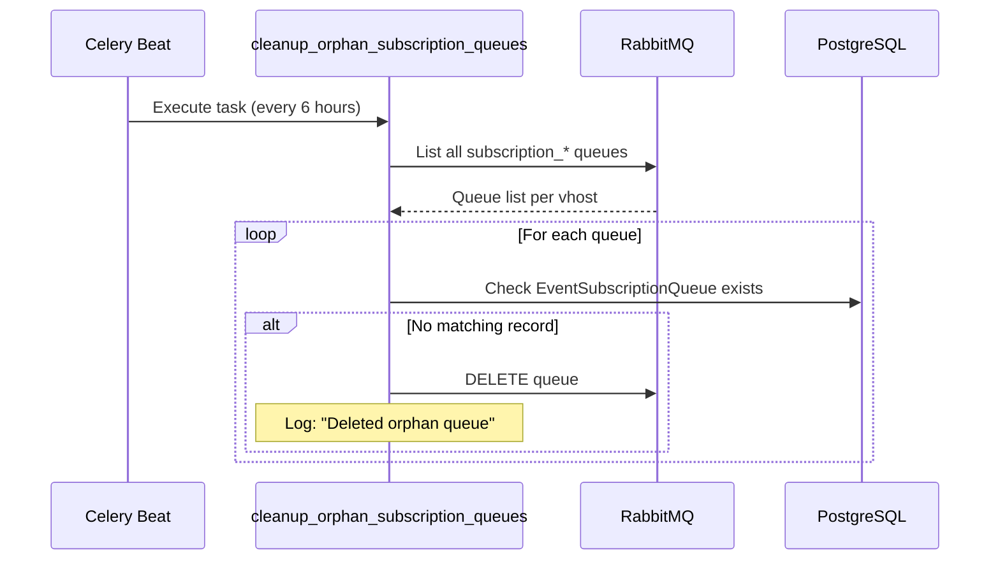

# Event Subscription Queues (Legacy — DEPRECATED)

> **DEPRECATED.** This documents the legacy per-offering, per-object-type queue
> approach. Its API endpoints are marked `deprecated` in the OpenAPI schema (and
> therefore in the generated SDKs). It still runs unchanged, so existing
> consumers keep working, but **no new integration should use it**.
>
> Use the [Unified Agent Queue](agent-pubsub.md) instead: one queue per consumer,
> bound to the entities you have access to, with enriched payloads.
>
> Removal is tracked in **WAL-10111** and gated on drain telemetry (zero legacy
> queues, sustained) rather than a date — see "The legacy path" in
> `docs/design/pubsub-architecture.md`. A consumer that already owns a unified
> queue is automatically suppressed from this path, so the two never
> double-deliver.

This guide explains the `EventSubscriptionQueue` system for managing RabbitMQ queues
used by event subscriptions, including queue lifecycle management and cleanup mechanisms.

## Overview

The `EventSubscriptionQueue` model tracks RabbitMQ queues that site agents create to
receive marketplace events. This explicit queue registration prevents race conditions
between STOMP subscribers and publishers that would otherwise cause `precondition_failed`
errors in RabbitMQ.

## Problem Solved

Without explicit queue management, a race condition occurs:



The solution requires agents to create queues via API before subscribing:



## Architecture

### Components

| Component | Location | Purpose |
|-----------|----------|---------|
| `EventSubscriptionQueue` model | `waldur_core/logging/models.py` | Tracks queue registrations |
| `create_queue` API action | `waldur_core/logging/views.py` | Creates queues via API |
| `RabbitMQManagementBackend.create_queue()` | `waldur_core/logging/backend.py` | RabbitMQ Management API calls |
| `prepare_messages()` queue check | `marketplace/utils.py` | Skips unregistered queues |
| `pre_delete` signal handler | `waldur_core/logging/handlers.py` | Cleans up RabbitMQ on deletion |
| `cleanup_orphan_subscription_queues` task | `waldur_core/logging/tasks.py` | Removes orphaned queues |

### Queue Naming Convention

Queue names follow the pattern:

```text
subscription_{subscription_uuid}_offering_{offering_uuid}_{object_type}
```

Example: `subscription_a1b2c3d4_offering_e5f6g7h8_resource`

### Queue Arguments

All subscription queues are created with these RabbitMQ arguments:

```python
SUBSCRIPTION_QUEUE_ARGUMENTS = {
    "x-message-ttl": 60 * 60 * 1000,  # one hour in milliseconds
    "x-max-length": 10000,
    "x-overflow": "reject-publish-dlx",
    "x-dead-letter-exchange": "",
    "x-dead-letter-routing-key": "waldur.dlq.messages",
}
```

## Queue Lifecycle

### Creation Flow



### Deletion Flow (Signal-Based)

When an `EventSubscriptionQueue` record is deleted (directly or via cascade),
a `pre_delete` signal automatically removes the RabbitMQ queue:



### Orphan Queue Cleanup

A periodic task runs every 6 hours to find and remove orphaned queues
(RabbitMQ queues without matching DB records):



## Cleanup Mechanisms

### 1. Signal-Based Cleanup (Real-Time)

**Trigger:** `EventSubscriptionQueue` record deletion

**Handler:** `cleanup_rabbitmq_queue_on_delete` in `handlers.py`

**Behavior:**
- Fires on `pre_delete` signal
- Calls `RabbitMQManagementBackend.delete_queue()`
- Logs warning on failure but doesn't block deletion

### 2. Orphan Queue Cleanup (Periodic)

**Task:** `cleanup_orphan_subscription_queues`

**Schedule:** Every 6 hours (configurable in celery beat)

**Behavior:**
- Lists all `subscription_*` queues from RabbitMQ
- Compares against `EventSubscriptionQueue` records
- Deletes queues with no matching DB record
- Continues processing even if individual deletes fail

### 3. Stale Subscription Cleanup (Existing)

**Task:** `delete_stale_event_subscriptions`

**Schedule:** Every 24 hours

**Behavior:**
- Removes subscriptions for users with expired tokens
- CASCADE deletes `EventSubscriptionQueue` records
- Signal handler cleans up RabbitMQ queues

## API Reference

### Create Queue

```http
POST /api/event-subscriptions/{uuid}/create_queue/
```

**Request:**

```json
{
    "offering_uuid": "e5f6a7b8-...",
    "object_type": "resource"
}
```

**Response (201 Created):**

```json
{
    "uuid": "a1b2c3d4-...",
    "queue_name": "subscription_..._offering_..._resource",
    "vhost": "user_uuid_hex",
    "offering_uuid": "e5f6a7b8-...",
    "object_type": "resource",
    "created": "2024-01-15T10:30:00Z"
}
```

**Response (200 OK):** Same format, returned when queue already exists.

**Access control:** The `offering_uuid` is validated against the user's permissions:

1. Users with standard offering access (customer owner, offering manager, etc.) can create queues for their offerings
2. ISD identity managers (`is_identity_manager=True` with non-empty `managed_isds`) can create queues for offerings in Active, Paused, or Unavailable states — Draft and Archived offerings are rejected with HTTP 400

This ISD manager access path enables federated agents to subscribe to events without requiring pre-existing offering users. See [Identity Bridge](../identity-bridge.md) for details on ISD identity managers.

**Valid object_type values:**
- `resource`
- `order`
- `user_role`
- `service_account`
- `course_account`
- `importable_resources`
- `resource_periodic_limits`
- `resource_api_key_rotation`
- `offering_user`

## Monitoring

### Check Queue Status

```bash
# List all subscription queues
curl -u guest:guest http://localhost:15672/api/queues | \
  jq '.[] | select(.name | startswith("subscription_")) | {name, vhost, messages}'

# Check specific queue arguments
curl -u guest:guest "http://localhost:15672/api/queues/{vhost}/{queue_name}" | \
  jq '.arguments'
```

### Watch for Errors

```bash
# RabbitMQ precondition errors
docker logs -f rabbitmq 2>&1 | grep precondition_failed

# Waldur queue registration logs
grep "Queue not registered" /var/log/waldur/waldur.log
```

### Django Shell Queries

```python
from waldur_core.logging.models import EventSubscriptionQueue
from waldur_core.logging.backend import RabbitMQManagementBackend

# Count registered queues
EventSubscriptionQueue.objects.count()

# List queues for a user
user_uuid = "..."
EventSubscriptionQueue.objects.filter(
    event_subscription__user__uuid=user_uuid
).values("queue_name", "object_type")

# Check RabbitMQ directly
rmq = RabbitMQManagementBackend()
rmq.list_all_subscription_queues()
```

## Troubleshooting

### Queue Creation Fails

**Symptom:** API returns 400/500 on `create_queue`

**Check:**
1. RabbitMQ is running and accessible
2. User has valid EventSubscription
3. Offering UUID exists and user has access

### Messages Not Delivered

**Symptom:** Events published but agent doesn't receive them

**Check:**
1. Queue exists in RabbitMQ with correct arguments
2. `EventSubscriptionQueue` record exists in DB
3. Waldur logs for "Queue not registered... Skipping"

### Orphan Queues Accumulating

**Symptom:** RabbitMQ has subscription queues with no consumers

**Fix:**
1. Run cleanup task manually:
   ```python
   from waldur_core.logging.tasks import cleanup_orphan_subscription_queues
   cleanup_orphan_subscription_queues()
   ```
2. Or delete via RabbitMQ Management API

### Periodic Limits Messages Not Delivered

**Symptom:** SlurmPeriodicUsagePolicy fires but site agent QoS doesn't change

**Check:**

1. Site agent config has `periodic_limits.enabled: true` for the offering
2. `EventSubscriptionQueue` record exists with `object_type=resource_periodic_limits`
3. Waldur logs for "No STOMP messages prepared for resource"

**Fix:** Enable `periodic_limits` in site agent config and restart the agent.

### precondition_failed Errors

**Symptom:** RabbitMQ logs show `PRECONDITION_FAILED - inequivalent arg`

**Cause:** Queue was created by STOMP subscriber before API call

**Fix:**
1. Delete the misconfigured queue from RabbitMQ
2. Ensure agent calls `create_queue` API before STOMP subscribe
3. Restart agent to recreate queue correctly

## Configuration

### Celery Beat Schedule

The cleanup tasks are registered in `marketplace_site_agent/extension.py`:

```python
{
    "cleanup-orphan-subscription-queues": {
        "task": "waldur_core.logging.cleanup_orphan_subscription_queues",
        "schedule": timedelta(hours=6),
        "args": (),
    },
}
```

### Queue Arguments

Queue arguments are defined in `waldur_core/logging/backend.py`:

```python
SUBSCRIPTION_QUEUE_ARGUMENTS = {
    "x-max-length": 10000,           # Max messages before overflow
    "x-overflow": "reject-publish-dlx",  # Overflow behavior
    "x-dead-letter-exchange": "",    # DLX for rejected messages
    "x-dead-letter-routing-key": "waldur.dlq.messages",
}
```

## Related Documentation

- [Unified Agent Queue](agent-pubsub.md) - The recommended approach for new agents
- [Event-Based Order Processing](../core-concepts/event-based-order-processing.md)
- [Waldur Architecture](waldur-architecture.md)
