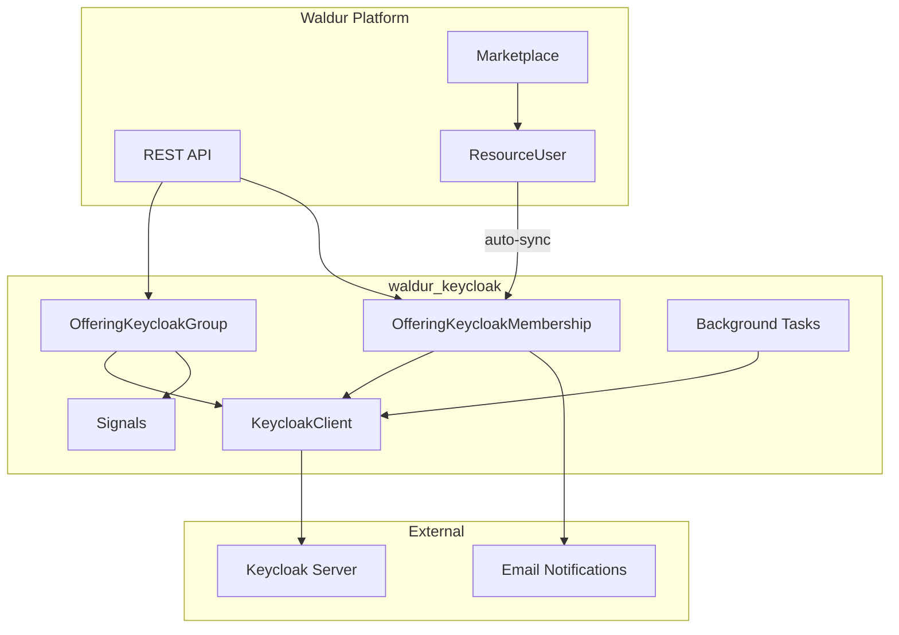
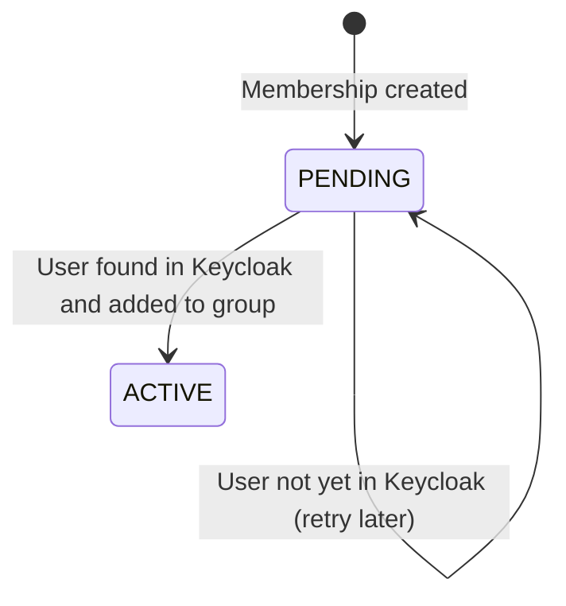
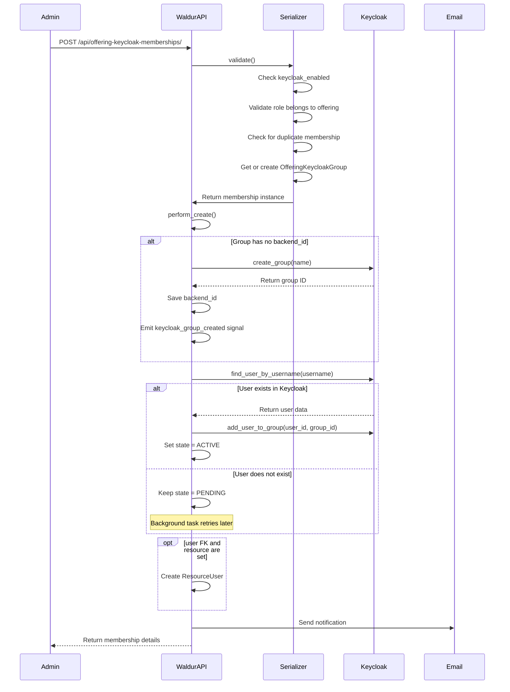
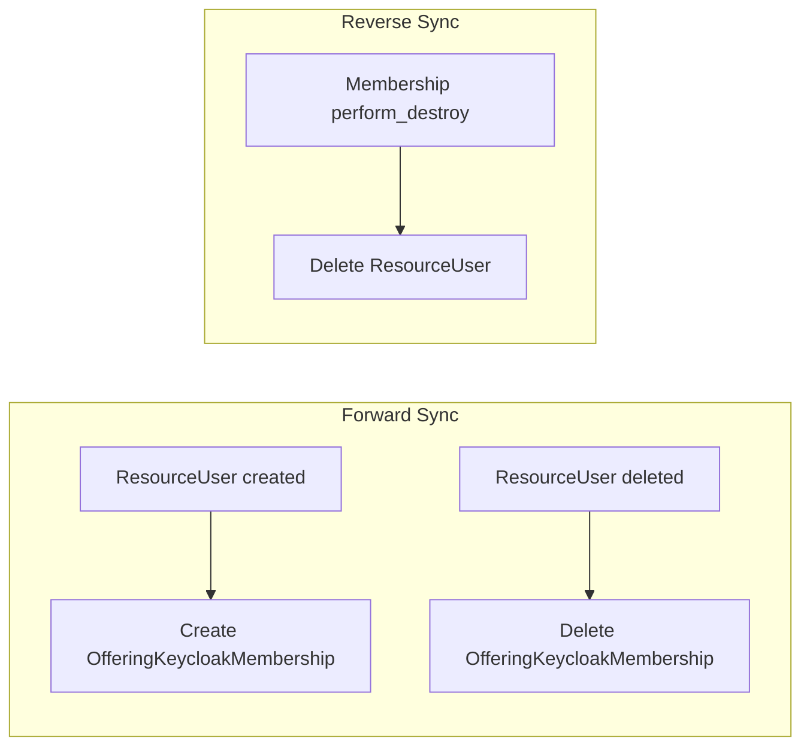
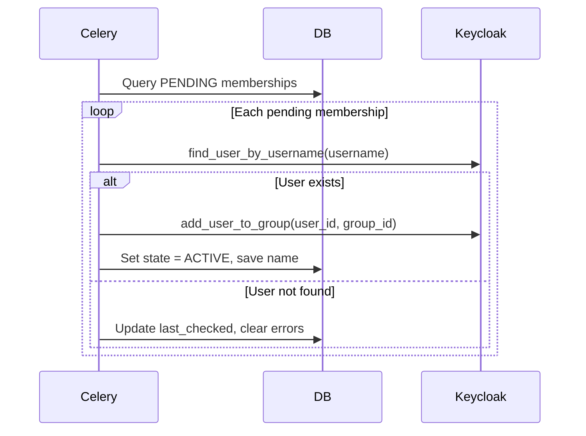

# Waldur Keycloak Integration

## Overview

The `waldur_keycloak` plugin provides generic Keycloak user role management that any marketplace offering can opt into. It synchronizes marketplace user roles with Keycloak groups, enabling automated identity and access management for offerings backed by Keycloak-aware infrastructure.

Previously, Keycloak integration existed exclusively within the `waldur_rancher` plugin. This app extracts that functionality into a reusable, offering-level system that works with any offering type.

## Key Design Decisions

- **Offering-level by default** with optional resource-level and sub-entity scoping via `scope_id`
- **Parallel-first approach**: Rancher keeps its existing Keycloak code; this app runs alongside
- **Auto-sync**: marketplace `ResourceUser` records automatically create and delete Keycloak memberships
- **Credential storage**: Keycloak credentials stored in `offering.secret_options`, public config in `offering.plugin_options`

## High-Level Architecture



## Data Model

### OfferingKeycloakGroup

Links a Keycloak group to an offering + role combination, optionally scoped to a specific resource and/or sub-entity.

| Field | Type | Description |
|-------|------|-------------|
| `uuid` | UUID | Primary identifier |
| `backend_id` | String | Keycloak group ID |
| `name` | CharField(150) | Group name |
| `offering` | FK -> Offering | Parent offering |
| `role` | FK -> OfferingUserRole | Associated role |
| `resource` | FK -> Resource (optional) | Resource-level scoping |
| `scope_id` | UUIDField (optional) | Sub-entity UUID within a resource |
| `created` | DateTime | Creation timestamp |
| `modified` | DateTime | Last modification timestamp |

**Unique constraint**: `(offering, role, resource, scope_id)`

**Mixins**: `UuidMixin`, `BackendMixin`, `TimeStampedModel`

### OfferingKeycloakMembership

A user's membership in a Keycloak group with state tracking.

| Field | Type | Description |
|-------|------|-------------|
| `uuid` | UUID | Primary identifier |
| `username` | CharField(255) | Keycloak username |
| `email` | EmailField | Notification email |
| `first_name` | CharField(100) | Populated from Keycloak |
| `last_name` | CharField(100) | Populated from Keycloak |
| `state` | FSMField | `PENDING` or `ACTIVE` |
| `last_checked` | DateTime | Last sync attempt timestamp |
| `group` | FK -> OfferingKeycloakGroup | Parent group |
| `user` | FK -> User (optional) | Linked Waldur user |
| `error_message` | TextField | Last error message |
| `error_traceback` | TextField | Last error traceback |
| `created` | DateTime | Creation timestamp |
| `modified` | DateTime | Last modification timestamp |

**Unique constraint**: `(username, group)`

**Mixins**: `UuidMixin`, `TimeStampedModel`, `ErrorMessageMixin`

### OfferingUserRole (marketplace model)

The marketplace `OfferingUserRole` model includes a `scope_type` field (`CharField(50)`, default `""`) to support hierarchical roles. An empty value means the role is offering-wide. Non-empty values like `"cluster"` or `"project"` indicate resource-scoped roles.

### State Machine



## Offering Configuration

### Public Configuration (`plugin_options`)

```json
{
    "keycloak_enabled": true,
    "keycloak_sync_frequency": 15,
    "keycloak_group_name_template": "{offering_uuid}_{role_name}"
}
```

| Key | Type | Default | Description |
|-----|------|---------|-------------|
| `keycloak_enabled` | Boolean | `false` | Enable Keycloak integration for this offering |
| `keycloak_sync_frequency` | Integer | `15` | Sync frequency in minutes (shown in notification emails) |
| `keycloak_group_name_template` | String | (auto) | Custom group name template |

### Private Configuration (`secret_options`)

```json
{
    "keycloak_url": "https://keycloak.example.com/auth/",
    "keycloak_realm": "waldur",
    "keycloak_user_realm": "master",
    "keycloak_username": "admin",
    "keycloak_password": "secret",
    "keycloak_ssl_verify": true
}
```

| Key | Type | Required | Default | Description |
|-----|------|----------|---------|-------------|
| `keycloak_url` | String | Yes | - | Keycloak server URL |
| `keycloak_realm` | String | Yes | - | Target realm |
| `keycloak_user_realm` | String | No | `"master"` | Admin user realm |
| `keycloak_username` | String | Yes | - | Admin username |
| `keycloak_password` | String | Yes | - | Admin password |
| `keycloak_ssl_verify` | Boolean | No | `true` | Verify TLS certificates |

## API Endpoints

### Keycloak Groups

**Endpoint**: `/api/offering-keycloak-groups/`

**Actions**: List, Retrieve (read-only)

**Visibility**: Staff sees all groups. Non-staff users see only groups belonging to offerings they have access to.

**Filters**:

| Parameter | Description |
|-----------|-------------|
| `offering_uuid` | Filter by offering UUID |
| `role_uuid` | Filter by role UUID |
| `resource_uuid` | Filter by resource UUID |

**Response fields**: `uuid`, `url`, `name`, `backend_id`, `offering`, `offering_uuid`, `offering_name`, `role`, `role_name`, `role_scope_type`, `resource`, `resource_uuid`, `resource_name`, `scope_id`, `created`, `modified`

### Keycloak Memberships

**Endpoint**: `/api/offering-keycloak-memberships/`

**Actions**: Create, List, Retrieve, Destroy (no update)

**Visibility**: Staff sees all memberships. Non-staff users see only memberships for offerings they have access to.

**Destroy permission**: `MANAGE_RESOURCE_USERS` on `group.offering.customer`

**Filters**:

| Parameter | Description |
|-----------|-------------|
| `group_uuid` | Filter by group UUID |
| `offering_uuid` | Filter by offering UUID |
| `role_uuid` | Filter by role UUID |
| `resource_uuid` | Filter by resource UUID |
| `username` | Filter by username |
| `email` | Filter by email |
| `first_name` | Filter by first name |
| `last_name` | Filter by last name |
| `state` | Filter by state (`pending`, `active`) |

**Create input fields**: `offering` (URL), `role` (URL), `resource` (URL, optional), `scope_id` (UUID, optional), `username`, `email`, `user` (URL, optional)

**Response fields**: `uuid`, `url`, `username`, `email`, `first_name`, `last_name`, `group`, `group_name`, `group_role_name`, `group_offering_uuid`, `group_offering_name`, `user`, `state`, `created`, `modified`, `last_checked`, `error_message`, `error_traceback`

## Membership Creation Flow



## ResourceUser Auto-Sync

The plugin maintains bidirectional synchronization between marketplace `ResourceUser` records and `OfferingKeycloakMembership` records. A `_syncing` flag prevents infinite loops.



### Forward Sync (ResourceUser -> Membership)

When a `ResourceUser` is created for an offering with `keycloak_enabled=True`:

1. Handler checks if a matching membership already exists
2. Gets or creates the `OfferingKeycloakGroup` for the offering + role + resource
3. Creates an `OfferingKeycloakMembership` with `PENDING` state

When a `ResourceUser` is deleted, the corresponding `OfferingKeycloakMembership` is also deleted.

### Reverse Sync (Membership -> ResourceUser)

When an `OfferingKeycloakMembership` is destroyed via the API (`perform_destroy`), the corresponding `ResourceUser` is deleted if both `user` and `resource` are set on the membership's group.

## Signal Handlers

### Backend Lifecycle Signals

Registered in `KeycloakConfig.ready()`:

| Signal | Sender | Handler | Effect |
|--------|--------|---------|--------|
| `post_delete` | `OfferingKeycloakGroup` | `delete_keycloak_group_from_backend` | Deletes group from Keycloak |
| `post_delete` | `OfferingKeycloakMembership` | `delete_keycloak_membership_from_backend` | Removes user from Keycloak group |
| `post_save` | `ResourceUser` | `sync_resource_user_to_keycloak_membership` | Creates membership on ResourceUser creation |
| `post_delete` | `ResourceUser` | `delete_keycloak_membership_on_resource_user_delete` | Deletes membership on ResourceUser deletion |

### Custom Signals

Defined in `waldur_keycloak.signals`:

```python
keycloak_group_created = Signal()   # args: group, offering, resource
keycloak_group_deleting = Signal()  # args: group, offering, resource
```

These signals allow other plugins (such as a future Rancher migration) to react to group lifecycle events. For example, Rancher could listen for `keycloak_group_created` to bind a Keycloak group to a Rancher cluster or project role.

## Background Tasks

### Scheduled Jobs

| Task | Schedule | Description |
|------|----------|-------------|
| `sync_pending_memberships` | Every 15 minutes | Find `PENDING` memberships, look up users in Keycloak, add to groups if found, transition to `ACTIVE` |
| `cleanup_orphaned_groups` | Every hour | Delete remote Keycloak groups with the offering UUID prefix that have no local `OfferingKeycloakGroup` counterpart |
| `cleanup_orphaned_memberships` | Every hour | Remove remote Keycloak group members that have no local `OfferingKeycloakMembership` record |

All tasks iterate only across offerings where `plugin_options.keycloak_enabled=True`.

### Pending Membership Sync Flow



## KeycloakClient

The `KeycloakClient` class (`waldur_keycloak.client`) is a generic wrapper around the `python-keycloak` library. It accepts a config dict rather than Django settings or `ServiceSettings`, making it reusable across offerings with different Keycloak instances.

### Methods

| Method | Return | Description |
|--------|--------|-------------|
| `find_user_by_username(username)` | `dict` or `None` | Look up a user by username |
| `get_group(group_id)` | `dict` or `None` | Fetch group data by ID |
| `create_group(group_name, parent_id=None)` | `dict` | Create a group (returns existing if name matches) |
| `delete_group(group_id)` | - | Delete a group |
| `list_groups()` | `list` | List all groups in the realm |
| `list_group_members(group_id)` | `list` | Get members of a group |
| `add_user_to_group(user_id, group_id)` | - | Add user to group |
| `remove_user_from_group(user_id, group_id)` | - | Remove user from group |

### Configuration

The client is instantiated from offering credentials via `utils.get_keycloak_client_for_offering()`:

```python
from waldur_keycloak.utils import get_keycloak_client_for_offering

client = get_keycloak_client_for_offering(offering)
user = client.find_user_by_username("john.doe")
```

## Group Naming Convention

The `utils.get_keycloak_group_name()` function generates group names:

| Scope | Pattern | Example |
|-------|---------|---------|
| Offering-wide | `{offering_uuid}_{role_name}` | `a1b2c3..._{Viewer}` |
| Resource-scoped | `{offering_uuid}_{resource_uuid}_{role_name}` | `a1b2c3..._d4e5f6..._{Admin}` |
| Sub-entity scoped | `{offering_uuid}_{scope_id}_{role_name}` | `a1b2c3..._f7g8h9..._{Member}` |
| Custom template | `{keycloak_group_name_template}` | Any format using template variables |

Template variables available: `offering_uuid`, `role_name`, `resource_uuid`, `scope_id`

## Hierarchical Scoping

The combination of `scope_type` on `OfferingUserRole` and `resource` + `scope_id` on `OfferingKeycloakGroup` enables hierarchical access structures.

### How it works

| Model field | Purpose | Example |
|-------------|---------|---------|
| `OfferingUserRole.scope_type` | Describes what kind of scope a role applies at | `""` (offering-wide), `"cluster"`, `"project"` |
| `OfferingKeycloakGroup.resource` | The marketplace resource (e.g. a provisioned cluster) | FK to a Rancher Cluster resource |
| `OfferingKeycloakGroup.scope_id` | Sub-entity UUID within a resource | A Rancher Project UUID inside a cluster |

Each unique combination of `(offering, role, resource, scope_id)` maps to one Keycloak group.

## Walkthrough: Rancher-like Environment

This example shows how to set up a Rancher-like environment where an HPC offering has
cluster-level and project-level roles, each backed by Keycloak groups.

### Scenario

- An offering "HPC Clusters" provisions compute clusters
- Each cluster has multiple projects inside it
- Users need different roles: **Cluster Owner** (full access to a cluster) and **Project Member** (access to a specific project within a cluster)
- Each role maps to a Keycloak group so that downstream systems (e.g. Rancher, Kubernetes RBAC) can consume group membership

### Step 1: Configure the offering

Enable Keycloak integration on the offering via the admin API or Django admin.

**plugin_options** (public):

```json
{
    "keycloak_enabled": true,
    "keycloak_sync_frequency": 15,
    "keycloak_group_name_template": "{offering_uuid}_{resource_uuid}_{scope_id}_{role_name}"
}
```

**secret_options** (private):

```json
{
    "keycloak_url": "https://keycloak.hpc.example.com/auth/",
    "keycloak_realm": "hpc",
    "keycloak_username": "waldur-admin",
    "keycloak_password": "...",
    "keycloak_ssl_verify": true
}
```

### Step 2: Create roles for the offering

Create two `OfferingUserRole` entries with different `scope_type` values. This tells
Waldur (and API consumers) what level of the hierarchy each role applies at.

```bash
# Create a cluster-level role
curl -X POST https://waldur.example.com/api/marketplace-offering-user-roles/ \
  -H "Authorization: Token <staff-token>" \
  -H "Content-Type: application/json" \
  -d '{
    "offering": "https://waldur.example.com/api/marketplace-provider-offerings/<offering-uuid>/",
    "name": "Cluster Owner",
    "scope_type": "cluster"
  }'
# Response: { "uuid": "<cluster-owner-role-uuid>", "name": "Cluster Owner", "scope_type": "cluster", ... }

# Create a project-level role
curl -X POST https://waldur.example.com/api/marketplace-offering-user-roles/ \
  -H "Authorization: Token <staff-token>" \
  -H "Content-Type: application/json" \
  -d '{
    "offering": "https://waldur.example.com/api/marketplace-provider-offerings/<offering-uuid>/",
    "name": "Project Member",
    "scope_type": "project"
  }'
# Response: { "uuid": "<project-member-role-uuid>", "name": "Project Member", "scope_type": "project", ... }
```

At this point, the offering has two roles defined but no Keycloak groups or memberships yet.

### Step 3: Provision a cluster (resource)

When a user orders the offering through the marketplace, Waldur creates a `Resource`
representing the provisioned cluster. Assume this produces:

- **Resource UUID**: `aaaa0000...` (the cluster)

### Step 4: Assign a user as Cluster Owner

Now assign a user as **Cluster Owner** of the cluster. The `resource` field scopes this
to a specific cluster. No `scope_id` is needed because the role is at the cluster level.

```bash
curl -X POST https://waldur.example.com/api/offering-keycloak-memberships/ \
  -H "Authorization: Token <staff-token>" \
  -H "Content-Type: application/json" \
  -d '{
    "offering": "https://waldur.example.com/api/marketplace-provider-offerings/<offering-uuid>/",
    "role": "https://waldur.example.com/api/marketplace-offering-user-roles/<cluster-owner-role-uuid>/",
    "resource": "https://waldur.example.com/api/marketplace-resources/<cluster-resource-uuid>/",
    "username": "alice",
    "email": "alice@example.com"
  }'
```

**What happens behind the scenes:**

1. Serializer validates the input (keycloak enabled, role belongs to offering, resource belongs to offering)
2. An `OfferingKeycloakGroup` is created (or reused) for `(offering, Cluster Owner role, cluster resource, scope_id=null)`
3. The group is created in Keycloak with name `<offering_uuid>_<cluster_uuid>__Cluster Owner`
4. Waldur looks up `alice` in Keycloak:
   - If found: adds her to the group, sets state to **ACTIVE**
   - If not found: state stays **PENDING** (background task retries every 15 min)
5. A notification email is sent to `alice@example.com`

### Step 5: Assign a user as Project Member

Rancher clusters contain projects. To scope a role to a specific project *within* a
cluster, use the `scope_id` field with the Rancher project's UUID.

```bash
# Assume Rancher project UUID is bbbb0000-0000-0000-0000-000000000001
curl -X POST https://waldur.example.com/api/offering-keycloak-memberships/ \
  -H "Authorization: Token <staff-token>" \
  -H "Content-Type: application/json" \
  -d '{
    "offering": "https://waldur.example.com/api/marketplace-provider-offerings/<offering-uuid>/",
    "role": "https://waldur.example.com/api/marketplace-offering-user-roles/<project-member-role-uuid>/",
    "resource": "https://waldur.example.com/api/marketplace-resources/<cluster-resource-uuid>/",
    "scope_id": "bbbb0000-0000-0000-0000-000000000001",
    "username": "bob",
    "email": "bob@example.com"
  }'
```

This creates a **different** Keycloak group (because `scope_id` differs), giving Bob
access only to that specific project within the cluster.

### Resulting Keycloak groups

After steps 4 and 5, two Keycloak groups exist:

| Keycloak Group Name | Role | Resource | scope_id | Members |
|---------------------|------|----------|----------|---------|
| `<off>_<cluster>__Cluster Owner` | Cluster Owner | Cluster | null | alice |
| `<off>_<cluster>_<project>_Project Member` | Project Member | Cluster | `bbbb0000...` | bob |

### Step 6: Query groups and memberships

```bash
# List all Keycloak groups for this offering
curl "https://waldur.example.com/api/offering-keycloak-groups/?offering_uuid=<offering-uuid>" \
  -H "Authorization: Token <token>"

# List all memberships for this offering, filtered by role
curl "https://waldur.example.com/api/offering-keycloak-memberships/?offering_uuid=<offering-uuid>&role_uuid=<cluster-owner-role-uuid>" \
  -H "Authorization: Token <token>"

# List only pending memberships (users not yet in Keycloak)
curl "https://waldur.example.com/api/offering-keycloak-memberships/?state=pending" \
  -H "Authorization: Token <token>"
```

### Step 7: Remove a membership

```bash
curl -X DELETE "https://waldur.example.com/api/offering-keycloak-memberships/<membership-uuid>/" \
  -H "Authorization: Token <token>"
```

This removes the user from the Keycloak group and deletes the membership record.
If the membership was the last one in its group, the group is also deleted from
both Waldur and Keycloak.

### Alternative: Auto-sync via ResourceUser

Instead of directly creating Keycloak memberships, you can manage access through
marketplace `ResourceUser` records. The plugin auto-syncs both directions:

```bash
# Creating a ResourceUser auto-creates a Keycloak membership
curl -X POST https://waldur.example.com/api/marketplace-resource-users/ \
  -H "Authorization: Token <token>" \
  -H "Content-Type: application/json" \
  -d '{
    "resource": "https://waldur.example.com/api/marketplace-resources/<cluster-resource-uuid>/",
    "user": "https://waldur.example.com/api/users/<user-uuid>/",
    "role": "https://waldur.example.com/api/marketplace-offering-user-roles/<cluster-owner-role-uuid>/"
  }'
```

This creates both a `ResourceUser` and an `OfferingKeycloakMembership` for the
same user/role/resource combination. Deleting either one deletes the other.

Note: the ResourceUser auto-sync path always sets `scope_id=null`, so it works for
resource-level roles (like Cluster Owner) but not for sub-entity roles (like
Project Member). For project-level scoping, use the Keycloak membership API directly.

### Summary: choosing the right fields

| Use case | `resource` | `scope_id` | Example |
|----------|-----------|-----------|---------|
| Offering-wide role | omit | omit | "Offering Admin" across all clusters |
| Resource-level role | set | omit | "Cluster Owner" for a specific cluster |
| Sub-entity role | set | set | "Project Member" for a project inside a cluster |

## Email Notifications

When a membership is created, a notification email is sent using templates in `templates/keycloak/`:

- `keycloak_membership_notification_subject.txt` - Subject line
- `keycloak_membership_notification_message.txt` - Plain text body
- `keycloak_membership_notification_message.html` - HTML body

### Template Context Variables

| Variable | Description |
|----------|-------------|
| `offering_name` | Name of the offering |
| `role` | Role name assigned to the user |
| `user_exists` | `True` if user was found in Keycloak (state is ACTIVE) |
| `sync_frequency_minutes` | Minutes until pending memberships are retried |
| `support_email` | Site support email from Constance config |

If the user does not yet exist in Keycloak, the email informs them that permissions will activate automatically after their first login (within the configured sync interval).

## Rancher Compatibility

This plugin does not modify the existing `waldur_rancher` Keycloak integration. Rancher retains its own `KeycloakGroup`, `KeycloakUserGroupMembership`, `RoleTemplate` models, views, and tasks.

A future migration path exists where Rancher would:

1. Register signal receivers on `keycloak_group_created` and `keycloak_group_deleting`
2. Bind Keycloak groups to Rancher cluster/project roles when groups are created
3. Clean up Rancher role bindings when groups are deleted

## App Structure

```text
src/waldur_keycloak/
    apps.py              # AppConfig with signal handler registration
    client.py            # KeycloakClient wrapper for python-keycloak
    enums.py             # KeycloakMembershipState (PENDING, ACTIVE)
    extension.py         # WaldurExtension with celery_tasks
    filters.py           # DjangoFilterBackend filter classes
    handlers.py          # Signal handlers (lifecycle + ResourceUser sync)
    models.py            # OfferingKeycloakGroup, OfferingKeycloakMembership
    serializers.py       # DRF serializers
    signals.py           # Custom signals for plugin hooks
    tasks.py             # Celery periodic tasks
    urls.py              # Router registration
    utils.py             # Helper functions
    views.py             # ViewSets
    migrations/
        0001_initial.py
    templates/keycloak/
        keycloak_membership_notification_subject.txt
        keycloak_membership_notification_message.txt
        keycloak_membership_notification_message.html
    tests/
        factories.py
        fixtures.py
        test_handlers.py
        test_tasks.py
        test_views.py
```

## Extension Registration

The plugin registers itself as a Waldur extension via `KeycloakExtension` in `extension.py`:

```python
class KeycloakExtension(WaldurExtension):
    @staticmethod
    def django_app():
        return "waldur_keycloak"

    @staticmethod
    def rest_urls():
        from .urls import register_in
        return register_in

    @staticmethod
    def celery_tasks():
        # Returns schedule for 3 periodic tasks
        ...
```

The entry point is registered in `pyproject.toml` under `[project.entry-points.waldur_extensions]`.
