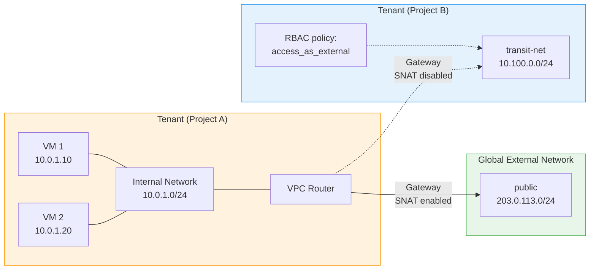
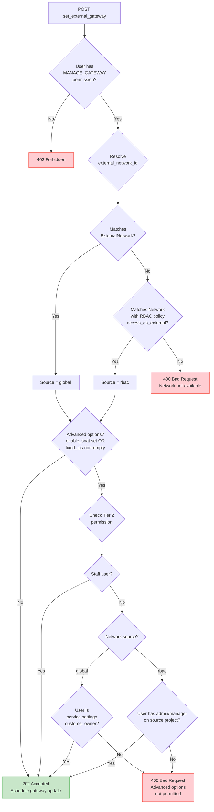
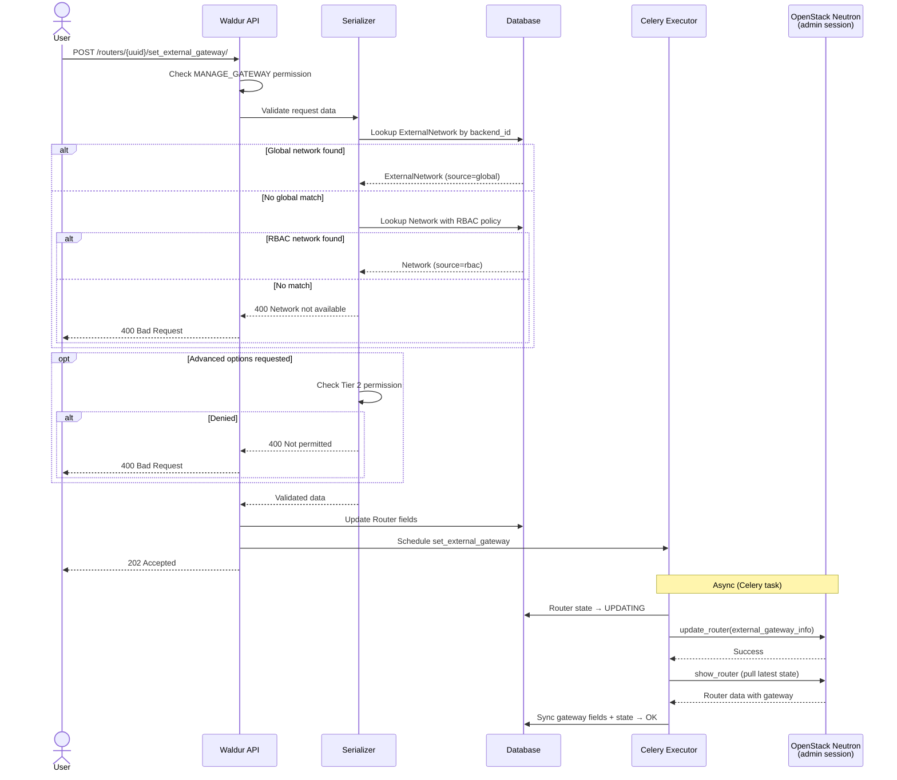
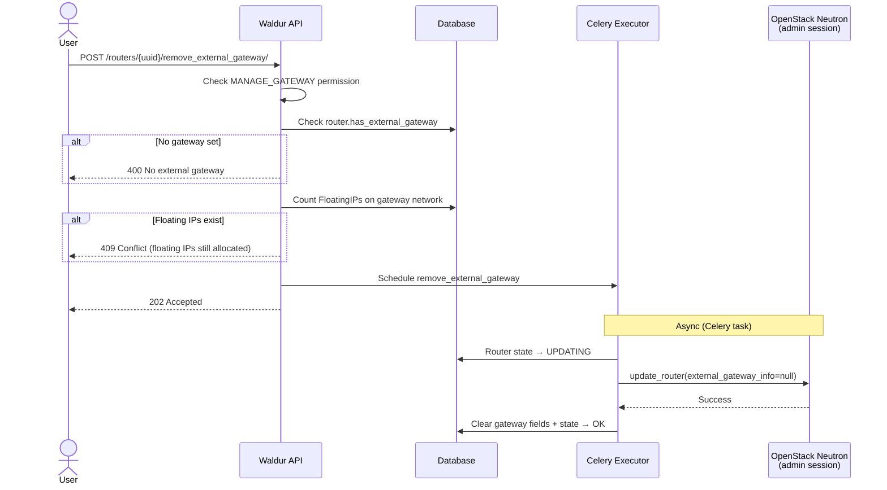

# OpenStack Plugin

## Introduction

The OpenStack plugin for Waldur provides comprehensive integration with OpenStack cloud infrastructure, enabling organizations to manage OpenStack resources through Waldur's unified platform. This plugin acts as a bridge between Waldur's resource management capabilities and OpenStack's Infrastructure-as-a-Service (IaaS) offerings.

### Core Functionality

The plugin enables:

- **Multi-tenant Resource Management**: Create and manage OpenStack projects (tenants) with isolated resources
- **Compute Resource Provisioning**: Deploy and manage virtual machines with full lifecycle control
- **Storage Management**: Provision block storage volumes, create snapshots, and manage backups
- **Network Configuration**: Set up virtual networks, subnets, routers, and security policies
- **Quota Management**: Synchronize and enforce resource quotas between Waldur and OpenStack
- **Cross-tenant Resource Sharing**: Share networks between tenants using RBAC policies
- **Automated Resource Discovery**: Import existing OpenStack resources into Waldur
- **Console Access**: Provide direct console access to virtual machines

## Architecture

### Module Structure

The OpenStack integration consists of two active Django applications:

| Module | Django Label | Purpose |
|--------|-------------|---------|
| `waldur_openstack` | `openstack` | Core OpenStack resource models, backend client, executors, serializers, and ViewSets |
| `waldur_mastermind.marketplace_openstack` | `marketplace_openstack` | Marketplace bridge that maps marketplace orders to OpenStack operations and synchronizes resource state |

A third module, `waldur_openstack_replication`, handles tenant migration between OpenStack deployments and is documented separately in [OpenStack Replication](openstack-replication.md).

### Layered Architecture

Each OpenStack operation flows through a well-defined layer stack:

```text
Marketplace Order
    -> Processor (marketplace_openstack)
        -> ViewSet / Serializer (waldur_openstack)
            -> Executor (Celery task chain)
                -> Backend (OpenStack API calls)
                    -> Handlers (update state on completion)
```

| Layer | Role |
|-------|------|
| **Models** | Django ORM models representing OpenStack resources (Tenant, Instance, Volume, Network, etc.) |
| **Serializers** | Validate API input and format output; enforce field-level permissions |
| **ViewSets** | REST endpoints for CRUD and custom actions; enforce object-level permissions |
| **Executors** | Celery task chains that orchestrate multi-step backend operations with error handling |
| **Backend** (`OpenStackBackend`) | Translates Waldur operations into OpenStack API calls using service-specific clients |
| **Handlers** | Signal receivers that react to state changes (e.g., update marketplace resource when backend state changes) |

### Resource Lifecycle Flow

A typical end-to-end provisioning flow:

1. **Administrator creates an Offering** of type `OpenStack.Tenant`, scoped to a set of OpenStack admin credentials (stored in `secret_options`).
2. **User places a marketplace order** for a tenant. The `TenantCreateProcessor` validates limits and delegates to the `TenantCreateExecutor`.
3. **Executor runs a Celery task chain**: create project in Keystone, create admin and tenant users, push quotas, create default security groups, set up internal network/subnet/router, connect to external network, pull images/flavors/volume types, then mark the tenant as OK.
4. **On tenant OK** (when `AUTOMATICALLY_CREATE_PRIVATE_OFFERING` is enabled), signal handlers automatically create private `OpenStack.Instance` and `OpenStack.Volume` offerings scoped to that tenant.
5. **Users order instances and volumes** through those offerings. The respective processors (`InstanceCreateProcessor`, `VolumeCreateProcessor`) handle creation via their own executor chains.
6. **Background tasks** periodically pull resource state, quotas, and properties from OpenStack to keep Waldur in sync.

### Backend Connection Flow

```text
ServiceSettings credentials
    -> keystoneauth1 v3.Password authentication
        -> Keystone v3 session (cached 10 hours)
            -> Service catalog endpoint discovery
                -> Per-service clients
```

**Session caching**: Authenticated Keystone sessions are cached in Django's cache backend with a 10-hour TTL. The cache key is derived from a SHA-256 hash of the credentials. If a cached token will expire within 10 minutes, the session is recreated.

**OpenStack client versions**:

| Service | Client Library | API Version |
|---------|---------------|-------------|
| Keystone | `keystoneclient` | v3 |
| Nova | `novaclient` | v2.19 (microversion) |
| Cinder | `cinderclient` | v3 |
| Glance | `glanceclient` | v2 |
| Neutron | `neutronclient` | v2.0 |
| Octavia (Load Balancer) | `openstacksdk` | v2 |

Only the Keystone endpoint needs to be configured explicitly; all other service endpoints are discovered automatically from the Keystone service catalog.

## Supported Operations by OpenStack Service

### Keystone (Identity Service)

| Operation | Description | API Endpoint |
|-----------|-------------|--------------|
| Tenant Creation | Create new OpenStack projects/tenants | `POST /api/openstack-tenants/` |
| Tenant Deletion | Remove OpenStack projects | `DELETE /api/openstack-tenants/{uuid}/` |
| Authentication | Manage tenant credentials | Handled internally |
| Quota Retrieval | Fetch tenant quotas | `GET /api/openstack-tenants/{uuid}/quotas/` |
| Quota Update | Modify tenant quotas | `POST /api/openstack-tenants/{uuid}/set_quotas/` |

### Nova (Compute Service)

| Operation | Description | API Endpoint |
|-----------|-------------|--------------|
| **Instances** | | |
| Create Instance | Launch new virtual machines | `POST /api/openstack-instances/` |
| Delete Instance | Terminate virtual machines | `DELETE /api/openstack-instances/{uuid}/` |
| Start Instance | Power on virtual machines | `POST /api/openstack-instances/{uuid}/start/` |
| Stop Instance | Power off virtual machines | `POST /api/openstack-instances/{uuid}/stop/` |
| Restart Instance | Reboot virtual machines | `POST /api/openstack-instances/{uuid}/restart/` |
| Resize Instance | Change instance flavor | `POST /api/openstack-instances/{uuid}/change_flavor/` |
| Console Access | Get VNC console URL | `POST /api/openstack-instances/{uuid}/console/` |
| Attach Volume | Connect storage to instance | `POST /api/openstack-instances/{uuid}/attach_volume/` |
| Detach Volume | Disconnect storage from instance | `POST /api/openstack-instances/{uuid}/detach_volume/` |
| Assign Floating IP | Attach public IP | `POST /api/openstack-instances/{uuid}/assign_floating_ip/` |
| **Flavors** | | |
| List Flavors | Get available VM sizes | `GET /api/openstack-flavors/` |
| Import Flavors | Sync flavors from backend | `POST /api/openstack-tenants/{uuid}/pull_flavors/` |
| **Images** | | |
| List Images | Get available OS images | `GET /api/openstack-images/` |
| Import Images | Sync images from backend | `POST /api/openstack-tenants/{uuid}/pull_images/` |
| **Server Groups** | | |
| Create Server Group | Set up affinity policies | `POST /api/openstack-server-groups/` |
| Delete Server Group | Remove affinity policies | `DELETE /api/openstack-server-groups/{uuid}/` |
| **Availability Zones** | | |
| List AZs | Get compute availability zones | `GET /api/openstack-instance-availability-zones/` |

### Cinder (Block Storage Service)

| Operation | Description | API Endpoint |
|-----------|-------------|--------------|
| **Volumes** | | |
| Create Volume | Provision block storage | `POST /api/openstack-volumes/` |
| Delete Volume | Remove block storage | `DELETE /api/openstack-volumes/{uuid}/` |
| Extend Volume | Increase volume size | `POST /api/openstack-volumes/{uuid}/extend/` |
| Attach to Instance | Connect volume to VM | `POST /api/openstack-volumes/{uuid}/attach/` |
| Detach from Instance | Disconnect volume from VM | `POST /api/openstack-volumes/{uuid}/detach/` |
| Create from Snapshot | Restore volume from snapshot | `POST /api/openstack-volumes/{uuid}/create_from_snapshot/` |
| **Snapshots** | | |
| Create Snapshot | Create volume snapshot | `POST /api/openstack-snapshots/` |
| Delete Snapshot | Remove snapshot | `DELETE /api/openstack-snapshots/{uuid}/` |
| Restore Snapshot | Create volume from snapshot | `POST /api/openstack-snapshots/{uuid}/restore/` |
| **Volume Types** | | |
| List Volume Types | Get storage types (SSD/HDD) | `GET /api/openstack-volume-types/` |
| Import Volume Types | Sync types from backend | `POST /api/openstack-tenants/{uuid}/pull_volume_types/` |
| **Backups** | | |
| Create Backup | Create volume backup | `POST /api/openstack-backups/` |
| Delete Backup | Remove backup | `DELETE /api/openstack-backups/{uuid}/` |
| Restore Backup | Restore volume from backup | `POST /api/openstack-backups/{uuid}/restore/` |

### Neutron (Networking Service)

| Operation | Description | API Endpoint |
|-----------|-------------|--------------|
| **Networks** | | |
| Create Network | Set up virtual network | `POST /api/openstack-networks/` |
| Delete Network | Remove virtual network | `DELETE /api/openstack-networks/{uuid}/` |
| Update Network | Modify network properties | `PATCH /api/openstack-networks/{uuid}/` |
| **Subnets** | | |
| Create Subnet | Define IP address pool | `POST /api/openstack-subnets/` |
| Delete Subnet | Remove subnet | `DELETE /api/openstack-subnets/{uuid}/` |
| Update Subnet | Modify subnet configuration | `PATCH /api/openstack-subnets/{uuid}/` |
| **Routers** | | |
| Create Router | Set up network router | `POST /api/openstack-routers/` |
| Delete Router | Remove router | `DELETE /api/openstack-routers/{uuid}/` |
| Add Interface | Connect subnet to router | `POST /api/openstack-routers/{uuid}/add_router_interface/` |
| Remove Interface | Disconnect subnet from router | `POST /api/openstack-routers/{uuid}/remove_router_interface/` |
| Set External Gateway | Attach external network as gateway | `POST /api/openstack-routers/{uuid}/set_external_gateway/` |
| Remove External Gateway | Detach external gateway | `POST /api/openstack-routers/{uuid}/remove_external_gateway/` |
| Available External Networks | List networks usable as gateway | `GET /api/openstack-routers/{uuid}/available_external_networks/` |
| **Load Balancers** (Octavia LBaaS) | | |
| List Load Balancers | Get load balancers | `GET /api/openstack-loadbalancers/` |
| Create Load Balancer | Create Octavia load balancer | `POST /api/openstack-loadbalancers/` |
| Update Load Balancer | Update load balancer name | `PATCH /api/openstack-loadbalancers/{uuid}/` |
| Delete Load Balancer | Remove load balancer | `DELETE /api/openstack-loadbalancers/{uuid}/` |
| Attach Floating IP | Attach floating IP to VIP port | `POST /api/openstack-loadbalancers/{uuid}/attach_floating_ip/` |
| Detach Floating IP | Detach floating IP from VIP port | `POST /api/openstack-loadbalancers/{uuid}/detach_floating_ip/` |
| Set Security Groups | Set security groups on VIP port | `POST /api/openstack-loadbalancers/{uuid}/set_security_groups/` |
| Unlink Load Balancer | Remove DB record without touching backend (staff-only) | `POST /api/openstack-loadbalancers/{uuid}/unlink/` |
| **Pools** (LB backend pools) | | |
| List Pools | Get load balancer pools | `GET /api/openstack-pools/` |
| Create Pool | Create backend pool | `POST /api/openstack-pools/` |
| Update Pool | Update pool name | `PATCH /api/openstack-pools/{uuid}/` |
| Delete Pool | Remove pool | `DELETE /api/openstack-pools/{uuid}/` |
| **Pool Members** | | |
| List Pool Members | Get pool members | `GET /api/openstack-pool-members/` |
| Create Pool Member | Add backend server to pool | `POST /api/openstack-pool-members/` |
| Update Pool Member | Update member name or weight | `PATCH /api/openstack-pool-members/{uuid}/` |
| Delete Pool Member | Remove member from pool | `DELETE /api/openstack-pool-members/{uuid}/` |
| **Health Monitors** | | |
| List Health Monitors | Get pool health monitors | `GET /api/openstack-health-monitors/` |
| Create Health Monitor | Create health check for pool | `POST /api/openstack-health-monitors/` |
| Update Health Monitor | Update delay, timeout, max_retries | `PATCH /api/openstack-health-monitors/{uuid}/` |
| Delete Health Monitor | Remove health monitor | `DELETE /api/openstack-health-monitors/{uuid}/` |
| **Listeners** (LB frontend) | | |
| List Listeners | Get load balancer listeners | `GET /api/openstack-listeners/` |
| Create Listener | Create frontend listener | `POST /api/openstack-listeners/` |
| Update Listener | Update name or default pool | `PATCH /api/openstack-listeners/{uuid}/` |
| Delete Listener | Remove listener | `DELETE /api/openstack-listeners/{uuid}/` |
| **Common Resource Actions** | | |
| Set Erred | Force resource to ERRED state (staff-only) | `POST /api/openstack-{resource}/{uuid}/set_erred/` |
| Set OK | Force resource to OK state (staff-only) | `POST /api/openstack-{resource}/{uuid}/set_ok/` |
| Pull | Sync resource state from backend | `POST /api/openstack-{resource}/{uuid}/pull/` |
| Unlink | Remove resource record without backend deletion (staff-only) | `POST /api/openstack-{resource}/{uuid}/unlink/` |
| **Ports** | | |
| Create Port | Create network interface | `POST /api/openstack-ports/` |
| Delete Port | Remove network interface | `DELETE /api/openstack-ports/{uuid}/` |
| Update Port | Modify port configuration | `PATCH /api/openstack-ports/{uuid}/` |
| **Floating IPs** | | |
| Allocate Floating IP | Reserve public IP | `POST /api/openstack-floating-ips/` |
| Release Floating IP | Release public IP | `DELETE /api/openstack-floating-ips/{uuid}/` |
| Associate Floating IP | Attach to instance | `POST /api/openstack-floating-ips/{uuid}/assign/` |
| Disassociate Floating IP | Detach from instance | `POST /api/openstack-floating-ips/{uuid}/unassign/` |
| **Security Groups** | | |
| Create Security Group | Set up firewall rules | `POST /api/openstack-sgp/` |
| Delete Security Group | Remove firewall rules | `DELETE /api/openstack-sgp/{uuid}/` |
| Add Rule | Create firewall rule | `POST /api/openstack-sgp/{uuid}/rules/` |
| Remove Rule | Delete firewall rule | `DELETE /api/openstack-sgp/{uuid}/rules/{rule_id}/` |
| **RBAC Policies** | | |
| Create RBAC Policy | Share network between tenants | `POST /api/openstack-network-rbac-policies/` |
| List RBAC Policies | View sharing policies | `GET /api/openstack-network-rbac-policies/` |
| **External Networks** | | |
| List External Networks | Get provider-level external networks with subnets | `GET /api/openstack-external-networks/` |
| Get External Network | Retrieve external network details | `GET /api/openstack-external-networks/{uuid}/` |

### Load Balancer Synchronization (Octavia LBaaS)

> **Note**: Waldur currently supports only the **OVN** Octavia provider. This imposes the following constraints:
>
> - Pool and Listener **protocols**: `TCP` and `UDP` only.
> - Pool **load balancing algorithm**: `SOURCE_IP_PORT` only (OVN does not support `ROUND_ROBIN` or `LEAST_CONNECTIONS`).
> - Health Monitor **type**: `TCP` and `UDP` only.
>
> Support for other providers (Amphora, etc.) is not tested and may not work correctly.

Waldur synchronizes load balancers with OpenStack Octavia using the `openstacksdk` library. The Octavia client (`OctaviaClient`) is instantiated per tenant and manages the full lifecycle of all LBaaS resources.

#### Enabling LBaaS

Set `lbaas_enabled: true` in `plugin_options` on the **OpenStack.Tenant** marketplace offering. This flag controls whether the LBaaS quota component is exposed to users.

#### Tenant-Level Sync (`pull_tenant_load_balancers`)

The periodic sync task discovers all Octavia load balancers for a tenant and reconciles them with Waldur:

- **Existing load balancers** (matched by `backend_id`): updated in-place by `_backend_load_balancer_to_load_balancer`.
- **New load balancers** (not yet in Waldur): a local `LoadBalancer` record is created. The VIP subnet must already exist as a Waldur `SubNet` object for the tenant; load balancers whose VIP subnet is unknown are skipped with a warning.
- **Stale load balancers** (removed from Octavia): the corresponding Waldur records are deleted.

#### VIP Port and Floating IP Auto-Detection

When a load balancer is synced from Octavia, Waldur automatically resolves the Neutron VIP port:

1. The `vip_port_id` returned by Octavia is looked up in Waldur's local `Port` objects for the tenant.
2. If the port is not yet in Waldur, it is fetched from Neutron and created via `import_port_from_neutron_by_id`.

The `vip_port` and `attached_floating_ip` fields are always read-only and derived — they are never set by the user directly.

#### Publishing a Load Balancer (Floating IP)

To make a load balancer publicly accessible, attach a previously allocated floating IP to it:

```
POST /api/openstack-loadbalancers/{uuid}/attach_floating_ip/
```

The floating IP must be allocated beforehand (`POST /api/openstack-floating-ips/`). Waldur associates it with the `vip_port` of the load balancer via the Neutron API. To detach:

```
POST /api/openstack-loadbalancers/{uuid}/detach_floating_ip/
```

After attach or detach the `attached_floating_ip` field on the load balancer is updated automatically on the next sync.

#### Managing Security Groups on the VIP Port

Security groups on the VIP port control which traffic can reach the load balancer. This is especially important when a floating IP is attached — without appropriate security groups, inbound traffic will be blocked.

```
POST /api/openstack-loadbalancers/{uuid}/set_security_groups/
{
    "security_groups": [
        "/api/openstack-sgp/{sg-uuid}/"
    ]
}
```

All security groups must belong to the same tenant as the load balancer. Pass an empty list to clear all security groups. The load balancer response includes a `vip_security_groups` field showing the currently assigned security groups.

#### Creating a Load Balancer

The `vip_subnet` field accepts a **URL reference** to an existing Waldur `SubNet` object (not a raw Neutron UUID string). The subnet must belong to the selected tenant and must already be provisioned in the backend. The Octavia provider defaults to `ovn`; currently only the OVN provider is supported.

#### Creating a Pool

Required fields: `load_balancer`, `name`, `protocol` (`TCP` or `UDP`). The optional `lb_algorithm` field defaults to `SOURCE_IP_PORT`. When the load balancer uses the OVN provider, only `SOURCE_IP_PORT` is accepted; other algorithms (`ROUND_ROBIN`, `LEAST_CONNECTIONS`, `SOURCE_IP`) are rejected with a validation error.

#### Creating a Listener

Required fields: `load_balancer`, `protocol` (`TCP` or `UDP`), `protocol_port` (1–65535). The optional `default_pool` field links the listener to a pool.

#### Creating a Health Monitor

One health monitor per pool. Required fields: `pool`, `type` (`TCP` or `UDP`). Optional fields with defaults: `delay` (5 s), `timeout` (5 s), `max_retries` (3), `max_retries_down` (3).

#### Pool Members

The `subnet` field accepts a URL reference to a Waldur `SubNet` object. The subnet must belong to the same tenant as the load balancer.

#### Background Synchronization

All LBaaS resources are synced as part of the **`TenantSubresourcesPullTask`** which runs every **2 hours**. The following backend methods are called in sequence for each tenant:

| Method | Syncs |
|--------|-------|
| `pull_tenant_load_balancers` | Load balancers, VIP ports, attached floating IPs |
| `pull_tenant_pools` | Backend pools |
| `pull_tenant_pool_members` | Pool members |
| `pull_tenant_healthmonitors` | Health monitors |
| `pull_tenant_listeners` | Listeners and their default pool links |

Individual resources can also be synced on demand via `POST /api/openstack-{resource}/{uuid}/pull/`.

#### LBaaS API Endpoints Summary

| Resource | List | Create | Update | Delete |
|----------|------|--------|--------|--------|
| Load Balancers | `GET /api/openstack-loadbalancers/` | `POST /api/openstack-loadbalancers/` | `PATCH /api/openstack-loadbalancers/{uuid}/` | `DELETE /api/openstack-loadbalancers/{uuid}/` |
| Pools | `GET /api/openstack-pools/` | `POST /api/openstack-pools/` | `PATCH /api/openstack-pools/{uuid}/` | `DELETE /api/openstack-pools/{uuid}/` |
| Pool Members | `GET /api/openstack-pool-members/` | `POST /api/openstack-pool-members/` | `PATCH /api/openstack-pool-members/{uuid}/` | `DELETE /api/openstack-pool-members/{uuid}/` |
| Listeners | `GET /api/openstack-listeners/` | `POST /api/openstack-listeners/` | `PATCH /api/openstack-listeners/{uuid}/` | `DELETE /api/openstack-listeners/{uuid}/` |
| Health Monitors | `GET /api/openstack-health-monitors/` | `POST /api/openstack-health-monitors/` | `PATCH /api/openstack-health-monitors/{uuid}/` | `DELETE /api/openstack-health-monitors/{uuid}/` |

Additional actions available on load balancers:

| Action | Endpoint |
|--------|----------|
| Attach floating IP | `POST /api/openstack-loadbalancers/{uuid}/attach_floating_ip/` |
| Detach floating IP | `POST /api/openstack-loadbalancers/{uuid}/detach_floating_ip/` |
| Set security groups on VIP | `POST /api/openstack-loadbalancers/{uuid}/set_security_groups/` |
| Pull (sync from backend) | `POST /api/openstack-loadbalancers/{uuid}/pull/` |

### External Networks

External networks are provider-level OpenStack networks (with `router:external=True`) that provide floating IP connectivity for tenants. Waldur discovers and stores these as `ExternalNetwork` and `ExternalSubnet` model instances, following the same ServiceProperty pattern used for flavors, images, and volume types.

#### API Endpoints

| Operation | Description | API Endpoint |
|-----------|-------------|--------------|
| List External Networks | Get discovered external networks with subnets | `GET /api/openstack-external-networks/` |
| Get External Network | Retrieve details including nested subnets | `GET /api/openstack-external-networks/{uuid}/` |

The endpoint is read-only. External networks are synced automatically from OpenStack during the periodic properties pull (every 24 hours) via `pull_external_networks()`.

#### Response Format

```json
{
    "uuid": "abc123...",
    "name": "public",
    "backend_id": "d32a49e1-...",
    "settings": "https://waldur.example.com/api/service-settings/...",
    "is_shared": true,
    "is_default": true,
    "status": "ACTIVE",
    "description": "Public external network",
    "subnets": [
        {
            "uuid": "def456...",
            "name": "public-subnet-v4",
            "backend_id": "e43b5af2-...",
            "cidr": "203.0.113.0/24",
            "gateway_ip": "203.0.113.1",
            "ip_version": 4,
            "enable_dhcp": false,
            "allocation_pools": [{"start": "203.0.113.2", "end": "203.0.113.254"}],
            "dns_nameservers": ["8.8.8.8"],
            "public_ip_range": "",
            "description": ""
        }
    ]
}
```

#### Filtering

| Parameter | Description |
|-----------|-------------|
| `settings_uuid` | Filter by service settings UUID |
| `settings` | Filter by service settings URL |

#### External Network Resolution

When Waldur needs to determine which external network a tenant should use (for floating IP allocation, router creation, etc.), it follows this priority order:

1. **Tenant FK** (`tenant.external_network_ref`) - direct model reference on the tenant
2. **CustomerOpenStack FK** (`customer_openstack.external_network_ref`) - per-customer override
3. **Service settings option** (`options.external_network_id`) - provider-wide default, resolved to an `ExternalNetwork` by `backend_id`
4. **Legacy string fallback** - direct `external_network_id` CharField values (deprecated, will be removed)

The `get_external_network()` utility in `waldur_openstack.utils` implements this resolution chain and returns an `ExternalNetwork` model instance (or `None`). The older `get_external_network_id()` function wraps this and returns the `backend_id` string for backward compatibility.

#### Carrier-Grade NAT (IP Mapping)

For environments using carrier-grade NAT, each `ExternalSubnet` has an optional `public_ip_range` field that maps the subnet's floating IP CIDR to a publicly routable CIDR. This replaces the free-form `ipv4_external_ip_mapping` JSON previously stored in `Offering.secret_options`.

The `get_external_ip()` function in `marketplace_openstack/utils.py` resolves public IPs by:

1. Looking up `ExternalSubnet` records where `public_ip_range` is set and the floating IP falls within the subnet's `cidr`
2. Falling back to `secret_options["ipv4_external_ip_mapping"]` if no matching subnet is found

#### Migration Notes

This feature was introduced as Phase 1 of a two-phase migration:

- **Phase 1 (current)**: `ExternalNetwork` and `ExternalSubnet` models exist alongside the legacy `external_network_id` CharField on `Tenant` and `CustomerOpenStack`. Both the FK (`external_network_ref`) and the string field are maintained in parallel. Internal code reads from the FK first and falls back to the string.
- **Phase 2 (follow-up)**: The legacy `external_network_id` CharFields and `ipv4_external_ip_mapping` in `secret_options` will be removed. All consumers will use the FK exclusively.

### Router External Gateway

Routers can be connected to external networks to provide outbound connectivity and floating IP support. The external gateway feature supports two types of external networks with a tiered permission model.

#### Network Topology Overview

The following diagram shows how a VPC router connects to external networks via the gateway feature, and how the two network source types differ:



#### External Network Sources

A network can serve as an external gateway for a router via two paths:

| Source | Description | Model |
|--------|-------------|-------|
| **Global external** | Provider-level networks discovered from OpenStack (`router:external=True`) | `ExternalNetwork` (ServiceProperty) |
| **RBAC-exposed** | A tenant's network shared to another tenant as external via RBAC policy | `Network` + `NetworkRBACPolicy(policy_type='access_as_external')` |

#### Permission Model

The gateway feature uses a two-tier permission model:

Tier 1 — Basic Gateway: Users with the `CAN_MANAGE_OPENSTACK_ROUTER_GATEWAY` permission (project admin, manager, customer owner, staff) can set or remove an external gateway on a router and choose which external network to use. SNAT defaults to enabled, IP is auto-assigned by OpenStack.

Tier 2 — Advanced Controls (SNAT + fixed IPs): Disabling SNAT or pinning specific external IPs requires elevated access, which depends on the network source:

| Network Source | Who Can Set Advanced Options |
|----------------|----------------------------|
| **Global external** | Service provider (service settings customer owner) or staff |
| **RBAC-exposed** | User with admin/manager role on the source network's project |

**Rationale for RBAC exception**: When a user sets up an RBAC policy to share their network as external, they control both sides of the routing topology. Disabling SNAT for direct L3 routing between controlled networks is the primary use case for RBAC-exposed external networks.

The following flowchart shows the complete permission decision tree when a user calls `set_external_gateway`:



#### API Endpoints

##### Set External Gateway

**Endpoint**: `POST /api/openstack-routers/{uuid}/set_external_gateway/`

Attaches an external network as the router's gateway. The router transitions to UPDATING state while the backend operation completes.

**Request Body**:

| Parameter | Type | Required | Description |
|-----------|------|----------|-------------|
| `external_network_id` | string | Yes | Backend ID (OpenStack UUID) of the external network |
| `enable_snat` | boolean/null | No | Enable/disable SNAT. `null` uses OpenStack default (enabled). Requires Tier 2 permission. |
| `external_fixed_ips` | list[object] | No | Fixed IP specs for the gateway port. Each entry must have `ip_address`. Requires Tier 2 permission. |

**Example — Basic gateway**:

```json
{
    "external_network_id": "d32a49e1-1234-5678-abcd-ef1234567890"
}
```

**Example — Advanced (disable SNAT, pin IP)**:

```json
{
    "external_network_id": "d32a49e1-1234-5678-abcd-ef1234567890",
    "enable_snat": false,
    "external_fixed_ips": [
        {"ip_address": "203.0.113.10", "subnet_id": "e43b5af2-..."}
    ]
}
```

**Responses**:

| Status | Condition |
|--------|-----------|
| 202 Accepted | Gateway update scheduled |
| 400 Bad Request | Invalid network ID, permission denied for advanced options, or invalid fixed IP format |
| 403 Forbidden | User lacks `CAN_MANAGE_OPENSTACK_ROUTER_GATEWAY` permission |
| 409 Conflict | Router not in OK or ERRED state |

**Validation**:

1. `external_network_id` must match either a global `ExternalNetwork` or a `Network` with an `access_as_external` RBAC policy targeting the router's tenant
2. If `enable_snat` is set (not null) or `external_fixed_ips` is non-empty, Tier 2 permission is checked
3. Each `external_fixed_ips` entry must contain an `ip_address` field

The following sequence diagram shows the end-to-end flow for setting an external gateway, from API request through backend execution:



##### Remove External Gateway

**Endpoint**: `POST /api/openstack-routers/{uuid}/remove_external_gateway/`

Detaches the external gateway from the router. No request body required.

**Responses**:

| Status | Condition |
|--------|-----------|
| 202 Accepted | Gateway removal scheduled |
| 400 Bad Request | Router has no external gateway |
| 403 Forbidden | User lacks permission |
| 409 Conflict | Router not in OK or ERRED state, or floating IPs still associated with gateway network |

**Safety check**: If any floating IPs are allocated on the gateway network for this tenant, the request is rejected with 409 to prevent connectivity loss.

The following diagram shows the remove gateway flow with its safety checks:



##### Available External Networks

**Endpoint**: `GET /api/openstack-routers/{uuid}/available_external_networks/`

Returns a merged, deduplicated list of external networks available for the router's tenant. No special permissions beyond router visibility.

**Response Format**:

```json
[
    {
        "backend_id": "d32a49e1-1234-5678-abcd-ef1234567890",
        "name": "public",
        "description": "Public external network",
        "source": "global",
        "subnets": [
            {
                "backend_id": "e43b5af2-...",
                "name": "public-subnet-v4",
                "cidr": "203.0.113.0/24"
            }
        ]
    },
    {
        "backend_id": "a1b2c3d4-...",
        "name": "shared-transit-net",
        "description": "Inter-tenant transit network",
        "source": "rbac",
        "subnets": [
            {
                "backend_id": "f5g6h7i8-...",
                "name": "transit-subnet",
                "cidr": "10.100.0.0/24"
            }
        ]
    }
]
```

#### Router Response Fields

When retrieving a router, the following gateway-related fields are included:

| Field | Type | Description |
|-------|------|-------------|
| `external_network_id` | string | Backend ID of the gateway network (empty if no gateway) |
| `external_network_uuid` | UUID/null | Waldur UUID of the `ExternalNetwork` record (null for RBAC networks) |
| `external_network_name` | string/null | Name of the `ExternalNetwork` record |
| `has_external_gateway` | boolean | Whether the router has an external gateway |
| `enable_snat` | boolean/null | SNAT status (`null` = OpenStack default) |
| `external_fixed_ips` | list[object] | Fixed IPs on the gateway port |

#### Backend Implementation

All gateway Neutron API calls use the **admin session** (not tenant credentials), because OpenStack requires admin privileges for SNAT and fixed-IP operations at the Neutron policy level. This ensures consistent behavior regardless of the permission tier.

The `pull_tenant_routers` periodic sync automatically reconciles gateway fields from the OpenStack backend, resolving `external_network_ref` FK references from the `ExternalNetwork` catalog.

#### Edge Cases

| Scenario | Behavior |
|----------|----------|
| Router already has a gateway | `set_external_gateway` replaces the existing gateway (idempotent) |
| Active floating IPs on gateway network | `remove_external_gateway` returns 409 |
| Router not in OK/ERRED state | State validator rejects with 409 |
| Backend call fails | Executor transitions router to ERRED; error message saved |
| Model fields out of sync | `pull_tenant_routers` reconciles on next sync |
| Concurrent operations | State transition to UPDATING blocks subsequent requests |

### Glance (Image Service)

| Operation | Description | API Endpoint |
|-----------|-------------|--------------|
| List Images | Get available images | `GET /api/openstack-images/` |
| Import Images | Sync images from Glance | Handled via tenant sync |
| Image Metadata | Get image properties | Included in image list |
| **Custom Images** | | |
| Create Custom Image | Create image metadata | `POST /api/openstack-marketplace/{tenant_uuid}/create_image/` |
| Upload Image Data | Upload binary image data | `POST /api/openstack-marketplace/{tenant_uuid}/upload_image_data/{image_id}/` |

## Custom Image Upload Workflow

The OpenStack plugin provides a two-step process for uploading custom images to OpenStack Glance, enabling users to create and use their own VM images.

### Overview

The image upload process consists of two sequential API calls:

1. **Create Image Metadata**: Creates an empty image record in OpenStack with metadata
2. **Upload Image Data**: Streams the actual image file content to OpenStack

### Step 1: Create Image Metadata

**Endpoint**: `POST /api/openstack-marketplace/{tenant_uuid}/create_image/`

Creates an image metadata record in OpenStack Glance and returns an upload URL.

#### Required Parameters

| Parameter | Type | Description | Default |
|-----------|------|-------------|---------|
| `name` | string | Image name | Required |
| `disk_format` | string | Disk format | `qcow2` |
| `container_format` | string | Container format | `bare` |
| `visibility` | string | Image visibility | `private` |
| `min_disk` | integer | Minimum disk size (GB) | `0` |
| `min_ram` | integer | Minimum RAM (MB) | `0` |

#### Supported Disk Formats

- `qcow2` - QEMU Copy On Write (recommended)
- `raw` - Raw disk image
- `vhd` - Virtual Hard Disk
- `vmdk` - VMware Virtual Machine Disk
- `vdi` - VirtualBox Disk Image
- `iso` - ISO 9660 disk image
- `aki`, `ami`, `ari` - Amazon kernel/machine/ramdisk images

#### Supported Container Formats

- `bare` - No container (most common)
- `ovf` - Open Virtualization Format
- `aki`, `ami`, `ari` - Amazon formats

#### Example Request

```json
{
    "name": "My Custom Ubuntu Image",
    "disk_format": "qcow2",
    "container_format": "bare",
    "visibility": "private",
    "min_disk": 10,
    "min_ram": 1024
}
```

#### Example Response

```json
{
    "image_id": "a1b2c3d4-e5f6-7890-abcd-ef1234567890",
    "name": "My Custom Ubuntu Image",
    "status": "queued",
    "upload_url": "/api/openstack-marketplace/12345678-90ab-cdef-1234-567890abcdef/upload_image_data/a1b2c3d4-e5f6-7890-abcd-ef1234567890/"
}
```

### Step 2: Upload Image Data

**Endpoint**: `POST /api/openstack-marketplace/{tenant_uuid}/upload_image_data/{image_id}/`

Uploads the binary image file content to the previously created image.

#### Request Format

- **Content-Type**: `application/octet-stream`
- **Body**: Raw binary image file data
- **Method**: HTTP PUT (internally) to OpenStack Glance

#### Example using curl

```bash
curl -X POST \
  -H "Authorization: Token your-auth-token" \
  -H "Content-Type: application/octet-stream" \
  --data-binary @/path/to/image.qcow2 \
  "https://waldur.example.com/api/openstack-marketplace/12345678-90ab-cdef-1234-567890abcdef/upload_image_data/a1b2c3d4-e5f6-7890-abcd-ef1234567890/"
```

#### Example Response

```json
{
    "status": "success",
    "response": "Image upload completed successfully"
}
```

### Implementation Details

#### Backend Workflow

1. **Authentication**: Uses tenant-specific OpenStack session
2. **Streaming**: Uploads data in 8KB chunks to handle large files efficiently
3. **Direct API**: Makes direct HTTP PUT to Glance API v2 (`/v2/images/{image_id}/file`)
4. **Verification**: Confirms image exists in Glance after upload

#### Permission Requirements

- **Service Provider Permission**: `SERVICE_PROVIDER_OPENSTACK_IMAGE_MANAGEMENT` required for public images
- **Tenant Access**: User must have access to the target OpenStack tenant
- **Offering Context**: Image limits are enforced based on the marketplace offering configuration

#### Size and Count Limits

The plugin enforces configurable limits:

| Limit Type | Configuration Key | Description |
|------------|-------------------|-------------|
| Total Image Count | `image_count_total_limit` | Maximum number of images per tenant |
| Total Image Size | `image_size_total_limit` | Maximum total size of all images (bytes) |

Limits are checked before creation and upload respectively.

#### Error Handling

Common error scenarios:

| Error | Cause | Solution |
|-------|-------|----------|
| `Image ID is required` | Missing image_id in URL path | Ensure correct URL format |
| `Image count limit exceeded` | Too many images in tenant | Remove unused images |
| `Image size limit would be exceeded` | File too large | Use smaller image or increase limits |
| `HTTPX request failed` | Network/connectivity issue | Check OpenStack connectivity |
| `Verification failed` | Image not found after upload | Retry upload or check OpenStack logs |

### Security Considerations

1. **File Size Validation**: Content-Length header used to validate file size before upload
2. **Permission Checks**: Public image creation requires special permissions
3. **Streaming Upload**: Large files handled via streaming to prevent memory issues
4. **SSL Verification**: Configurable SSL verification for OpenStack API calls

### Image Upload Troubleshooting

1. **Upload Timeouts**: Large images may require extended timeout settings
2. **SSL Issues**: Verify `verify_ssl` setting in service configuration
3. **Quota Exceeded**: Check OpenStack image quotas in addition to Waldur limits
4. **Format Validation**: Ensure disk_format and container_format are compatible

## Network Requirements

### Required Network Connectivity

The following table outlines the network ports and protocols required for Waldur to communicate with OpenStack services:

| Service | Port | Protocol | Direction | Description | Required |
|---------|------|----------|-----------|-------------|----------|
| **Keystone (Identity)** | 5000 | HTTPS/HTTP | Outbound | Public API endpoint for authentication | Yes |
| **Keystone (Admin)** | 35357 | HTTPS/HTTP | Outbound | Admin API endpoint (deprecated in newer versions) | Version dependent |
| **Nova (Compute)** | 8774 | HTTPS/HTTP | Outbound | Compute API for instance management | Yes |
| **Cinder (Block Storage)** | 8776 | HTTPS/HTTP | Outbound | Volume API for storage management | Yes |
| **Neutron (Networking)** | 9696 | HTTPS/HTTP | Outbound | Network API for networking operations | Yes |
| **Glance (Images)** | 9292 | HTTPS/HTTP | Outbound | Image API for image management | Yes |
| **Nova VNC Console** | 6080 | HTTPS/HTTP | Outbound | VNC console proxy for instance access | Optional |
| **Horizon Dashboard** | 80/443 | HTTPS/HTTP | Outbound | Generate links to OpenStack web UI for users | Optional |

### Network Configuration Notes

1. **SSL/TLS Requirements**:
    - HTTPS is strongly recommended for all API communications
    - Self-signed certificates are supported but require configuration
    - Certificate validation can be disabled for testing (not recommended for production)

2. **Firewall Considerations**:
    - All connections are initiated from Waldur to OpenStack (outbound only)
    - No inbound connections to Waldur are required from OpenStack
    - Stateful firewall rules should allow return traffic

3. **API Endpoint Discovery**:
    - Waldur uses Keystone service catalog for endpoint discovery
    - Only the Keystone endpoint needs to be explicitly configured
    - Other service endpoints are automatically discovered from the service catalog

4. **Network Latency**:
    - API timeout: 60 seconds (configurable)
    - Recommended latency: < 100ms
    - Long-running operations use asynchronous task queues

## Configuration

### Marketplace-Based Configuration

OpenStack integration in Waldur is configured through Marketplace offerings. The plugin provides three offering types for different resource levels:

| Offering Type | Purpose | Resource Scope |
|---------------|---------|----------------|
| `OpenStack.Tenant` | Provision and manage OpenStack projects/tenants | Provider-level |
| `OpenStack.Instance` | Provision virtual machines within a tenant | Tenant-level |
| `OpenStack.Volume` | Provision block storage volumes within a tenant | Tenant-level |

### Configuring an OpenStack Provider

To set up an OpenStack provider, create a Marketplace offering of type `OpenStack.Tenant` with the following configuration:

#### Required Connection Settings

| Parameter | Location | Description | Example |
|-----------|----------|-------------|---------|
| `backend_url` | secret_options | Keystone API endpoint URL | `https://keystone.example.com:5000/v3` |
| `username` | secret_options | Admin account username or application credential ID | `admin` |
| `password` | secret_options | Admin account password or application credential secret | `secure_password` |
| `tenant_name` | secret_options | Admin tenant/project name | `admin` |
| `domain` | secret_options | Keystone domain (v3 only) | `default` |

#### Network Configuration

| Parameter | Location | Description | Required |
|-----------|----------|-------------|----------|
| `external_network_id` | secret_options | UUID of external network for floating IPs | Yes |
| `default_internal_network_mtu` | plugin_options | MTU for tenant internal networks (68-9000) | No |
| `ipv4_external_ip_mapping` | secret_options | NAT mapping for floating IPs | No |

#### Optional Settings

| Parameter | Location | Description | Default |
|-----------|----------|-------------|---------|
| `auth_type` | options | Authentication method: `password` or `v3applicationcredential` | `password` |
| `access_url` | options | Horizon dashboard URL for user links | Generated from backend_url |
| `verify_ssl` | options | Verify SSL certificates | `true` |
| `availability_zone` | options | Default availability zone | `nova` |
| `lbaas_enabled` | plugin_options | Enable Octavia LBaaS for the marketplace **OpenStack.Tenant** offering | `false` |
| `storage_mode` | plugin_options | Storage quota mode (`fixed` or `dynamic`) | `fixed` |

#### Using Application Credentials

OpenStack [application credentials](https://docs.openstack.org/keystone/latest/user/application_credentials.html)
provide a way to authenticate without exposing your primary username and password. This is
recommended for production deployments as application credentials can be scoped and revoked
independently.

To use application credentials:

1. Create an application credential in OpenStack:

    ```bash
    openstack application credential create waldur --unrestricted
    ```

2. Configure the offering with the returned values:

    | Parameter | Value |
    |-----------|-------|
    | `auth_type` | `v3applicationcredential` |
    | `username` | Application credential **ID** (not name) |
    | `password` | Application credential **secret** |

3. The `tenant_name` and `domain` fields are still required but are not used for authentication
   when `auth_type` is `v3applicationcredential` — the project scope is determined by the
   application credential itself.

### Storage Modes

The plugin supports two storage quota modes:

| Mode | Description | Use Case |
|------|-------------|----------|
| `fixed` | Single storage quota shared by all volume types | Simple environments with uniform storage |
| `dynamic` | Separate quotas per volume type (SSD, HDD, etc.) | Environments with tiered storage offerings |

In **fixed** mode, a single aggregate `storage` component tracks total block storage. All volume types share this one quota.

In **dynamic** mode, each OpenStack volume type becomes its own offering component with an independent quota. The generic `storage` component is excluded from the offering. Volume types are automatically synchronized from OpenStack when tenants are pulled.

### Resource Components

OpenStack tenant offerings include the following billable components:

| Component Type | Description | Unit | Default Limit |
|----------------|-------------|------|---------------|
| `cores` | CPU cores | Count | 20 |
| `ram` | Memory | MB | 51200 |
| `storage` | Block storage (fixed mode) | MB | 1048576 |
| `volume_type_*` | Per-type storage (dynamic mode) | MB | Varies |

### Automated Private Offerings

When `AUTOMATICALLY_CREATE_PRIVATE_OFFERING` is enabled in settings (default: `True`), the plugin automatically creates private offerings for instances and volumes when a tenant transitions to the OK state. This allows tenant users to order compute and storage resources through the Marketplace interface without administrator intervention.

### Quota Mapping

OpenStack quotas are automatically synchronized with Waldur quotas:

| OpenStack Quota | Waldur Quota | Default Limit |
|-----------------|--------------|---------------|
| cores | vcpu | 20 |
| ram | ram | 51200 MB |
| instances | instances | 30 |
| volumes | volumes | 50 |
| gigabytes | storage | 1024 GB |
| snapshots | snapshots | 50 |
| security_groups | security_group_count | 100 |
| security_group_rules | security_group_rule_count | 100 |
| floatingip | floating_ip_count | 50 |
| network | network_count | 10 |
| subnet | subnet_count | 10 |
| port | port_count | Unlimited |

## Marketplace Integration

The OpenStack plugin integrates with Waldur Marketplace through the `marketplace_openstack` module.

### Offering Types and Processors

Each offering type has dedicated processor classes that translate marketplace orders into OpenStack operations:

| Offering Type | Create Processor | Delete Processor | Resource Model |
|---------------|-----------------|-----------------|----------------|
| `OpenStack.Tenant` | `TenantCreateProcessor` | `TenantDeleteProcessor` | `Tenant` |
| `OpenStack.Instance` | `InstanceCreateProcessor` | `InstanceDeleteProcessor` | `Instance` |
| `OpenStack.Volume` | `VolumeCreateProcessor` | `VolumeDeleteProcessor` | `Volume` |

Tenant offerings also have a `TenantUpdateProcessor` that handles quota/limit changes by pushing updated quotas to the OpenStack backend.

### Order Processing Flow

```text
User places order
    -> Marketplace validates order attributes and limits
        -> Processor maps order to OpenStack ViewSet request
            -> Executor builds Celery task chain
                -> Backend calls OpenStack APIs
                    -> Signal handlers update marketplace resource state
```

For **instance creation**, the processor resolves the parent tenant from the offering scope, then passes attributes (name, flavor, image, security groups, networks, SSH key, user_data) to the Instance ViewSet.

For **instance deletion**, the processor validates that the instance is in a deletable state (SHUTOFF + OK, or ERRED) before proceeding. Both `destroy` (delete instance, keep volumes) and `force_destroy` (delete instance and all attached volumes) modes are supported.

### Automatic Offering Creation

When `AUTOMATICALLY_CREATE_PRIVATE_OFFERING` is `True` (the default), transitioning a tenant to the OK state triggers automatic creation of:

- An `OpenStack.Instance` offering in the `vm` category, scoped to the new tenant
- An `OpenStack.Volume` offering in the `volume` category, scoped to the new tenant

These offerings are marked as private and are only visible to users with access to the parent tenant's project.

### Storage Mode Impact on Components

The `storage_mode` setting on the tenant offering controls how storage components appear on the automatically created volume offerings:

- **`fixed`**: A single `storage` component represents all block storage.
- **`dynamic`**: The `storage` component is removed and replaced by per-volume-type components (e.g., `volume_type_ssd`, `volume_type_hdd`). These are auto-created when volume types are pulled from OpenStack.

### Lost Resource Recovery

A scheduled task (`create_resources_for_lost_instances_and_volumes`) runs every 6 hours to detect OpenStack instances and volumes that exist in the backend but have no corresponding marketplace resource. For each orphaned resource found, a marketplace resource is automatically created. This handles cases where resources were created outside of Waldur or where marketplace records were lost.

## Scheduled Tasks

The plugin runs the following automated tasks:

### Core OpenStack Tasks

| Task | Schedule | Purpose |
|------|----------|---------|
| Pull Quotas | Every 12 hours | Synchronize quotas with OpenStack |
| Pull Resources | Every 1 hour | Update resource states (instances, volumes) |
| Pull Sub-resources | Every 2 hours | Sync networks, subnets, ports |
| Pull Properties | Every 24 hours | Update flavors, images, volume types, external networks |
| Mark Stuck Deleting Tenants as Erred | Every 24 hours | Clean up tenants stuck in deleting state |
| Mark Stuck Updating Tenants as Erred | Every 1 hour | Clean up tenants stuck in updating state |
| Delete Expired Backups | Every 10 minutes | Remove backups past retention |
| Delete Expired Snapshots | Every 10 minutes | Remove snapshots past retention |

### Marketplace OpenStack Tasks

| Task | Schedule | Purpose |
|------|----------|---------|
| Create Resources for Lost Instances and Volumes | Every 6 hours | Recover orphaned OpenStack resources into marketplace |
| Refresh Instance Backend Metadata | Every 24 hours | Sync instance metadata from OpenStack to marketplace resources |

## Administrator Operations

### Initial Setup Checklist

1. **Create a Marketplace Offering** of type `OpenStack.Tenant` with your OpenStack admin credentials in `secret_options` (see [Configuring an OpenStack Provider](#configuring-an-openstack-provider)).
2. **Set the external network ID** in `secret_options.external_network_id` to enable floating IP allocation.
3. **Choose a storage mode** (`fixed` or `dynamic`) in `plugin_options.storage_mode` based on whether you need per-volume-type quotas.
4. **Validate connectivity** by running:

    ```bash
    waldur validate_openstack_services --offering-uuid <UUID> --verbose
    ```

5. **Optionally enable write tests** to verify full CRUD capabilities:

    ```bash
    waldur validate_openstack_services --offering-uuid <UUID> --test-writes
    ```

6. **Activate the offering** in the marketplace to make it available to users.

### CLI Commands

| Command | Purpose | Example |
|---------|---------|---------|
| `validate_openstack_services` | Test connectivity and access to all OpenStack services | `waldur validate_openstack_services --offering-uuid <UUID> --verbose` |
| `drop_leftover_openstack_projects` | Remove OpenStack projects that are terminated in Waldur but still exist in OpenStack | `waldur drop_leftover_openstack_projects --offering <name> --dry-run` |
| `pull_openstack_volume_metadata` | Sync volume metadata from OpenStack to marketplace resources | `waldur pull_openstack_volume_metadata --dry-run` |
| `push_tenant_quotas` | Push marketplace quota limits to OpenStack backend | `waldur push_tenant_quotas --dry-run` |
| `import_tenant_quotas` | Import current OpenStack quota usage into marketplace | `waldur import_tenant_quotas` |

All commands except `validate_openstack_services` support the `--dry-run` flag to preview changes without applying them.

### Connectivity Validation

The `validate_openstack_services` command tests each OpenStack service endpoint:

```bash
# Basic validation (read-only)
waldur validate_openstack_services --offering-uuid <UUID> --verbose

# Full validation including write operations
waldur validate_openstack_services --offering-uuid <UUID> --test-writes

# Validate a specific service settings object
waldur validate_openstack_services --service-uuid <UUID>

# Validate a specific tenant
waldur validate_openstack_services --tenant-uuid <UUID>
```

The `--test-writes` flag performs actual create/delete operations for security groups, networks, volumes, server groups, floating IPs, and instances. Use this to verify full operational capability.

### Feature Flags

The following UI feature flags can be toggled in the Waldur admin panel under Features:

| Flag | Description |
|------|-------------|
| `openstack.hide_volume_type_selector` | Hide the volume type dropdown when provisioning instances or volumes |
| `openstack.show_migrations` | Show OpenStack tenant migration action and tab in the UI |

## Security and Troubleshooting

### Security

1. **Credential Management**:
    - Service account credentials are stored in the database `secret_options` field
    - Per-tenant credentials are auto-generated using random passwords
    - Tenant credentials visibility can be controlled via `TENANT_CREDENTIALS_VISIBLE` setting
    - SSH keys are automatically distributed to tenants based on user permissions

2. **Network Security**:
    - Security groups provide instance-level firewalling
    - Default deny-all policy for new security groups
    - RBAC policies control cross-tenant network resource sharing
    - External IP mapping supports NAT scenarios

3. **Audit Logging**:
    - All operations are logged with user attribution
    - Resource state changes tracked in event log
    - Failed operations logged with error details
    - Quota changes trigger audit events

### Common Issues

1. **Connection Timeouts**:
    - Verify network connectivity to Keystone endpoint
    - Check firewall rules for required ports
    - Validate SSL certificates if using HTTPS

2. **Authentication Failures**:
    - Verify service account credentials
    - Check domain configuration for Keystone v3
    - Ensure service account has admin privileges

3. **Quota Synchronization Issues**:
    - Check OpenStack policy files for quota permissions
    - Verify nova, cinder, and neutron quota drivers
    - Review background task logs
    - Run `waldur push_tenant_quotas --dry-run` to check for mismatches
    - Note that `storage_mode` affects which quotas are tracked; switching modes may require re-syncing

4. **Resource State Mismatches**:
    - Trigger manual pull operation
    - Check OpenStack service status
    - Review executor task logs

### Troubleshooting Specific Scenarios

#### Resource Stuck in Creating or Deleting State

Resources that remain in a transitional state (Creating, Deleting, Updating) are automatically cleaned up by scheduled tasks:

- Tenants stuck in **Deleting** are marked as Erred after 24 hours.
- Tenants stuck in **Updating** are marked as Erred after 1 hour.
- Instances and volumes stuck in **Creating** are marked as Erred by the hourly resource pull task.

For manual intervention, staff users can use the `set_erred` API action to force a resource into the Erred state, then use `pull` to re-sync from the backend or `unlink` to remove the database record:

```bash
# 1. Mark the stuck resource as ERRED (staff-only)
POST /api/openstack-networks/{uuid}/set_erred/
# Optional request body: {"error_message": "Stuck in creating", "error_traceback": "..."}

# 2. Sync resource state from backend
POST /api/openstack-networks/{uuid}/pull/

# 3. Or mark as OK if the resource is actually healthy
POST /api/openstack-networks/{uuid}/set_ok/
```

The `set_erred` and `set_ok` actions are available on all OpenStack resource endpoints (networks, subnets, instances, volumes, ports, floating IPs, security groups, routers, snapshots, backups). Both actions are restricted to staff users.

#### Missing Marketplace Resource

If an OpenStack instance or volume exists in the backend but has no marketplace resource:

- The `create_resources_for_lost_instances_and_volumes` task (runs every 6 hours) will automatically create the missing marketplace resource.
- To trigger recovery immediately, run the task manually from the Celery admin or restart the beat scheduler.
- Common causes: resource created directly in OpenStack, marketplace database inconsistency, or failed order that partially completed.

#### Instance Deletion Failures

Instance deletion requires specific state conditions:

- The instance must be in **SHUTOFF + OK** or **ERRED** state for normal deletion.
- Running instances must be stopped first.
- Use `force_destroy` to delete the instance along with all attached volumes.
- If deletion fails, check that the OpenStack project still has the instance and that the service account has sufficient permissions.

#### Quota Mismatch Between Waldur and OpenStack

- **Pull quotas from OpenStack**: `waldur import_tenant_quotas` imports current usage and limits.
- **Push quotas to OpenStack**: `waldur push_tenant_quotas` applies Waldur limits to OpenStack.
- When using **dynamic storage mode**, ensure all volume types are synchronized (the hourly properties pull task handles this automatically).
- Quota mismatches often occur after changing `storage_mode`; re-import quotas after switching modes.

#### SSL and Certificate Issues

- Set `verify_ssl` to `false` in the offering's `options` to disable certificate verification (testing only).
- For self-signed certificates, add the CA certificate to the system trust store on the Waldur server.
- Certificate errors appear in Celery worker logs as `SSLError` or `SSLCertVerificationError`.

## Configuration Reference

### WALDUR_OPENSTACK Settings

These settings are configured in `waldur_core.server.settings` or `local_settings.py` under the `WALDUR_OPENSTACK` dictionary:

| Setting | Type | Default | Description |
|---------|------|---------|-------------|
| `ALLOW_CUSTOMER_USERS_OPENSTACK_CONSOLE_ACCESS` | bool | `True` | Allow customer users to access the OpenStack VNC console |
| `ALLOW_DIRECT_EXTERNAL_NETWORK_CONNECTION` | bool | `False` | Allow connecting instances directly to external networks (bypassing internal network + router) |
| `DEFAULT_SECURITY_GROUPS` | list[dict] | SSH (22), ping (ICMP), RDP (3389), web (80, 443) | Default security groups and rules created in each provisioned tenant |
| `DEFAULT_BLACKLISTED_USERNAMES` | list[str] | `["admin", "service"]` | Usernames that cannot be created by Waldur in OpenStack |
| `MAX_CONCURRENT_PROVISION` | dict | `{"OpenStack.Instance": 4, "OpenStack.Volume": 4, "OpenStack.Snapshot": 4}` | Maximum parallel provisioning operations per resource type |
| `REQUIRE_AVAILABILITY_ZONE` | bool | `False` | Make availability zone selection mandatory during provisioning |
| `SUBNET` | dict | Pool from `.10` to `.200` | Default IP allocation pool range for auto-created internal subnets |
| `TENANT_CREDENTIALS_VISIBLE` | bool | `False` | Expose auto-generated tenant credentials to project users |

Settings marked as public (`ALLOW_CUSTOMER_USERS_OPENSTACK_CONSOLE_ACCESS`, `REQUIRE_AVAILABILITY_ZONE`, `ALLOW_DIRECT_EXTERNAL_NETWORK_CONNECTION`, `TENANT_CREDENTIALS_VISIBLE`) are sent to the frontend and affect UI behavior.

### WALDUR_MARKETPLACE_OPENSTACK Settings

| Setting | Type | Default | Description |
|---------|------|---------|-------------|
| `AUTOMATICALLY_CREATE_PRIVATE_OFFERING` | bool | `True` | Auto-create private instance and volume offerings when a tenant is provisioned |

### Per-Offering Configuration

In addition to the global settings above, each OpenStack offering has three configuration sections:

| Section | Visibility | Purpose | Examples |
|---------|-----------|---------|----------|
| `secret_options` | Admin only | Sensitive credentials and connection details | `backend_url`, `username`, `password`, `tenant_name`, `domain`, `external_network_id` |
| `plugin_options` | Admin only | Plugin-specific behavior settings | `storage_mode`, `default_internal_network_mtu` |
| `options` | Visible to users | Non-sensitive offering metadata | `access_url`, `verify_ssl`, `availability_zone`, `auth_type` |

## API Reference

For detailed API documentation, refer to the Waldur API schema at `/api/schema/` with the OpenStack plugin enabled.
