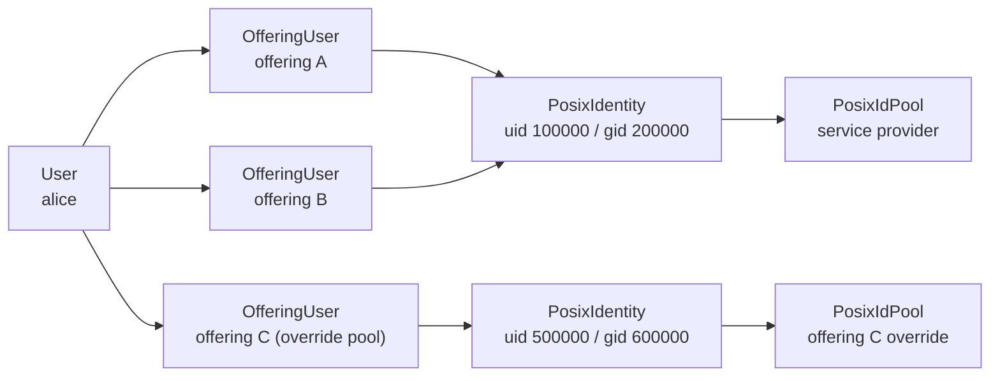

# POSIX ID pools

## Overview

A service provider that runs a Linux estate — SLURM clusters, shared filesystems,
an LDAP or GLAuth directory — needs a UID and a primary GID for every account
Waldur creates. Those numbers come from a **POSIX ID pool**: a reserved UID range
and GID range attached to a service provider, or, as an override, to a single
offering.

The allocator records every value it hands out in a `PosixIdentity` row, which is
the source of truth. Consumers keep a projection of the value in their
`backend_metadata` (`uidnumber` / `primarygroup` for accounts and robot accounts,
`gid` for groups), so the GLAuth rendering and the site-agent contract are
unchanged.

## One identity per principal

An identity belongs to a **principal**, not to a single account:

| Consumer | Principal |
|----------|-----------|
| Offering user | The Waldur user |
| Robot account | The robot account row |
| Offering user group / offering role group | The group row |

A user with accounts on several offerings of one provider therefore receives the
**same UID and primary GID everywhere**, allocated once from the provider's pool.



This is not a convenience: `set_offerings_username` already assigns one username
per user per provider, and the home directory is derived as
`homedir_prefix + username`. Two offerings of one provider therefore resolve to
the same DN and the same home directory. Two different `uidNumber` values there
would leave two site agents fighting over one LDAP entry, with job files landing
under whichever UID wrote last.

The sharing key is the **pool**, so an offering with its own pool automatically
gets its own identity: `PosixIdPool.resolve()` prefers an offering's own pool
over the provider's.

## Release and recycling

Deleting one offering user releases nothing while another account of the same
user still resolves to the same pool. Only the last one frees the value, which
then becomes a recycle candidate for the next allocation from that pool and
namespace.

A released row can also be **withheld** from recycling (`recyclable=False`). The
retrofit and the re-point action below set it: the number is still stamped on
files in the provider's filesystem, and reissuing it to a different user before
those files are reconciled is a security problem. Returning such values to their
pool is a deliberate operator step — select the rows in the POSIX identity admin
and run *Return withheld values to the pool*.

## Manual overrides

`POST /api/marketplace-offering-users/{uuid}/set_posix_attributes/` pins a UID or
primary GID. The pin applies to the **principal within the pool** — that is, to
the user across every offering of the provider that has no override pool — and
must fall inside the resolved pool's range. The projection in every one of those
accounts' `backend_metadata` is rewritten in the same request, so the ledger and
the directory entries cannot drift apart.

## Retrofitting existing deployments

Deployments that allocated identifiers before identities became principal-scoped
have one identity per account. The `collapse_posix_identities` command reports
the collapse and, with `--apply`, performs it:

```sh
waldur collapse_posix_identities              # dry run: report only
waldur collapse_posix_identities --apply      # perform the collapse
waldur collapse_posix_identities --pool <uuid>  # limit to one pool
```

For each `(pool, user)` group it keeps one canonical identity — the manually
pinned one if there is exactly one, the oldest pinned one (with a warning) if
several look pinned, otherwise the oldest — rewrites the other
accounts' `backend_metadata` onto it, and emits an event per changed account. The
dry run prints the UID -> UID and GID -> GID map per offering so the operator can
drive `chown` and the SLURM-side updates first, plus the list of values that are
freed but withheld from recycling.

## Adding an override pool later

An offering that gains its own pool keeps its existing accounts on the values
they already have; only accounts created afterwards draw from the override pool.
Moving the existing ones is explicit:

```http
GET  /api/marketplace-posix-id-pools/{uuid}/repoint_preview/
POST /api/marketplace-posix-id-pools/{uuid}/repoint/   {"confirm": true}
```

The preview reports which accounts change and from which value to which, without
writing anything. The apply moves them, logs an event per account, and withholds
the values freed in the previously resolved pool from recycling.

Two things stay where they are, and both are reported:

- An identity whose namespaces the new pool does not all manage — a GID-only
  override leaves the UID sourced from the provider pool — stays active, so the
  value it still supplies keeps its reservation (`retained` in the response).
- Robot accounts and groups of the offering keep their existing values
  (`other_consumers`). Re-pointing moves offering accounts, which are the rows
  the provider's directory keys on by username and home directory.

## Pool utilization

`GET /api/marketplace-posix-id-pools/{uuid}/stats/` reports capacity, used count
and utilization per namespace. `used` counts **principals**: a user with accounts
on five offerings of the provider consumes one UID, not five.
