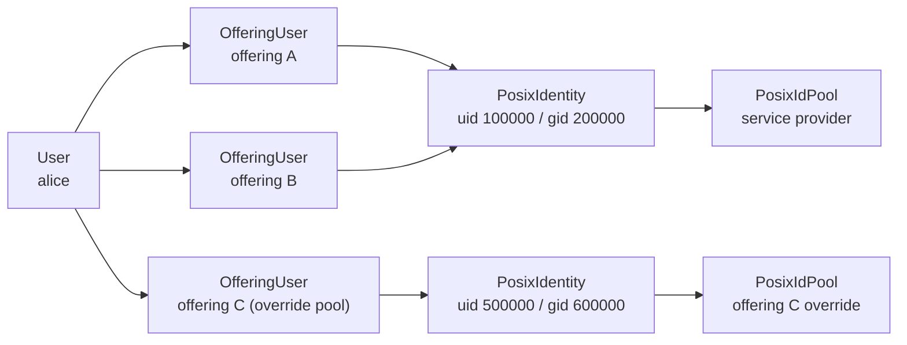

# POSIX ID pools

## Overview

A service provider that runs a Linux estate — SLURM clusters, shared filesystems,
an LDAP or GLAuth directory — needs a UID and a primary GID for every account
Waldur creates. Those numbers come from a **POSIX ID pool**: a reserved UID range
and GID range attached to a service provider, or, as an override, to a single
offering.

The allocator records every value it hands out in a `PosixIdentity` row, which is
the source of truth. Consumers keep a projection of the value in their
`backend_metadata` (`uidnumber` / `primarygroup` for accounts and robot accounts,
`gid` for groups), so the GLAuth rendering and the site-agent contract are
unchanged.

## One identity per principal

An identity belongs to a **principal**, not to a single account:

| Consumer | Principal |
|----------|-----------|
| Offering user | The Waldur user |
| Robot account | The robot account row |
| Offering user group / offering role group | The group row |

A user with accounts on several offerings of one provider therefore receives the
**same UID and primary GID everywhere**, allocated once from the provider's pool.


```mermaid
graph LR
  U["User<br/>alice"]
  OUA["OfferingUser<br/>offering A"]
  OUB["OfferingUser<br/>offering B"]
  OUC["OfferingUser<br/>offering C (override pool)"]
  I1["PosixIdentity<br/>uid 100000 / gid 200000"]
  I2["PosixIdentity<br/>uid 500000 / gid 600000"]
  P1["PosixIdPool<br/>service provider"]
  P2["PosixIdPool<br/>offering C override"]

  U --> OUA
  U --> OUB
  U --> OUC
  OUA --> I1
  OUB --> I1
  OUC --> I2
  I1 --> P1
  I2 --> P2
```

This is not a convenience: `set_offerings_username` already assigns one username
per user per provider, and the home directory is derived as
`homedir_prefix + username`. Two offerings of one provider therefore resolve to
the same DN and the same home directory. Two different `uidNumber` values there
would leave two site agents fighting over one LDAP entry, with job files landing
under whichever UID wrote last.

The sharing key is the **pool**, so an offering with its own pool automatically
gets its own identity: `PosixIdPool.resolve()` prefers an offering's own pool
over the provider's.

## Release and recycling

Deleting one offering user releases nothing while another account of the same
user still resolves to the same pool. Only the last one frees the value, which
then becomes a recycle candidate for the next allocation from that pool and
namespace.

A released row can also be **withheld** from recycling (`recyclable=False`). The
retrofit and the re-point action below set it: the number is still stamped on
files in the provider's filesystem, and reissuing it to a different user before
those files are reconciled is a security problem. Returning such values to their
pool is a deliberate operator step — select the rows in the POSIX identity admin
and run *Return withheld values to the pool*.

## Manual overrides

`POST /api/marketplace-offering-users/{uuid}/set_posix_attributes/` pins a UID or
primary GID. The pin applies to the **principal within the pool** — that is, to
the user across every offering of the provider that has no override pool — and
must fall inside the resolved pool's range. The projection in every one of those
accounts' `backend_metadata` is rewritten in the same request, so the ledger and
the directory entries cannot drift apart.

## Retrofitting existing deployments

Deployments that allocated identifiers before identities became principal-scoped
have one identity per account. The `collapse_posix_identities` command reports
the collapse and, with `--apply`, performs it:

```sh
waldur collapse_posix_identities              # dry run: report only
waldur collapse_posix_identities --apply      # perform the collapse
waldur collapse_posix_identities --pool <uuid>  # limit to one pool
```

For each `(pool, user)` group it keeps one canonical identity — the manually
pinned one if there is exactly one, the oldest pinned one (with a warning) if
several look pinned, otherwise the oldest — rewrites the other
accounts' `backend_metadata` onto it, and emits an event per changed account. The
dry run prints the UID -> UID and GID -> GID map per offering so the operator can
drive `chown` and the SLURM-side updates first, plus the list of values that are
freed but withheld from recycling.

## Adding an override pool later

An offering that gains its own pool keeps its existing accounts on the values
they already have; only accounts created afterwards draw from the override pool.
Moving the existing ones is explicit:

```http
GET  /api/marketplace-posix-id-pools/{uuid}/repoint_preview/
POST /api/marketplace-posix-id-pools/{uuid}/repoint/   {"confirm": true}
```

The preview reports which accounts change and from which value to which, without
writing anything. The apply moves them, logs an event per account, and withholds
the values freed in the previously resolved pool from recycling.

Two things stay where they are, and both are reported:

- An identity whose namespaces the new pool does not all manage — a GID-only
  override leaves the UID sourced from the provider pool — stays active, so the
  value it still supplies keeps its reservation (`retained` in the response).
- Robot accounts and groups of the offering keep their existing values
  (`other_consumers`). Re-pointing moves offering accounts, which are the rows
  the provider's directory keys on by username and home directory.

## Pool utilization

`GET /api/marketplace-posix-id-pools/{uuid}/stats/` reports capacity, used count
and utilization per namespace. `used` counts **principals**: a user with accounts
on five offerings of the provider consumes one UID, not five.

## Provider project groups

A provider that runs its own directory can give every project that uses its
services one POSIX group. Set `project_groups_enabled` in the service
provider's `account_options` (`PATCH /api/marketplace-service-providers/{uuid}/`).
Set the pool's group range first: the `account_options_preview` action returns
a warning when the provider pool has no group range (groups would then share
the GID range with users' primary GIDs) or no GID range at all.

### Group GID range

A pool may reserve a separate range for project groups with `min_group_gid` and
`max_group_gid` (all-or-nothing, like the UID and GID ranges; `next_group_gid`
is the read-only high-water mark). The group range must not overlap the pool's
GID range, nor any GID or group GID range of another pool of the provider; such
a pool is refused with 400. Without a group range, project groups draw from the
GID range. Group GIDs always come from the provider's own pool: offering-level
override pools are not consulted, because a project group belongs to the whole
provider. With offering-level pools only, groups exist but have `gid: null`.

The pool reports the group range like the other ranges: `group_gid_used` and
`group_gid_utilization` on the pool, and a `group_gid` entry in its `stats`,
with the same utilization threshold. A GID counts against the range it lies in.

A pool cannot be deleted on its own while project groups hold GIDs from it,
through the API or the admin: the groups would keep their GIDs and a new pool
could hand them out again. Deleting the service provider (or its organization)
deletes its pool and its project groups together. A newly created provider pool
reserves the GIDs the provider's groups already carry, and refuses a range that
holds a value another pool of the provider has handed out. Only a provider's
pool may have a group range.

Project group GIDs are never recycled: a released GID may be a departed user's
primary group still present on files. Nor is any value that was ever released
as withheld (an override or a re-point moved off it), even if an earlier
release of the same value was recyclable.

### When a project uses the provider

A project uses the provider while it has a resource on one of its offerings
that

- is of a type with offering users (Basic, Script, site agent) and does not set
  `enable_posix_account: false`;
- is not terminated — creating, updating, terminating and erred resources all
  count;
- is past approval: while its create order waits for the consumer, the
  provider, the project or a start date, or once it was rejected or cancelled,
  the resource does not count, so it never takes a GID;

and the project is not deleted. `in_use` and `offerings` in the listing follow
the same rule.

The project's first such resource creates its group and gives it the next free
GID; the group is also created when a resource is moved into the project, when
an offering moves to the provider, and when an order is approved. Further
resources, on the same or another offering of the provider, reuse that group.

When the project stops using the provider — its last resource terminates, or
the project is deleted — the group stays with `in_use: false` and keeps its
GID: files may still carry it. A new resource in the project reuses the same
group and GID. A GID is never handed to another project; deleting a group
releases its GID without making it recyclable. Groups are not deleted with
their project: a hard-deleted project leaves its group with `project_uuid:
null`.

### Group names

A name matches `^[a-z_][a-z0-9_-]{0,31}$` and is unique per provider ignoring
case. The automatic name is the project slug, lowercased, with other characters
replaced by `-`, cut to 32 characters; when it is taken, `-2`, `-3`, … is
appended (cutting the slug further to stay within 32). When the slug is empty
or does not start with a letter — non-ASCII project names, for instance — the
name is `p` followed by the first eight hex digits of the project UUID. The name
is fixed at creation, so a later slug change does not rename the group.

### Catching up

Groups without a GID get one as soon as a range can supply one. The catch-up
runs when the switch is turned on, when the provider's pool is created, and
whenever it is updated (e.g. a group range added or its maximum raised). It is
also available as a management command, which a second run leaves unchanged:

```bash
waldur backfill_provider_project_groups [--provider <uuid>] [--dry-run]
```

While the switch is off nothing new is created, but existing groups stay listed.

### Pinning

Provider owners (and staff) can set a group's GID:

- `POST /api/marketplace-service-provider-project-groups/` with
  `{"service_provider", "project", "gid", "name"?, "allow_outside_range"?}`
  **adopts** a group the directory already holds — also for a project with no
  resource yet. The allocator skips the pinned GID, so pinning 20001-20003 and
  then creating a group yields 20004. A project that already has a group is
  refused (use `set_gid`), and so is a name already used at the provider.
- `POST .../{uuid}/set_gid/` with `{"gid", "allow_outside_range"?}`
  **overrides** a group's GID. The previous GID is released but never handed
  out again automatically; renumbering files is the operator's job.
- `POST .../import_groups/` with `{"service_provider", "groups": [{"project",
  "gid", "name"?}], "allow_outside_range"?}` adopts several groups at once, all
  or nothing.

`project` takes the project UUID, or its slug when exactly one project with
that slug qualifies. Provider owners may adopt only for projects with a
resource or an order, in any state, on one of the provider's offerings —
`GET .../adoptable_projects/?service_provider_uuid=&query=` lists them, with
the group each already has; staff may adopt for any project.

A pin is refused with 400, changing nothing, when another consumer holds the
GID in any of the provider's pools, when it lies inside a GID range of another
pool of the provider, or when it lies outside the range project groups draw
from and `allow_outside_range` is not set. A released GID may be pinned again.
Every pin and override is logged as a
`marketplace_provider_project_group_gid_updated` event carrying `old_gid` and
`new_gid`. A GID pinned outside every range does not block later pool updates.

### Reading the groups

`GET /api/marketplace-service-provider-project-groups/` lists every group of
the provider — in use or not, whether or not the switch is on — with `name`,
`gid`, `in_use`, the project and its organization, `offerings` (the provider's
offerings the project uses) and `members`. Filters: `service_provider_uuid`,
`provider_offering_uuid` (every group of the provider owning that offering),
`offering_uuid` (groups of projects using that offering), `project_uuid` and
`in_use`.

`members` are the sorted usernames of the accounts at the provider of the
project's members: users that are active and hold an unexpired role in the
project, with an offering account at the provider that is live (requested,
being created, pending, OK or erred on creation) and has a username. A
username whose every account at the provider is restricted is left out. Robot
and service accounts are not members.

A directory writer such as the site agent recognises a person across renames by
their Waldur username (`user_username` on the offering-user listing), which it
stores in the directory entry. Waldur shows `user_username` to the provider only
while the offering exposes usernames (`expose_username` in the offering's user
attribute settings, on by default); an offering that turns it off leaves the
agent without a stable key, so renames there appear as a new account.

Staff and support, owners and service managers (organization role) of the
provider's organization,
and managers of any of its offerings can read the groups; the last is how a
site agent's token lists the groups of its provider.

Anyone who can see a project also sees its groups at every provider in the
project's POSIX group rollup (`GET /api/marketplace-project-posix-groups/?project_uuid=`,
kind `provider_project_group`, with GID, name, provider, `in_use`, `offerings`
and `members`), and an account's `posix_groups` action lists the provider
project groups that account is a member of.

The GLAuth output of an offering includes the provider project groups of the
projects using it (kind `provider_project`), and adds their GIDs to the
members' `otherGroups`. Providers without project groups render as before.
