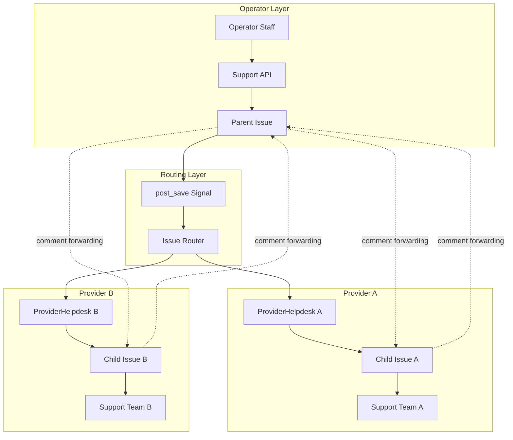
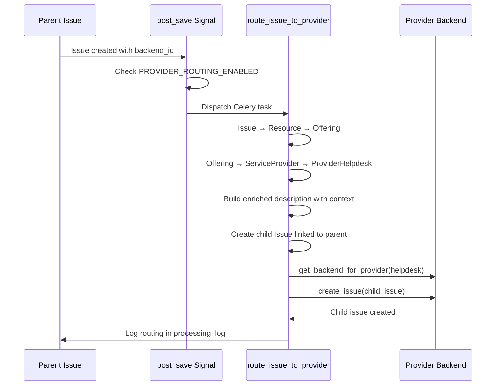
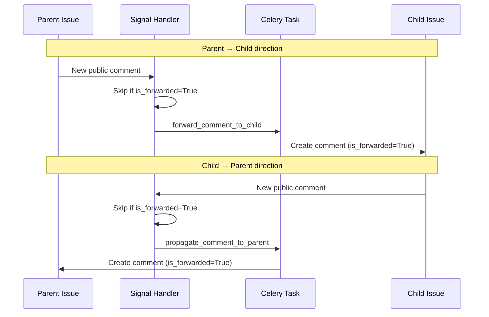

# Provider Helpdesk System

The provider helpdesk extends Waldur's single-tenant support module into a multi-tenant system. Service providers register their own helpdesk backends, tickets are automatically routed to the correct provider, and bidirectional communication flows between operator and provider via parent/child issue pairs.

For the base support module, see [Support Module Documentation](support.md).

## Architecture



## Models

### ProviderHelpdesk

Links a marketplace `ServiceProvider` to a helpdesk backend. Each provider can have one helpdesk.

| Field | Type | Description |
|-------|------|-------------|
| `service_provider` | OneToOne FK | Link to `marketplace.ServiceProvider` |
| `backend_type` | CharField | `basic`, `email`, `atlassian`, `zammad`, or `smax` |
| `settings` | JSONField | Backend-specific configuration |
| `is_active` | BooleanField | Whether routing is enabled (default: `True`) |
| `webhook_secret` | CharField | Secret for webhook validation |
| `notification_email` | EmailField | Primary notification email |
| `notify_on_new_ticket` | BooleanField | Notify on new routed tickets (default: `True`) |
| `notify_on_comment` | BooleanField | Notify on customer comments (default: `True`) |
| `notify_on_escalation` | BooleanField | Notify on escalations (default: `True`) |
| `notify_on_sla_warning` | BooleanField | Notify on SLA warnings (default: `True`) |
| `last_health_check` | DateTimeField | Timestamp of last connectivity check |
| `last_health_status` | CharField | Result of last health check |
| `failed_routing_count` | PositiveIntegerField | Counter for failed routing attempts |

### ProviderSupportUser

Team members who handle tickets for a provider helpdesk.

| Field | Type | Description |
|-------|------|-------------|
| `provider_helpdesk` | FK | Link to `ProviderHelpdesk` |
| `user` | FK | Link to Waldur `User` |
| `role` | CharField | `agent` or `manager` |
| `is_active` | BooleanField | Default: `True` |
| `skills` | JSONField | List of skill tags for routing |
| `max_open_tickets` | PositiveIntegerField | Capacity limit (default: 20) |

Unique constraint on `(provider_helpdesk, user)`. Provides `open_ticket_count` and `has_capacity` properties.

### ProviderCannedResponse

Template responses scoped to a provider helpdesk. Supports Django template syntax via `render(context_dict)`.

### IssueStatusTransition

Defines allowed status transitions for issues. When the table is empty, all transitions are allowed (backwards compatibility). When populated, only listed transitions are permitted.

### IssueTag

Simple name/color tag model for issue categorization. Color stored as hex (e.g., `#FF0000`).

### IssueLink

Links between issues with typed relationships: `related`, `blocked_by`, or `duplicates`. Unique constraint on `(source, target)`.

### SavedFilter

User-scoped saved filter configurations. Stores filter parameters as JSON. Can be shared with all staff/support users via `is_shared` flag.

### CannedResponse (operator-level)

Template responses available to operator staff. Same template rendering as `ProviderCannedResponse` but not scoped to a provider.

### New fields on Issue

| Field | Purpose |
|-------|---------|
| `parent_issue` | Self FK linking child issues to their parent |
| `provider_helpdesk` | FK to the `ProviderHelpdesk` handling this issue |
| `provider_assignee` | FK to `ProviderSupportUser` assigned to the issue |
| `is_escalated` | Whether the issue has been escalated |
| `escalated_at` | Timestamp of escalation |
| `escalation_reason` | Text reason for escalation |
| `first_response_deadline` | SLA deadline for first response |
| `resolution_deadline` | SLA deadline for resolution |
| `first_response_at` | Timestamp of first support response |
| `sla_breached` | Whether SLA has been breached |
| `tags` | M2M to `IssueTag` |

### New field on Comment

| Field | Purpose |
|-------|---------|
| `is_forwarded` | Marks comments copied between parent/child issues |

## Ticket Routing

### Flow

When an issue is created and routing is enabled, the system resolves the provider chain and creates a child issue.



### Resolution chain

1. `dispatch_routing_on_issue_create` signal handler fires on `Issue` post_save
2. Checks `WALDUR_SUPPORT_PROVIDER_ROUTING_ENABLED` is `True`
3. Skips child issues (already routed) and issues without `backend_id`
4. `route_issue_to_provider` Celery task resolves: Issue -> resource -> `Offering` -> `ServiceProvider` -> `ProviderHelpdesk`
5. Creates a child issue with enriched description (customer, project, resource context)
6. Calls `create_issue()` on the provider backend
7. Retries up to 3 times on failure, increments `failed_routing_count`

## Comment Forwarding

Bidirectional comment forwarding maintains communication between operator and provider.



The `is_forwarded` flag prevents infinite loops: forwarded comments are skipped by all signal handlers.

## Escalation

1. User calls `POST /api/support-issues/{uuid}/escalate/` with `reason`
2. Issue fields updated: `is_escalated=True`, `escalated_at`, `escalation_reason`
3. Escalation comment `[ESCALATED] {reason}` created on the issue
4. Comment forwarding propagates to child issues automatically
5. `notify_provider_escalation` task sends email to provider

**Permissions:** Issue caller (the person who created the ticket), staff, or support users.

## SLA Management

### Configuration

| Setting | Default | Description |
|---------|---------|-------------|
| `WALDUR_SUPPORT_SLA_RESPONSE_HOURS` | 4 | Hours until first response deadline |
| `WALDUR_SUPPORT_SLA_RESOLUTION_HOURS` | 24 | Hours until resolution deadline |

### Behavior

The `BasicBackend` sets SLA deadlines on issue creation based on `created + configured hours`. When a support user adds the first comment to an issue, `first_response_at` is recorded.

### Monitoring

Two periodic Celery tasks monitor SLA compliance:

- **`check_sla_breaches`** (every 15 min): Marks issues as `sla_breached=True` when response or resolution deadlines pass without the corresponding action
- **`check_sla_warnings`** (every 30 min): Logs warnings and notifies providers for issues within 1 hour of deadline

## Auto-Assignment

### Configuration

| Setting | Default | Description |
|---------|---------|-------------|
| `WALDUR_SUPPORT_AUTO_ASSIGN` | `False` | Enable automatic ticket assignment |
| `WALDUR_SUPPORT_AUTO_ASSIGN_STRATEGY` | `least_loaded` | Assignment algorithm |

### Strategies

- **`least_loaded`**: Assigns to the active `ProviderSupportUser` with fewest open tickets who still has capacity (`open_ticket_count < max_open_tickets`)
- **`round_robin`**: Cycles through active users using a cache-based counter

## Per-Provider Backend Configuration

Each `ProviderHelpdesk` stores backend-specific settings in its `settings` JSON field. The factory function `get_backend_for_provider()` creates a backend instance configured from these settings.

```python
# Example: Atlassian backend settings for a provider
provider_helpdesk.settings = {
    "server": "https://provider-jira.example.com",
    "username": "provider-bot",
    "password": "secret",
    "project_key": "PROV",
    "verify_ssl": True,
}
```

Each backend implements `from_settings(settings_dict)` classmethod and `_get_config(key, default)` that falls back to global Constance settings when a per-provider key is missing. This means a provider with no custom settings uses the operator's global backend configuration.

## API Endpoints

### Provider Helpdesk Management

| Endpoint | Method | Description |
|----------|--------|-------------|
| `/api/provider-helpdesks/` | GET | List provider helpdesks |
| `/api/provider-helpdesks/` | POST | Register helpdesk for a service provider |
| `/api/provider-helpdesks/{uuid}/` | GET/PATCH/DELETE | Manage helpdesk |
| `/api/provider-helpdesks/{uuid}/validate/` | POST | Test backend connectivity |

### Provider Ticket Portal

| Endpoint | Method | Description |
|----------|--------|-------------|
| `/api/provider-tickets/` | GET | List tickets routed to provider |
| `/api/provider-tickets/{uuid}/` | GET | Retrieve ticket details |
| `/api/provider-tickets/{uuid}/comment/` | POST | Add comment to ticket |
| `/api/provider-tickets/{uuid}/resolve/` | POST | Resolve ticket |
| `/api/provider-tickets/{uuid}/assign/` | POST | Assign to team member |
| `/api/provider-tickets/{uuid}/claim/` | POST | Claim ticket for self |
| `/api/provider-tickets/{uuid}/customer_context/` | GET | Get caller/resource context |
| `/api/provider-tickets/{uuid}/stats/` | GET | Provider-scoped statistics |

### Provider Team Management

| Endpoint | Method | Description |
|----------|--------|-------------|
| `/api/provider-support-users/` | GET/POST | List/create team members |
| `/api/provider-support-users/{uuid}/` | GET/PATCH/DELETE | Manage team member |
| `/api/provider-support-users/{uuid}/team_workload/` | GET | View team workload |

### Provider Canned Responses

| Endpoint | Method | Description |
|----------|--------|-------------|
| `/api/provider-canned-responses/` | GET/POST | List/create |
| `/api/provider-canned-responses/{uuid}/` | GET/PATCH/DELETE | Manage |
| `/api/provider-canned-responses/{uuid}/render/` | POST | Render template with context |

### Operator Productivity

| Endpoint | Method | Description |
|----------|--------|-------------|
| `/api/support-issue-tags/` | GET/POST | Manage issue tags |
| `/api/support-issue-links/` | GET/POST | Manage issue links |
| `/api/support-saved-filters/` | GET/POST | Saved filter management |
| `/api/support-canned-responses/` | GET/POST | Operator canned responses |
| `/api/support-canned-responses/{uuid}/render/` | POST | Render template |

### Issue Enhancements

| Endpoint | Method | Description |
|----------|--------|-------------|
| `/api/support-issues/{uuid}/escalate/` | POST | Escalate issue to provider |
| `/api/support-issues/bulk_update/` | POST | Bulk update issues |

### Dashboard and Health

| Endpoint | Method | Description |
|----------|--------|-------------|
| `/api/helpdesk-stats/` | GET | Helpdesk statistics |
| `/api/helpdesk-health/` | GET | Provider connectivity status |

### Provider Webhook

| Endpoint | Method | Description |
|----------|--------|-------------|
| `/api/support-provider-webhook/{uuid}/{backend_type}/` | POST | Unauthenticated webhook, validated via `X-Webhook-Secret` header |

## Permissions

| Resource | Who can access |
|----------|---------------|
| Provider Helpdesk CRUD | Customer owners of the provider's customer, staff |
| Provider Tickets | `ProviderSupportUser` members of the helpdesk, customer owners, staff |
| Provider Team | Customer owners of the provider, staff |
| Issue Tags, Links, Canned Responses, Saved Filters | Staff and support users |
| Escalation | Issue caller, staff, support users |
| Helpdesk Stats/Health | Staff and support users |

## Celery Tasks

### Scheduled

| Task | Schedule | Description |
|------|----------|-------------|
| `check_sla_breaches` | Every 15 min | Mark breached SLA deadlines |
| `check_sla_warnings` | Every 30 min | Log warnings for approaching deadlines |

### On-demand

| Task | Trigger | Description |
|------|---------|-------------|
| `route_issue_to_provider` | Issue creation | Route issue to provider helpdesk |
| `forward_comment_to_child` | Comment on parent | Forward comment to child issues |
| `propagate_comment_to_parent` | Comment on child | Propagate comment to parent issue |
| `notify_provider_new_ticket` | Routing complete | Email provider about new ticket |
| `notify_provider_customer_comment` | Customer comment | Email provider about comment |
| `notify_provider_sla_warning` | SLA check | Email provider about SLA warning |
| `notify_provider_escalation` | Escalation | Email provider about escalation |

## Management Commands

| Command | Description |
|---------|-------------|
| `check_provider_helpdesks` | Test connectivity of all active provider helpdesks |
| `retry_failed_routing` | Retry routing for issues that failed (supports `--dry-run`) |
| `helpdesk_stats` | Display helpdesk statistics summary |

## Constance Settings

| Setting | Type | Default | Description |
|---------|------|---------|-------------|
| `WALDUR_SUPPORT_PROVIDER_ROUTING_ENABLED` | bool | `False` | Enable automatic ticket routing to providers |
| `WALDUR_SUPPORT_AUTO_ASSIGN` | bool | `False` | Enable auto-assignment of tickets |
| `WALDUR_SUPPORT_AUTO_ASSIGN_STRATEGY` | str | `least_loaded` | Assignment strategy |
| `WALDUR_SUPPORT_SLA_RESPONSE_HOURS` | int | `4` | Hours until first response SLA deadline |
| `WALDUR_SUPPORT_SLA_RESOLUTION_HOURS` | int | `24` | Hours until resolution SLA deadline |

## Implementation Files

| File | Purpose |
|------|---------|
| `support/models.py` | New models and new fields on Issue/Comment |
| `support/views.py` | ViewSets for all new endpoints |
| `support/serializers.py` | Serializers for all new endpoints |
| `support/filters.py` | Filters for new models |
| `support/urls.py` | URL routing |
| `support/tasks.py` | Celery tasks for routing, forwarding, SLA, notifications |
| `support/handlers.py` | Signal handlers for routing and forwarding |
| `support/utils.py` | Helper functions (stats, context building) |
| `support/backend/__init__.py` | `get_backend_for_provider()` factory |
| `support/backend/basic.py` | Enhanced BasicBackend with SLA and auto-assign |
| `support/backend/email_backend.py` | Email-based provider backend |
| `support/management/commands/` | `check_provider_helpdesks`, `retry_failed_routing`, `helpdesk_stats` |
| `support/templates/support/` | Email notification templates |

All paths are relative to `src/waldur_mastermind/`.
