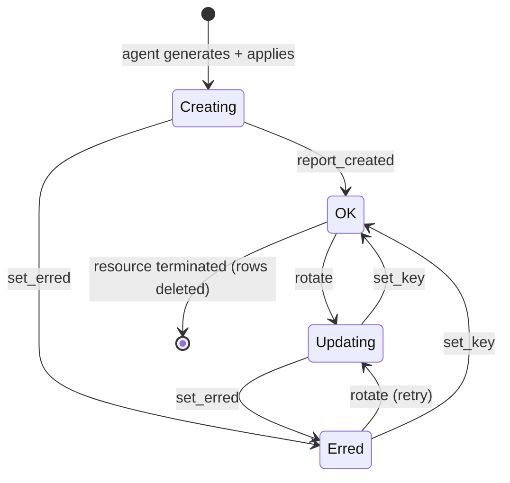
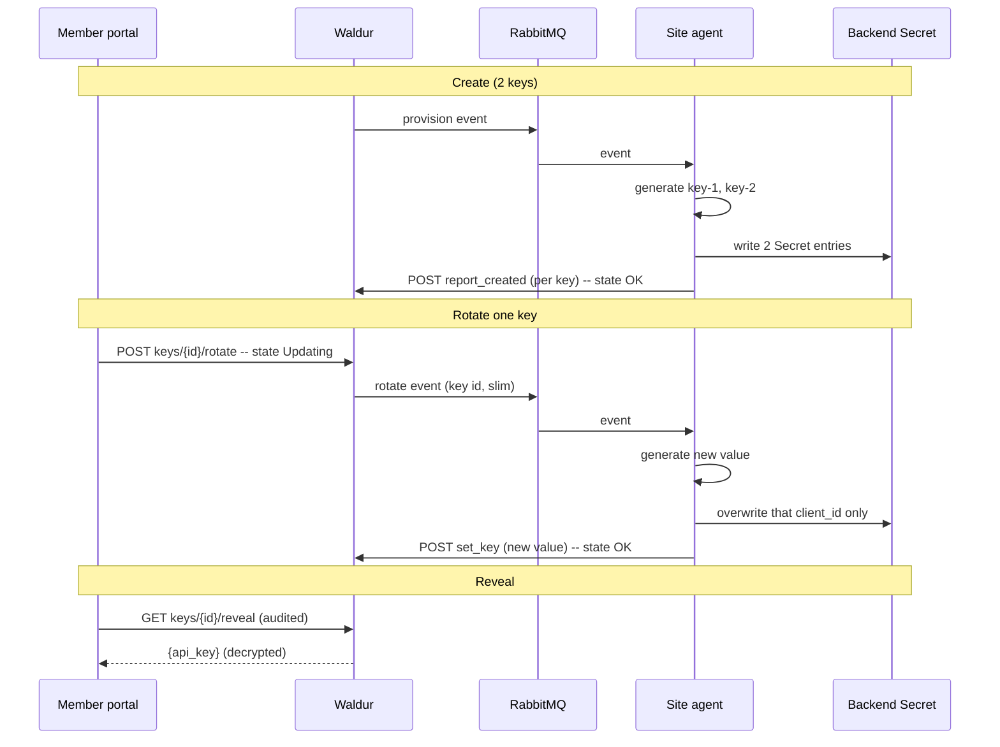

# Resource API Keys

How a site-agent resource's API keys are generated, applied, revealed and
rotated. The motivating case is inference resources (Envoy AI Gateway keys),
but nothing here is Envoy-specific: the croit-s3 plugin uses the same lifecycle
for S3 access/secret pairs, which is what surfaced the mutable-`client_id` case
below. The agent-side mechanics build on the
[event pub/sub architecture](design/pubsub-architecture.md) and the
[agent queue guide](guides/agent-pubsub.md).

## Overview

- A resource owns **multiple** API keys, each independently revealed and
  rotated from the portal. The count is fixed at provisioning.
- **Zero-downtime rotation**: rotating one key never disturbs the others, so
  consumers on a different key keep working.
- **The stored key is always a working key.** Waldur never hands a member a key
  the gateway would reject.
- **Safe visibility**: members read the keys on demand, but they are never
  plaintext where a database dump or a broad API response could leak them.

## Design rationale

**The site agent generates the key, not Waldur.** Generation (and any
backend-specific format, e.g. the `sk-` prefix) lives in the site-agent plugin.
Waldur is a management layer, not the source of provider secrets. Crucially, the
agent **applies the key to the gateway first, then reports it to Waldur** — so
Waldur only ever stores a key that is already live. Waldur-side minting was
rejected because it creates phantom keys: generate → store → the apply fails →
Waldur holds a key the gateway never accepted.

**Waldur stores the key, encrypted, for reveal.** For multiple members to read a
key later, something durable and member-reachable must hold it. The agent has no
inbound server (it dials out only), so a live per-reveal round-trip to the agent
would be slow and fail whenever the agent is offline. Waldur holding an
**encrypted** copy keeps reveal a fast, reliable read; the agent remains the
source.

**Multiple keys per resource, not per user.** Two keys are provisioned by
default — two independent keys are what make rotation zero-downtime, and they
model the operator reality of primary/standby credentials. Per-user keys were
rejected: they multiply the provisioning surface for a credential that is
inherently shared, and cutting a departed member's access is solved by rotating
the shared keys.

## Model

`ResourceApiKey` (`marketplace/models.py`) — many per resource:

| Field | Purpose |
| --- | --- |
| `resource` | `ForeignKey` — a resource owns a collection of keys |
| `client_id` | the backend's **public** identifier, e.g. `<resource_backend_id>-<n>` (one gateway Secret entry) or an S3 access key; unique per resource, and may move on rotation |
| `key_ciphertext` | the agent-generated value, Fernet-encrypted ([field encryption](#encryption-at-rest)) |
| `fingerprint` | `sk-AbCd...WxYz` — recognizable without revealing |
| `state` | FSM, aligned to resource states (below) |
| `error_message` | agent-reported failure detail when `Erred` |

The key value is deliberately **not** on `Resource`: it never touches the broad
`ResourceSerializer`, gets its own permission-gated endpoints, and stays out of
admin and reversion history. `ResourceSerializer` carries only `has_api_keys`, a
boolean (an `Exists` annotation on the consumer and provider resource viewsets,
with a per-instance fallback) so the portal can offer key management without
knowing the backend —
`offering_type` cannot tell these backends apart, they are all site-agent offerings.

**`client_id` is the backend's public identifier, and it is not always stable.**
Envoy uses a slot, `<resource_backend_id>-<n>`, that survives rotation: only the
value behind it changes. The croit-s3 plugin puts the S3 **access key** there,
which a rotation replaces along with the secret. `set_api_key` therefore accepts
an optional `client_id`; a backend with a stable identifier omits it. A value
already held by another key of the same resource is rejected.

### States

The FSM reuses the **resource state vocabulary** so the portal renders it with
the standard `StateIndicator` (`@/core/StateIndicator`) — no bespoke badge:

| State | Meaning | Indicator |
| --- | --- | --- |
| `Creating` | agent is generating + applying the initial key | spinner |
| `OK` | applied and live at the gateway | green |
| `Updating` | rotation in flight (agent applying a new value) | spinner |
| `Erred` | the agent could not apply the change | red |

`Creating` and `Updating` are the transitional (spinner) states, matching how
`ResourceStateField` treats a resource.

There is deliberately **no `Terminating`**. It existed for a consumer-facing revoke
that no longer ships, so nothing could enter it; a state a model can describe but
never reach only invites code that guards against it. Termination cleanup does not
need it — it deletes the rows directly (`callbacks.py`). Migration 0256 drops the
choice and moves any key left mid-revoke to `Erred`, where rotation can repair it.

Erred is always recoverable (a rotate retry from the portal, or the agent finally
applying via `set_key`), and `set_erred` is deliberately not allowed from
`OK` — a stale failure report must not flip a key that has since been applied.

## Flows

Rotation never touches the other keys, so a consumer authenticating with a
sibling key keeps working throughout — that is what makes it zero-downtime, and
why two keys are provisioned.

The rotation event (observable type `resource_api_key_rotation`) carries a
**slim** payload — resource/key identifiers, `client_id`, and the action, never
key material. The key only ever travels agent → Waldur, in the `report_created` /
`set_key` request body (TLS), and is encrypted on receipt. When a resource is
terminated, its remaining key rows are deleted by the termination callback.

## API

All endpoints live under `/api/marketplace-resource-api-keys/`
(`ResourceApiKeyViewSet`); keys are addressed by their own UUID and filtered per
resource with `?resource_uuid=`.

Consumer side:

- `GET /` and `GET /{uuid}/` — list/retrieve status (fingerprint, `client_id`,
  state, error message — no secret). Visible to resource project/customer
  members and the provider organization.
- `GET /{uuid}/reveal/` — return the decrypted value (in the body, never the
  URL, with `Cache-Control: no-store`). Restricted to **consumer-side** access —
  a member of the resource's project or its customer, plus staff/support; a
  provider-org member (who can reach the write actions) is explicitly excluded,
  and so are minimal-visibility viewers (as with `backend_metadata`). Only an
  `OK` key is revealed — a transitional key's stored value may not match the
  gateway. **Audited** — each reveal emits the `marketplace_resource_api_key_revealed`
  event identifying the key.
- `POST /{uuid}/rotate/` — mark `Updating` and emit the agent event. Gated on
  `RESOURCE.MANAGE_USERS` (project or customer scope); rejected unless the key is
  `OK` (or `Erred`, for retries) and the resource is live (not
  terminating/terminated). Emits the `marketplace_resource_api_key_rotated` audit
  event.

The keys are provisioned at resource creation (both supporting plugins make two)
and **rotation is the only operation on them**: it replaces a key's value in
place, so the count never changes after provisioning.

Neither adding nor revoking is exposed, and the two omissions hold each other up.
Without an add, a revoke would be a one-way door — keys are minted only at
provisioning, and the portal mounts its tab from `has_api_keys`, so revoking the
last key would strand the resource with neither credentials nor the surface to
manage them. Without a revoke, the count cannot fall, so "this resource has the
keys it was provisioned with" holds by construction rather than by a guard. The
sensible maximum is in any case backend-specific, so a generic mastermind cap
would be premature — it belongs with the site-agent plugin if a concrete need for
on-demand keys appears.

The provider `destroy` endpoint went with revoke: deleting a key row was only ever
a revoke confirmation, and an ungated delete could drop a row whose key still serves
at the backend. `destroy` is in `disabled_actions`, and termination cleanup deletes
the rows directly (see [States](#states)).

Provider side (used by the site agent), gated on `RESOURCE.MANAGE_API_KEY` on
the offering customer:

- `POST /report_created/` — the agent pushes a freshly-applied key value after
  provisioning; Waldur encrypts, stores, and the row lands `OK`. Idempotent per
  `(resource, client_id)` — but rejected once the resource itself is
  terminating/terminated, so a stale duplicate can never resurrect a key of a
  resource on its way out.
- `POST /{uuid}/set_key/` — the agent pushes a rotated value; Waldur encrypts,
  stores, transitions to `OK`. Takes an optional `client_id` for backends whose
  public identifier rotates with the secret (see the model above); a value
  already held by a sibling key of the same resource is rejected.
- `POST /{uuid}/set_erred/` — the agent reports an apply failure → `Erred`.
(There is no `DELETE`: see above.)

## Encryption at rest {#encryption-at-rest}

Keys are encrypted with Fernet via `waldur_core.core.encryption`
(`encrypt_value` / `decrypt_value` / `is_encrypted`), keyed by
`settings.FIELD_ENCRYPTION_KEY`. `FIELD_ENCRYPTION_KEY` is a separate setting
from `SECRET_KEY`: leaking Django settings must not, by itself, unlock encrypted
DB fields.

**Rotating the encryption key.** `FIELD_ENCRYPTION_KEY_FALLBACKS` (a
comma-separated list) holds previous keys so the app can be re-keyed without
downtime, using `MultiFernet`: encryption always uses the primary
`FIELD_ENCRYPTION_KEY`, but decryption is attempted against the primary *and*
every fallback. To rotate:

1. Generate a new Fernet key, set it as `FIELD_ENCRYPTION_KEY`, and move the
   previous key into `FIELD_ENCRYPTION_KEY_FALLBACKS`. Existing rows still
   decrypt (via the fallback); new writes use the new primary.
2. Run `waldur reencrypt_fields`, which rewrites every stored token under the new
   primary. Waiting for rows to be re-saved on their own does not work here: a key
   is only rewritten when it happens to be rotated, so there is no point at which
   you could tell the old key had become unnecessary.
3. Drop the old key from `FIELD_ENCRYPTION_KEY_FALLBACKS`.

`waldur reencrypt_fields --dry-run` reports the same counts without writing, and in
particular how many rows **no** configured key can decrypt. That is worth checking
on its own: such rows are invisible until someone calls `reveal` and gets a 409, and
the only fix is to restore the key that wrote them.

When no dedicated key is configured, the key is derived from `SECRET_KEY` (with
a startup warning). That derived key always remains an **implicit last-resort
decrypt fallback**, so a deployment that starts without a dedicated key can
introduce `FIELD_ENCRYPTION_KEY` later without losing the rows written before
the switch — no manual fallback entry or re-encrypt migration needed. (This
costs nothing at rest: an attacker holding `SECRET_KEY` and a dump can decrypt
those pre-switch rows regardless of the server's fallback list.)

| Threat | Protection |
| --- | --- |
| Database dump / backup theft | Values are opaque Fernet tokens |
| Casual `SELECT` / SQL-injection read | Ciphertext, not plaintext |
| Over-broad API serialization | Keys live off `ResourceSerializer`, behind gated endpoints |
| Application-server compromise | **Not** protected — the process can decrypt |

Defense-in-depth against at-rest exposure, not a secrets manager.

## Usage and billing

A resource owns several keys, but usage is attributed **per resource** — otherwise
rotating a key would split a tenant's bill in two. No backend meters per key.

How each backend gets there is plugin-specific and documented with the plugin.
The Envoy AI Gateway tags requests with a per-key `x-client-id` and strips the key
suffix during the usage rollup; croit-s3 meters the S3 user directly, so keys never
enter usage at all. Either way Waldur sees one usage stream per resource, and
adding or rotating a key does not change it.
