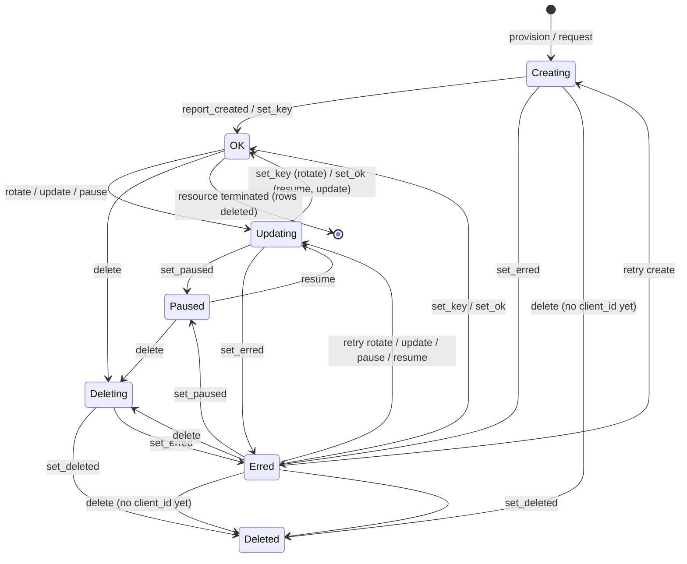
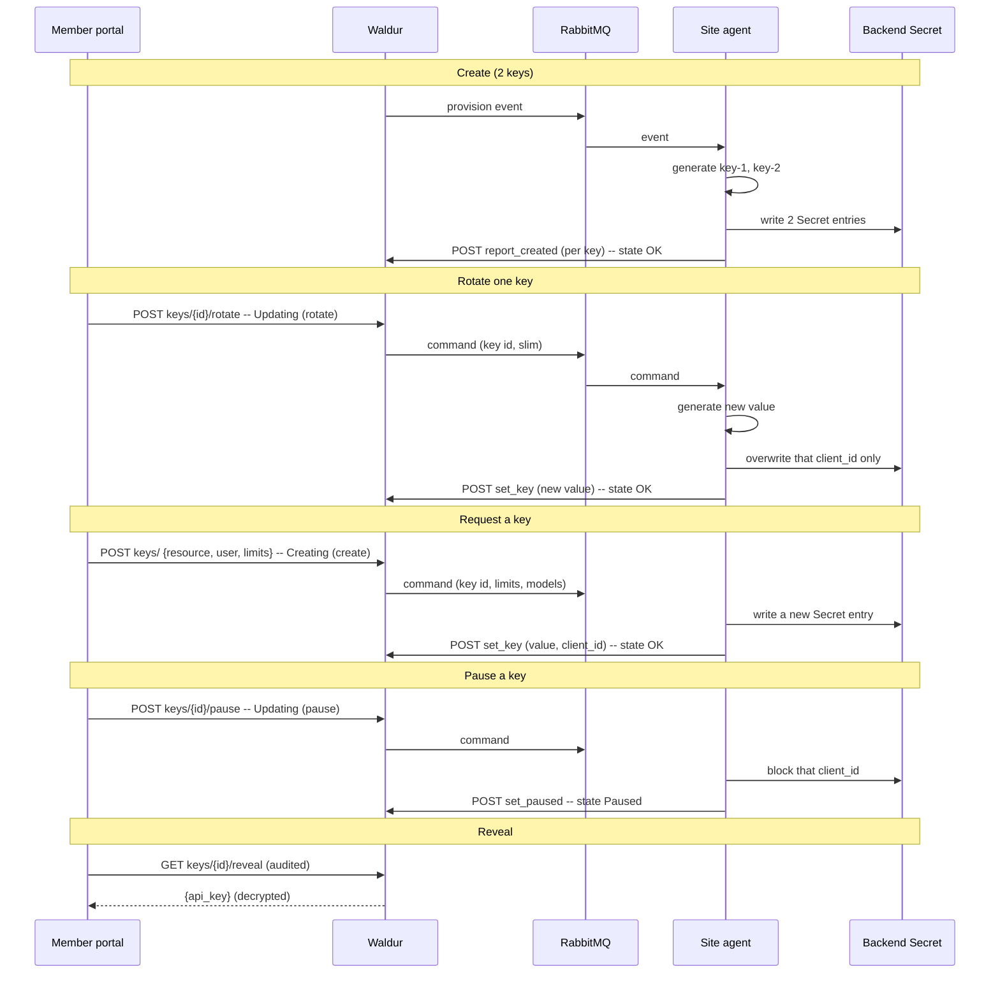

# Resource API Keys

How a site-agent resource's API keys are generated, applied, revealed and
rotated — and, where the backend supports it, requested, assigned, limited,
paused, resumed and deleted one by one. The motivating case is inference resources (Envoy AI Gateway keys),
but nothing here is Envoy-specific: the croit-s3 plugin uses the same lifecycle
for S3 access/secret pairs, which is what surfaced the mutable-`client_id` case
below. The agent-side mechanics build on the
[event pub/sub architecture](design/pubsub-architecture.md) and the
[agent queue guide](guides/agent-pubsub.md).

## Overview

- A resource owns **multiple** API keys, each independently revealed and
  rotated from the portal.
- **Zero-downtime rotation**: rotating one key never disturbs the others, so
  consumers on a different key keep working.
- **The stored key is always a working key.** Waldur never hands a member a key
  the gateway would reject.
- **Safe visibility**: members read the keys on demand, but they are never
  plaintext where a database dump or a broad API response could leak them.
- **Per-key governance**, where the backend supports it: a key can be requested,
  assigned to a person, given per-component limits, restricted to some models, paused,
  resumed and deleted — each without touching the resource or its other keys.

## Design rationale

**The site agent generates the key, not Waldur.** Generation (and any
backend-specific format, e.g. the `sk-` prefix) lives in the site-agent plugin.
Waldur is a management layer, not the source of provider secrets. Crucially, the
agent **applies the key to the gateway first, then reports it to Waldur** — so
Waldur only ever stores a key that is already live. Minting in Waldur instead
produces phantom keys: generate → store → the apply fails → Waldur holds a key
the gateway never accepted. Requesting a key keeps this: the request creates a
row and a command, never a value.

**Waldur stores the key, encrypted, for reveal.** For multiple members to read a
key later, something durable and member-reachable must hold it. The agent has no
inbound server (it dials out only), so a live per-reveal round-trip to the agent
would be slow and fail whenever the agent is offline. Waldur holding an
**encrypted** copy keeps reveal a fast, reliable read; the agent remains the
source.

**Every change is a command the agent acknowledges.** Pause, resume, delete, a
settings update and a request all follow rotation's shape: Waldur moves the key
into a transitional state, records the command as `pending_action`, publishes
it, and settles the key only when the agent reports back. A key that has not been
acknowledged refuses a second command, so two commands can never race at the
agent.

**Keys are shared by default, personal when assigned.** Two keys are provisioned
by default — two independent keys are what make rotation zero-downtime, and they
model the operator reality of primary/standby credentials. On a team-shared
inference offering that is not enough: usage cannot be attributed to a person, a
single key cannot be limited, and a leaked key can only be rotated. So a key may
carry an **assignee**, and then only that person (plus staff and support) can
reveal it.

**Limits are enforced by Waldur, not the gateway.** The Envoy backend's
`set_resource_limits` is a no-op by design: limits are enforced by Waldur (report
→ pause → block). A per-key limit works the same way — reported per-key usage that
reaches the limit issues a `pause` for that key. Nothing new is pushed to the
gateway to enforce a limit, and a limit never affects billing.

**Limits are monthly.** A key's usage is counted per month, like a resource's
usage per billing period, and its limits apply to each month afresh. A key Waldur
paused for its limit therefore comes back on its own once a new month begins, and
so it does when the limit is raised; a key a person paused stays paused.

**Deletion is soft.** A deleted key keeps its row and the usage it reported, so
the resource's per-component totals for the month do not move when a key goes
away. Hard deletion would lose usage that belongs in the resource's total.

**Governance is a backend capability.** Not every key-carrying backend can honour
a per-key command: ceph-s3's `pause_resource` is a no-op and its `client_id`
rotates with the secret. The offering declares support with
`plugin_options.enable_api_key_provisioning`; without it the governance fields
read as null and the governance actions are refused, while reveal and rotation
work as before.

The option is a claim the operator makes about the agent's backend, and nothing
checks it: the agent does not yet report what its backend supports. Turned on
for a backend without per-key commands (ceph-s3, for one), every request, pause,
resume, update or delete errs at the agent and leaves the key `Erred`. Turn it
on only for a backend whose agent sets `supports_resource_api_key_lifecycle`.

## Model

`ResourceApiKey` (`marketplace/models.py`) — many per resource:

| Field | Purpose |
| --- | --- |
| `resource` | `ForeignKey` — a resource owns a collection of keys |
| `client_id` | the backend's **public** identifier, e.g. `<resource_backend_id>-<n>` (one gateway Secret entry) or an S3 access key; unique per resource, and may move on rotation. Blank on a requested key until the agent creates it |
| `key_ciphertext` | the agent-generated value, Fernet-encrypted ([field encryption](#encryption-at-rest)); dropped when the key is deleted |
| `issued_at` | when the agent last stored a value: the key's creation or its latest rotation. Unlike `modified`, a pause, resume or edit leaves it alone, so it is the age of the value in use |
| `state` | FSM, aligned to resource states (below) |
| `pending_action` | the command in flight (`ResourceApiKeyActions`: `create`, `rotate`, `pause`, `resume`, `delete`, `update`); blank once settled, kept on `Erred` to show which command failed |
| `user` | optional assignee; only they can reveal the key |
| `limits` | optional per-component limits, keyed by component type; zero means no limit |
| `allowed_models` | optional model allowlist; null allows every model |
| `current_usages` | per-component usage in `usage_period`, as last reported by the agent |
| `usage_period` | the month `current_usages` covers (its first day); usage of an earlier month counts against no limit |
| `paused_by_limit` | Waldur paused the key because its usage reached a limit; such a key is resumed automatically once under its limits again |
| `error_message` | agent-reported failure detail when `Erred` |
| `modified` | `TimeStampedModel`; the time the key last changed state or settings — the agent's sweep reads it as "in this state since". Usage reports do not touch it |

The key value is deliberately **not** on `Resource`: it never touches the broad
`ResourceSerializer`, gets its own permission-gated endpoints, and stays out of
admin and reversion history. `ResourceSerializer` carries only `has_api_keys`, a
boolean (an `Exists` annotation on the consumer and provider resource viewsets,
with a per-instance fallback) so the portal can offer key management without
knowing the backend —
`offering_type` cannot tell these backends apart, they are all site-agent offerings.

**`client_id` is the backend's public identifier, and it is not always stable.**
Envoy uses a slot, `<resource_backend_id>-<n>`, that survives rotation: only the
value behind it changes. The croit-s3 plugin puts the S3 **access key** there,
which a rotation replaces along with the secret. `set_key` therefore accepts
an optional `client_id`; a backend with a stable identifier omits it. A value
already held by another key of the same resource — a deleted one included — is
rejected: usage is attributed by `client_id`, so a deleted key's identifier is
never handed out again.

### States

The FSM reuses the **resource state vocabulary** so the portal renders it with
the standard `StateIndicator` (`@/core/StateIndicator`) — no bespoke badge:

| State | Meaning | Indicator |
| --- | --- | --- |
| `Creating` | agent is generating + applying the initial key | spinner |
| `OK` | applied and live at the gateway | green |
| `Updating` | a rotate, pause, resume or update is in flight; `pending_action` says which | spinner |
| `Paused` | the gateway refuses the key; it keeps its value | — |
| `Deleting` | the agent is revoking the key | spinner |
| `Deleted` | revoked; the row stays for its usage, hidden from default listings | — |
| `Erred` | the agent could not apply the change | red |

```mermaid
stateDiagram-v2
    [*] --> Creating: provision / request
    Creating --> OK: report_created / set_key
    OK --> Updating: rotate / update / pause
    Paused --> Updating: resume
    Updating --> OK: set_key (rotate) / set_ok (resume, update)
    Updating --> Paused: set_paused
    OK --> Deleting: delete
    Paused --> Deleting: delete
    Deleting --> Deleted: set_deleted
    Creating --> Erred: set_erred
    Updating --> Erred: set_erred
    Deleting --> Erred: set_erred
    Erred --> Updating: retry rotate / update / pause / resume
    Erred --> Creating: retry create
    Erred --> Deleting: delete
    Creating --> Deleted: delete (no client_id yet)
    Erred --> Deleted: delete (no client_id yet)
    Erred --> OK: set_key / set_ok
    Erred --> Paused: set_paused
    Erred --> Deleted: set_deleted
    OK --> [*]: resource terminated (rows deleted)
```

Every acknowledgement names the commands it settles, and is refused otherwise:
`set_key` settles `create` and `rotate`, `set_ok` settles `resume` and `update`,
`set_paused` settles `pause`, `set_deleted` settles `delete`. So a late or
duplicated report can neither resurrect a paused or deleted key nor settle a
command it does not answer — a rotation report cannot un-pause a key.
`set_erred` is accepted from any transitional state but never from `OK`, `Paused`
or `Deleted`: a stale failure report must not flip a key that has since settled.

Erred is always recoverable, but only by the command that failed or by a
delete. `pending_action` stays set on an Erred key, and `POST /{uuid}/retry/`
sends that command again, with the limits and models the key has now; posting the
same command directly (a `pause` after a failed pause, a `PATCH` of limits or
models after a failed update) is a retry too. Any other command is refused with
`409`: a rotation standing in for a failed pause would leave the key `OK` and
live, and one standing in for a failed update would show limits and models the
backend never received. A requested key that erred before it had a `client_id`
never reached the backend, so it can only be requested again (`retry`) or
deleted. A key that erred before commands were recorded retries a rotation.

A requested key without a `client_id` — still `Creating`, or `Erred` on its
`create` — holds nothing at the backend, so deleting it publishes no command:
it is `Deleted` at once, even while its `create` is still pending. That is the
way out of a request whose command was lost. Should the agent still create the
key afterwards, its `set_key` is refused with `409`, and the agent withdraws the
key it minted from the backend, so nothing is left live that Waldur does not
track.

Once governance is switched off, a failed governed command (`pause`, `update`,
`delete`, `create`) cannot be retried; an ungoverned one (`rotate`, `resume`)
may then take its place, so the key is not stranded.

## Flows

```mermaid
sequenceDiagram
    participant M as Member portal
    participant W as Waldur
    participant Q as RabbitMQ
    participant A as Site agent
    participant B as Backend Secret

    Note over M,B: Create (2 keys)
    W->>Q: provision event
    Q->>A: event
    A->>A: generate key-1, key-2
    A->>B: write 2 Secret entries
    A->>W: POST report_created (per key)  -- state OK
    Note over M,B: Rotate one key
    M->>W: POST keys/{id}/rotate  -- Updating (rotate)
    W->>Q: command (key id, slim)
    Q->>A: command
    A->>A: generate new value
    A->>B: overwrite that client_id only
    A->>W: POST set_key (new value)  -- state OK
    Note over M,B: Request a key
    M->>W: POST keys/ {resource, user, limits}  -- Creating (create)
    W->>Q: command (key id, limits, models)
    A->>B: write a new Secret entry
    A->>W: POST set_key (value, client_id)  -- state OK
    Note over M,B: Pause a key
    M->>W: POST keys/{id}/pause  -- Updating (pause)
    W->>Q: command
    A->>B: block that client_id
    A->>W: POST set_paused  -- state Paused
    Note over M,B: Reveal
    M->>W: GET keys/{id}/reveal (audited)
    W-->>M: {api_key}  (decrypted)
```

Rotation never touches the other keys, so a consumer authenticating with a
sibling key keeps working throughout — that is what makes it zero-downtime, and
why two keys are provisioned.

Commands (observable type `resource_api_key_rotation` — the name predates the
other commands and agents subscribe to it by name) carry a **slim** payload:
resource/key identifiers, `client_id`, and `action`, never key material.
`create`, `update` and `resume` also carry the key's `limits` and
`allowed_models`, so settings edited while a key was paused are applied when it
resumes. The key only ever travels agent → Waldur, in the `report_created` /
`set_key` request body (TLS), and is encrypted on receipt. When a resource is
terminated, its remaining key rows — deleted ones included — are deleted by the
termination callback.

**Limits.** The agent reports each key's usage so far in a month with
`report_usage`. When a key is `OK`, has no command in flight and its usage this
month reaches a non-zero limit, Waldur issues a `pause` for that key alone, marks
it `paused_by_limit` and audit-logs it as automatic. The resource and its other
keys keep serving. An `Erred` key is not paused automatically — its failed
command needs a person to retry it first.

Waldur resumes a key it paused for its limit, again audit-logged as automatic, as
soon as its usage is under every limit again:

- a usage report for a new month, since limits start afresh each month;
- a limit raised above the usage, or removed — the `resume` carries the new limits;
- the hourly `resume_api_keys_under_limit` task, for a month that begins before
  the agent reports anything for it.

A resume by hand clears the mark: if the key is still over its limit, the next
report pauses it again. A key a person paused is never resumed automatically.

## API

All endpoints live under `/api/marketplace-resource-api-keys/`
(`ResourceApiKeyViewSet`); keys are addressed by their own UUID and filtered per
resource with `?resource_uuid=`, and further by `state`, `pending_action`,
`has_pending_action` (`false` for keys with no command in flight), `user_uuid`,
`offering_uuid` and `modified_before`. A listing leaves out `Deleted` keys
unless `?state=Deleted` asks for them.

Consumer side. The actions marked *governance* need the offering's
`enable_api_key_provisioning`; without it they return 400.

- `GET /` and `GET /{uuid}/` — list/retrieve status (`client_id`, state,
  `pending_action`, `modified`, error message, assignee, limits, models, usage — no
  secret). Visible to resource project/customer members and the provider
  organization.
- `GET /{uuid}/reveal/` — return the decrypted value (in the body, never the
  URL, with `Cache-Control: no-store`). Restricted to **consumer-side** access —
  a member of the resource's project or its customer, plus staff/support; a
  provider-org member (who can reach the write actions) is explicitly excluded,
  and so are minimal-visibility viewers (as with `backend_metadata`). A key with
  an assignee is revealed **only to the assignee** (plus staff/support). Only an
  `OK` key is revealed — a transitional or paused key's stored value may not
  match the gateway. **Audited** — each reveal emits the
  `marketplace_resource_api_key_revealed` event identifying the key.
- `POST /{uuid}/rotate/` — the `rotate` command. Available on every backend.
- `POST /{uuid}/resume/` — the `resume` command. Available on every backend
  too, so a key paused before the provider switched governance off can come
  back.
- `POST /{uuid}/retry/` — re-sends the command that left the key `Erred`
  (`pending_action`); governed unless that command is `rotate` or `resume`.
- `POST /` *(governance)* — request a key: `{resource, user?, limits?,
  allowed_models?}`. Creates a `Creating` row and the `create` command; Waldur
  generates nothing. The assignee must be a member of the resource's project (an
  organization role alone is not enough), limits must name offering components,
  and models must be among the offering's
  `resource_options.options.models.choices` when it lists any.
- `PATCH /{uuid}/` *(governance)* — change `user`, `limits`, `allowed_models`. An
  assignee change is Waldur's alone, but audited as
  `marketplace_resource_api_key_updated`, since it decides who may reveal the
  key. A change to limits or models is the `update` command — or, on a paused key,
  is stored and sent with its `resume`. Unassigning (`{"user": null}`) needs no
  governance: reveal still honours an assignee set while governance was on, and
  only this lets someone other than staff lift it.
- `POST /{uuid}/pause/` *(governance)* — the `pause` command.
- `DELETE /{uuid}/` *(governance)* — the `delete` command; `202`, since the key
  is gone only once the agent acknowledges. A requested key with no `client_id`
  yet is `Deleted` at once, with no command (see [States](#states)).
- `GET /usage_totals/?resource_uuid=` — the resource's reported key usage this
  month, summed per component, deleted keys included.

Every command is gated on `RESOURCE.MANAGE_USERS` (project or customer scope),
refused while the resource is terminating/terminated or while the key already
has an unacknowledged command, and emits an audit event when it is issued:
`marketplace_resource_api_key_requested`, `_rotated`, `_paused`, `_resumed`,
`_updated` or `_deleted`. Those events read as requested ("Pause of API key … has
been requested by …"), since the agent has not carried the command out yet; an
agent's failure report emits `marketplace_resource_api_key_failed` naming the
command and the error.

Provider side (used by the site agent), gated on `RESOURCE.MANAGE_API_KEY` held
on any of the provider-side scopes the permission is granted at — the offering
itself (`OFFERING.MANAGER`, which is what a site agent runs as), the offering's
customer (`CUSTOMER.OWNER`), or that customer's `ServiceProvider`
(`CUSTOMER.MANAGER`). The list of keys is likewise visible to the provider
organization, but reading a value is not: `reveal` stays consumer-side only.

- `POST /report_created/` — the agent pushes a key it created on its own at
  provisioning; Waldur encrypts, stores, and the row lands `OK`. Idempotent per
  `(resource, client_id)`, but refused for a key that has since been paused or
  deleted or has another command in flight, and once the resource itself is
  terminating/terminated. **Not** for a requested key: that row has no
  `client_id` to match on, so `report_created` would add a second row and leave
  the requested one `Creating`. A requested key is reported with `set_key` on
  its own UUID.
- `POST /{uuid}/set_key/` — the agent pushes a created or rotated value; Waldur
  encrypts, stores, transitions to `OK`. Takes an optional `client_id` for
  backends whose public identifier rotates with the secret; a requested key must
  send the one it was given.
- `POST /{uuid}/set_ok/` — acknowledges `resume` or `update`.
- `POST /{uuid}/set_paused/` — acknowledges `pause`.
- `POST /{uuid}/set_deleted/` — acknowledges `delete`; the value is dropped, the
  row and usage kept.

- `POST /{uuid}/set_erred/` — the agent reports that a command failed → `Erred`,
  audited as `marketplace_resource_api_key_failed`.
- `POST /{uuid}/report_usage/` *(governance)* — `{usages: {component_type:
  value}, billing_period?}`: the key's usage so far in that month (any day of
  it; the current month when omitted). A report for the month the key holds is
  merged into `current_usages`; one for a later month replaces it. Only the
  latest month is kept, so a report for an earlier one is refused with `409`,
  and one for a future month with `400`. May trigger a limit pause, or the resume
  of a key paused for its limit. Accepted for a deleted key, so usage up to the
  deletion still counts.

The acknowledgements (`set_key`, `set_ok`, `set_paused`, `set_deleted`,
`set_erred`) are not gated on `enable_api_key_provisioning`: a command already in
flight still settles if the provider switches governance off.

**Reconciliation sweep contract.** A command is published once; if the agent
misses it, the key waits in its transitional state. An agent that re-drives keys
stuck in `Updating` (listing `state=Updating&modified_before=…`) must replay the
command named by `pending_action`, not assume a rotation: `Updating` also covers
`pause`, `resume` and `update`, and a rotation replayed over a lost pause would
install a new secret that `set_key` then refuses. Keys stuck in `Creating` and
`Deleting` are found the same way; a replayed `create` that lands after the
original one is refused by `set_key` and withdrawn by the agent. A sweep written
before this change must be updated before an offering turns on
`enable_api_key_provisioning`.

## Encryption at rest {#encryption-at-rest}

This is one of several encrypted columns; see [Field encryption](field-encryption.md)
for the general feature (what is encrypted, key configuration, rotation, backups).

Keys are encrypted with Fernet via `waldur_core.core.encryption`
(`encrypt_value` / `decrypt_value` / `is_encrypted`), keyed by
`settings.FIELD_ENCRYPTION_KEY`. `FIELD_ENCRYPTION_KEY` is a separate setting
from `SECRET_KEY`: leaking Django settings must not, by itself, unlock encrypted
DB fields.

**Rotating the encryption key.** `FIELD_ENCRYPTION_KEY_FALLBACKS` (a
comma-separated list) holds previous keys so the app can be re-keyed without
downtime, using `MultiFernet`: encryption always uses the primary
`FIELD_ENCRYPTION_KEY`, but decryption is attempted against the primary *and*
every fallback. To rotate:

1. Generate a new Fernet key, set it as `FIELD_ENCRYPTION_KEY`, and move the
   previous key into `FIELD_ENCRYPTION_KEY_FALLBACKS`. Existing rows still
   decrypt (via the fallback); new writes use the new primary.
2. Run `waldur reencrypt_fields`, which rewrites every stored token under the new
   primary. Waiting for rows to be re-saved on their own does not work here: a key
   is only rewritten when it happens to be rotated, so there is no point at which
   you could tell the old key had become unnecessary.
3. Drop the old key from `FIELD_ENCRYPTION_KEY_FALLBACKS`.

`waldur reencrypt_fields --dry-run` reports the same counts without writing, and in
particular how many rows **no** configured key can decrypt. That is worth checking
on its own: such rows are invisible until someone calls `reveal` and gets a 409, and
the only fix is to restore the key that wrote them.

When no dedicated key is configured, the key is derived from `SECRET_KEY` (with
a startup warning). That derived key always remains an **implicit last-resort
decrypt fallback**, so a deployment that starts without a dedicated key can
introduce `FIELD_ENCRYPTION_KEY` later without losing the rows written before
the switch — no manual fallback entry or re-encrypt migration needed. (This
costs nothing at rest: an attacker holding `SECRET_KEY` and a dump can decrypt
those pre-switch rows regardless of the server's fallback list.)

| Threat | Protection |
| --- | --- |
| Database dump / backup theft | Values are opaque Fernet tokens |
| Casual `SELECT` / SQL-injection read | Ciphertext, not plaintext |
| Over-broad API serialization | Keys live off `ResourceSerializer`, behind gated endpoints |
| Application-server compromise | **Not** protected — the process can decrypt |

Defense-in-depth against at-rest exposure, not a secrets manager.

## Usage and billing

Billing stays **per resource**: a resource's usage is what the agent reports for
the resource, and rotating, adding, pausing or deleting a key does not change it.
A key limit never affects an invoice.

Per-key usage (`current_usages`, reported with `report_usage`) is a breakdown of
that total for one month — it is what limits are enforced against and what lets
usage be attributed to an assignee. Summed over all of a resource's keys, deleted
ones included, it should add up to the resource's usage in that month
(`usage_totals`), which is why deletion is soft. Only a key's latest month is
kept: the resource's own usage history stays in its component usages.

How each backend gets there is plugin-specific and documented with the plugin.
The Envoy AI Gateway tags requests with a per-key `x-client-id`; per-key numbers
depend on the usage shipper emitting them per `client_id`. croit-s3 meters the S3
user directly, so keys never enter usage at all — and it does not declare
`enable_api_key_provisioning`.
